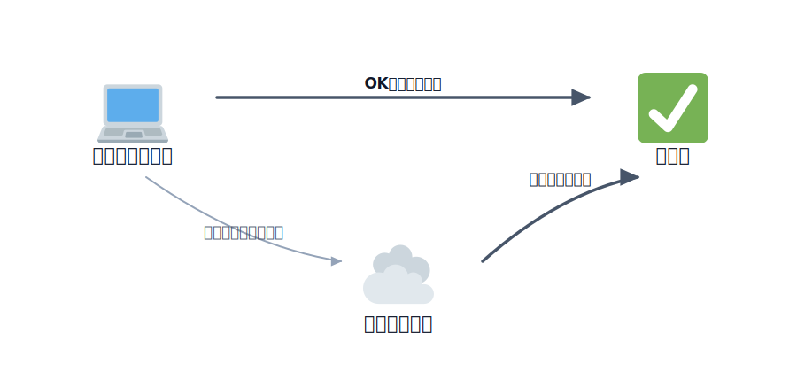

# Node.js のセットアップ

このハンズオンでは、各レクチャーのコマンド（`npm` / `npx wrangler`）を動かすために **Node.js** を
使います。当日スムーズに進めるため、事前にインストールしておいてください。

## インストール済みかの確認

ターミナル（macOS なら「ターミナル.app」、Windows なら「PowerShell」）で以下を実行し、バージョンが
表示されればインストール済みです。

```bash
node --version
npm --version
```

Node.js は **v20 以上（できれば最新の LTS）** を推奨します。`command not found` と出た場合は
インストールが必要です。



<!-- genfig: Node.js セットアップ手順を左から右への一本道フローで描く。要素は3ステップ：(1)「バージョン確認」(💻 ローカル/開発PC で `node --version` を実行)、(2)「インストール」(☁️ 公式サイトからLTSを入れる)、(3)「再確認」(✅ バージョン表示OK)。ステップ間を connector の矢印でつなぐ。分岐の表現：(1)から、表示されればそのまま(3)へ「OKならそのまま」のラベル付き矢印、`command not found` の場合は(2)へ「未インストールなら」のラベル付き矢印を分ける（SPLITTING）。(2)から(3)へ矢印。イメージスキーマ = SOURCE-PATH-GOAL（確認から完了までの一本道）+ SPLITTING（インストール有無の分岐）。絵文字割当: ローカル/開発PC=💻(1f4bb)、クラウド/公式サイト=☁️(2601)、許可/成功=✅(2705)。 -->
*図: Node.js セットアップの流れ——まずバージョンを確認し、未インストールならインストールしてから再確認する。*

## インストール方法

### 公式インストーラー

[nodejs.org](https://nodejs.org/) から **LTS 版** をダウンロードしてインストールしてください。

その他の方法もありますが、ここでは説明を省略します。気になる方はご質問ください。

## 再度インストール済みかの確認

ターミナルで以下を実行し、バージョンが表示されればインストール済みです。

```bash
node --version
v26.1.0
npm --version
11.13.0
```

環境によってバージョンは異なりますので、`v20 以上` であれば問題ありません。
