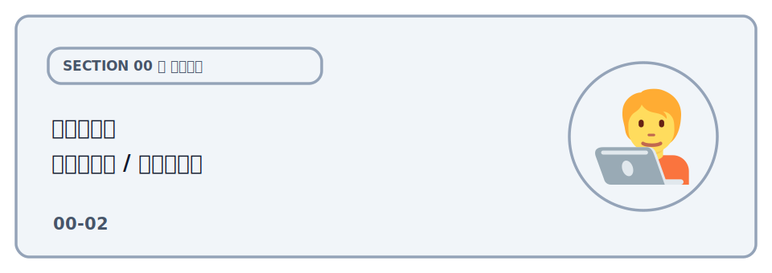

# 開発ツール（エディタ / ブラウザ）

ハンズオンを進めるうえで使うエディタとブラウザについてまとめます。必須ではありませんが、あると
スムーズです。

## エディタ（VSCode）

エディタには [Visual Studio Code](https://code.visualstudio.com/) を推奨します。

コード編集と同じウィンドウ内でターミナルを使えるので、`npx wrangler dev` の実行とソース閲覧を素早く切り替えられます。

### ターミナルの起動

VSCode 内でターミナルを開くには、次のいずれかの方法があります。

- **メニューから** — 上部メニューの「Terminal（ターミナル）」→「New Terminal（新しいターミナル）」を選ぶ
- **ショートカットで** — macOS は `Control` + `` ` ``（Shift を押しながらだと表示切り替え）、Windows / Linux は `Ctrl` + `` ` ``（バッククォート）
- **エクスプローラーで右クリックして開く** — 左側のエクスプローラー（ファイル一覧）で、ターミナルを開きたいフォルダを右クリックし、「Open in Integrated Terminal（統合ターミナルで開く）」を選ぶ

開いたターミナルは、VSCode でフォルダを開いているディレクトリ（ワークスペースのルート）がそのまま作業ディレクトリになります。ここで `npx wrangler dev` などのコマンドを実行します。ウィンドウ下部にパネルとして表示され、`+` ボタンで複数のターミナルを開いて切り替えることもできます。

:::notice[フォルダを右クリックで開くと「移動」を省ける]
各レクチャーのコマンドは、決まったフォルダ（例: `sections/03-build-app/02-d1/`）の中で実行します。
**そのフォルダをエクスプローラーで右クリック →「Open in Integrated Terminal（統合ターミナルで開く）」** で開くと、
ターミナルは最初からそのフォルダに入った状態になるので、`cd` での移動を省けます。
このとき念のため、macOS / Linux は `pwd`、Windows（PowerShell）は `cd` で、今いる場所が目的のフォルダかを
確認しておくと安心です。
:::

詳しくは公式マニュアル [Integrated Terminal（VSCode 公式ドキュメント）](https://code.visualstudio.com/docs/terminal/basics) を参照してください。

## ブラウザの開発者ツール

公開したアプリの挙動を確認するときは、ブラウザの開発者ツール（DevTools）を使います。Chrome / Edge /
Firefox いずれでも `F12` または右クリック →「検証」で開けます。

- **Network タブ** — フロントから Worker API へのリクエストやレスポンス、ステータスコード、CORS
  エラーの有無を確認できます（このハンズオンで何度も使います）
- **Console タブ** — JavaScript のエラーやログを確認できます
- **Elements タブ** — HTML の構造を確認できます。DOM の構造を確認したり、CSS を変更して見た目を調整したりできます
