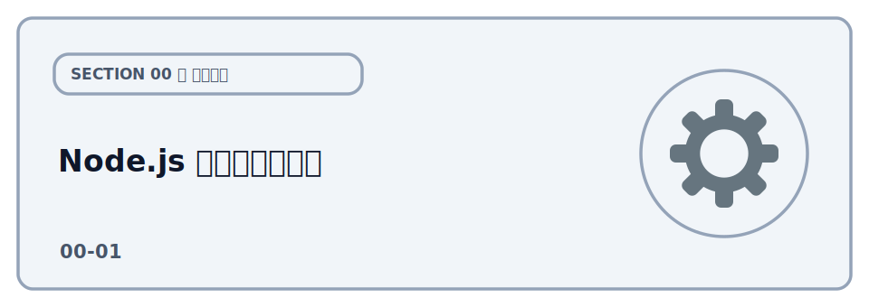

# Node.js のセットアップ



このハンズオンでは、各レクチャーのコマンド（`npm` / `npx wrangler`）を動かすために **Node.js** を
使います。当日スムーズに進めるため、事前にインストールしておいてください。

## インストール済みかの確認

コマンドは **VSCode の統合ターミナル**で実行するのがおすすめです（開き方は
[開発ツール](../01-tools/LECTURE.md)を参照）。VSCode を使わない場合は、macOS なら「ターミナル.app」、
Windows なら「PowerShell」を使ってください。

いずれかのターミナルで以下を実行し、バージョンが表示されればインストール済みです。

```bash
node --version
npm --version
```

Node.js は **v20 以上（できれば最新の LTS）** を推奨します。`command not found` と出た場合は
インストールが必要です。

## インストール方法

### 公式インストーラー

[nodejs.org](https://nodejs.org/) からダウンロードしてインストールしてください。

その他の方法もありますが、ここでは説明を省略します。気になる方はご質問ください。

## 再度インストール済みかの確認

VSCode の統合ターミナル（または「ターミナル.app」/「PowerShell」）で以下を実行し、バージョンが
表示されればインストール済みです。

```bash
node --version
v26.1.0
npm --version
11.13.0
```

環境によってバージョンは異なりますので、`v20 以上` であれば問題ありません。
