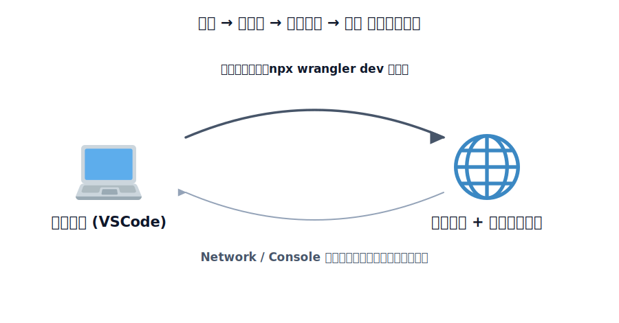

# 開発ツール（エディタ / ブラウザ）

ハンズオンを進めるうえで使うエディタとブラウザについてまとめます。必須ではありませんが、あると
スムーズです。

<!-- genfig: 開発の往復ループ図。左に「エディタ(VSCode) 💻」、右に「ブラウザ + 開発者ツール 🌐」を配置。左→右の矢印にラベル「コードを書く・npx wrangler dev で起動」、右→左の矢印にラベル「Network/Console で結果を確認・修正点を見つける」。2本の矢印で円環をつくり、書く→動かす→確かめる→直すの繰り返しを表す。登場要素=エディタ(💻)・ブラウザ開発者ツール(🌐)。関係は矢印ラベルのみ（絵文字ノードにしない）。イメージスキーマ = CYCLE + SOURCE-PATH-GOAL。 -->
*図: エディタで書いて動かし、ブラウザの開発者ツールで確かめて直す——この往復を繰り返して進める。*

## エディタ（VSCode）

エディタには [Visual Studio Code](https://code.visualstudio.com/) を推奨します。

コード編集と同じウィンドウ内でターミナルを使えるので、`npx wrangler dev` の実行とソース閲覧を素早く切り替えられます。

## ブラウザの開発者ツール

公開したアプリの挙動を確認するときは、ブラウザの開発者ツール（DevTools）を使います。Chrome / Edge /
Firefox いずれでも `F12` または右クリック →「検証」で開けます。

- **Network タブ** — フロントから Worker API へのリクエストやレスポンス、ステータスコード、CORS
  エラーの有無を確認できます（このハンズオンで何度も使います）
- **Console タブ** — JavaScript のエラーやログを確認できます
- **Elements タブ** — HTML の構造を確認できます。DOM の構造を確認したり、CSS を変更して見た目を調整したりできます
