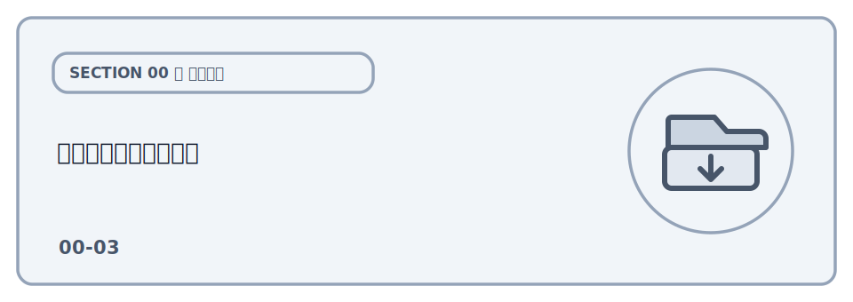
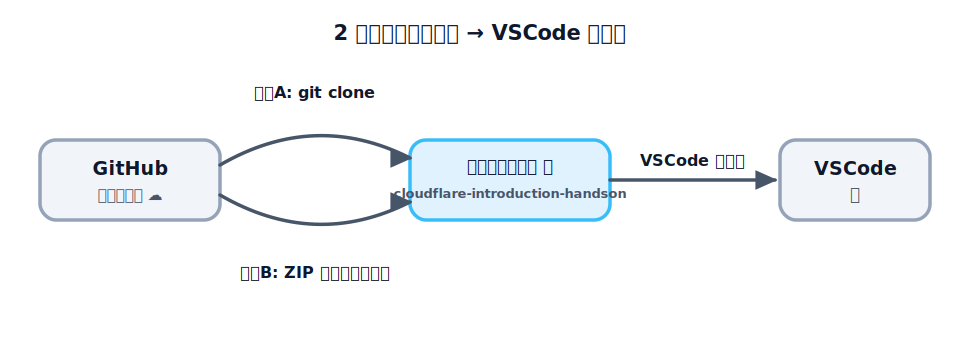

# リポジトリを入手する



このハンズオンは、GitHub にある **1 つのサンプルリポジトリ**（`cloudflare-introduction-handson`）を
手元に置き、その中のフォルダを移動しながら進めます。各レクチャーの「`sections/.../` フォルダの中で
実行します」という説明は、**このリポジトリが手元にある** ことが前提です。

まずはリポジトリを自分の PC にダウンロードし、VSCode で開くところまでを準備します。手順は
**Web から ZIP でダウンロードする方法** と **git を使う方法** の 2 通りがあります。どちらでも
中身は同じなので、やりやすい方で構いません。



## どちらの方法を選ぶか

- **git をまだ使っていない人 / とにかく早く始めたい人** → 方法 A（ZIP ダウンロード）。git のインストールは
  不要です。
- **git を使ったことがある / これから使いたい人** → 方法 B（`git clone`）。あとから教材が更新されても
  `git pull` で追従できます。

:::notice
どちらでも進められます。迷ったら、まずは手軽な **方法 A（ZIP）** で始めて構いません。
:::

## 方法 A: Web から ZIP でダウンロードする

git を使わず、ブラウザだけで入手する方法です。

1. リポジトリのページを開く: <https://github.com/seekseep/cloudflare-introduction-handson>
2. 緑色の **「Code」** ボタンを押す
3. メニューの一番下 **「Download ZIP」** を押す
4. ダウンロードした ZIP ファイルを **展開（解凍）** する

展開すると `cloudflare-introduction-handson-main` のようなフォルダができます（末尾の `-main` は
ブランチ名です）。分かりやすい場所（デスクトップや書類フォルダなど）に置いておきましょう。

:::notice
ZIP には git の履歴が含まれないため、あとで教材が更新されても `git pull` では追従できません。
更新を取り込みたいときは、最新の ZIP をもう一度ダウンロードしてください。
:::

## 方法 B: git clone で入手する

git がインストールされていることを確認します。バージョンが表示されれば OK です。

```bash
git --version
```

`command not found` と出た場合は git のインストールが必要です（[git 公式サイト](https://git-scm.com/)）。
インストール済みなら、リポジトリを置きたいフォルダに移動してから `clone` します。

```bash
git clone https://github.com/seekseep/cloudflare-introduction-handson.git
```

`cloudflare-introduction-handson` というフォルダができ、その中に教材一式が入ります。中に移動して
確認します。

```bash
cd cloudflare-introduction-handson
ls
```

`sections` や `README.md` が見えれば成功です。

## VSCode で開く

手元にできたフォルダを [VSCode](../01-tools/LECTURE.md) で開きます。方法はいくつかあります。

- **メニューから**: VSCode を起動し、**File（ファイル）→ Open Folder（フォルダーを開く）** で
  `cloudflare-introduction-handson` フォルダを選ぶ
- **ドラッグ&ドロップ**: フォルダを VSCode のウィンドウにドロップする
- **コマンドから**（`code` コマンドが使える場合）: フォルダの中で次を実行する

```bash
code .
```

開いたら、VSCode 内で[ターミナルを開いて](../01-tools/LECTURE.md)おくと以降の作業がスムーズです。
今どこにいるかは、次のコマンドで確認できます（以降の各レクチャーでも、コマンドを打つ前に同じ方法で
確認します）。

**macOS / Linux**

```bash
pwd
```

**Windows（PowerShell）**

```powershell
cd
```

表示された末尾が `.../cloudflare-introduction-handson` になっていれば準備完了です。各レクチャーでは、この
リポジトリのルートを起点に `cd sections/...` で目的のフォルダへ移動して進めます。

これで、各レクチャーの「`sections/.../` フォルダの中で実行します」という手順を進められます。

## 次は

準備ができたら、[01. Cloudflare で公開する](../../01-publish/01-account/LECTURE.md) から
ハンズオンを始めましょう。
