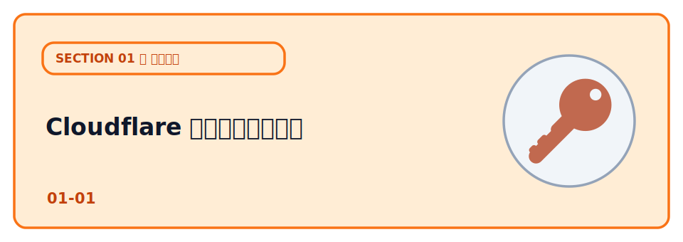
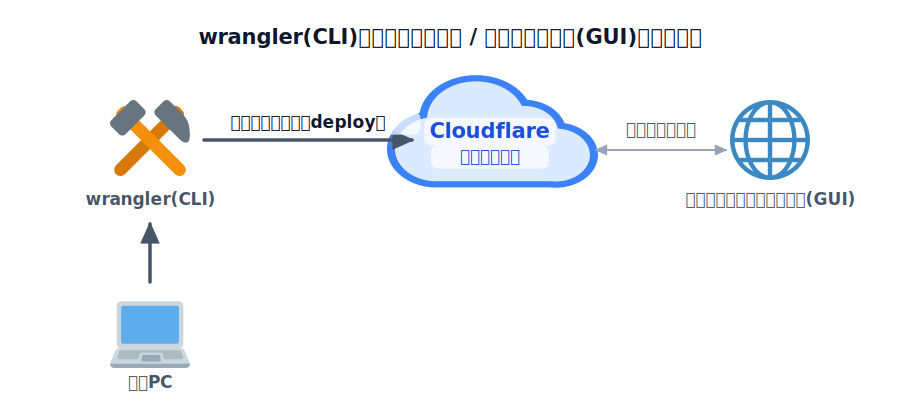

# Cloudflare アカウントを作る



Web サイトを公開する最初の一歩として、公開先となる **Cloudflare アカウント** を作り、CLI（wrangler）から
操作できる状態にします。ここが整えば、あとはコマンドひとつでインターネットに公開できるようになります。

このレクチャーにはコードはありません。アカウントとCLIの準備だけを行います。

## TODO

1. Cloudflare の無料アカウントを作り、メール認証を済ませる
2. wrangler でログインし、自分のアカウントが選ばれていることを確認する

## 学ぶこと

- Cloudflare のアカウントの作成方法
- wrangler でログインする方法

## 説明

### TODO 1: アカウントを作る

1. [https://dash.cloudflare.com/sign-up](https://dash.cloudflare.com/sign-up) を開く
2. **メールの送受信ができるアドレス**（Google アカウントのメールなど）とパスワードを入力して登録
3. 届いた確認メールのリンクを踏んで、メールアドレスを認証する

無料プランの利用だけならクレジットカードの登録は不要です。R2（ストレージ）など一部の機能では、無料枠の範囲でも支払い方法の登録を求められることがあります。

ログインすると [ダッシュボード](https://dash.cloudflare.com/) が開きます。ここで、これから作るPages / Workers / D1 などのリソースを一覧・確認できます。

### TODO 2: wrangler でログインする

ターミナルで以下を実行します（Node.js のセットアップが済んでいる前提。まだの人は
[Node.js のセットアップ](../../00-environment/01-node/LECTURE.md) を先に）。

```bash
npx wrangler login
```

ブラウザが開くので、Cloudflare にログインして「Authorize」を選びます。ターミナルに戻って成功メッセージが出ればOKです。

ログイン中のアカウントを確認します。

```bash
npx wrangler whoami
```

表示された Account が、これから使いたいアカウントであることを確認してください。

**複数の Cloudflare アカウントを持っている場合**は特に注意。`whoami` の表示が意図したアカウントでないと、別のアカウントにアプリを公開してしまいます。違う場合は `npx wrangler logout` してから入り直します。

## コラム

### Cloudflare とは

Cloudflare は、もともと CDN（コンテンツ配信網） や Web サイトを攻撃から守るセキュリティサービス を提供する会社として広く知られるようになりました。世界中に配置されたサーバーを利用して、コンテンツを高速に配信したり、DDoS 攻撃などから Web サイトを保護したりできます。

その後、サービスの幅を広げ、現在では Web サイトや Web アプリを開発・公開・運用するためのクラウドプラットフォーム として多くの機能を提供しています。このハンズオンで利用する主なサービスは次のとおりです。

- **Pages** … フロントエンド（画面）を公開する
- **Workers** … API やサーバー側の処理を動かす
- **D1** … データベースを利用する

これらはいずれも 無料で利用できる範囲 が用意されているため、初めての人でも気軽に試せます。まずは小さく作って公開し、必要に応じて規模を広げていける点も Cloudflare の大きな魅力です。

### CLI で操作する

CLI（Command Line Interface）は、ボタンやアイコンではなく**文字のコマンドでコンピュータを操作する**方法です。`wrangler login` のように、やりたいことを単語で打ち込むとその通りに動きます。マウスで操作する画面（GUI）と違い、手順をそのまま記録・共有・自動化できるのが強みです。

公開やデプロイは「同じ操作を何度も・正確に」繰り返す作業です。CLI ならコマンド一行で再現でき、結果も文字で残るので何が起きたか追いやすい。 **作る・反映するは wrangler（CLI）、状態の確認はダッシュボード（GUI）** と役割を分けると快適に進められます。



*図: 「作る・反映する」は wrangler（CLI）、「状態の確認」はダッシュボード（GUI）。役割を分けて Cloudflare を操作する。*

CLIは Claude Code などのAIエージェントからも操作できるので、AIに「このアプリをデプロイして」とお願いすることも可能です。

## 理解度チェック

この章の内容を◯✕で確認しましょう。全3問、最後に何問正解だったかが出ます。

:::questions
- Cloudflare を使うために必ずクレジットカードの登録が必要になる [x]
- `npx wrangler whoami` で、いまログインしているアカウントを確認できる [o]
- AI エージェントは CLI を使うことはできない [x]
:::

## 次の章へ

アカウントの準備ができたら、次は [Pages でフロントを公開する](../02-pages/LECTURE.md) に進みます。
まずは「見た目（フロント）」だけをインターネットに公開してみましょう。
