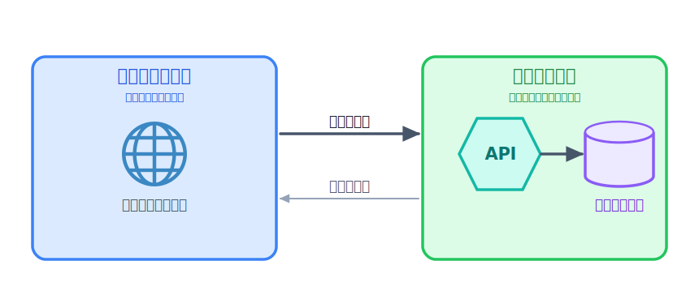

# Pages でフロントを公開する


アプリの公開で最初にやることは、多くの場合「画面（フロント）を見られる状態にする」ことです。
ここでは「ひとことボード」の HTML / CSS を **Cloudflare Pages** に公開し、世界中からアクセスできる URL を手に入れます。

Cloudflare Pages は、HTML・CSS・画像のような **静的ファイルをそのまま配信** するサービスです。
サーバーの管理は不要で、無料枠でも帯域は実質無制限。AI に作らせたランディングページや、フロントエンドフレームワーク（React など）のビルド結果を置く先として最適です。

## TODO

1. ローカルで動作確認をする
2. Cloudflare Pages に公開して、`*.pages.dev` の URL でアクセスできることを確認する
3. ファイルを直して再デプロイし、変更が反映されることを確認する
4. 不要になったプロジェクトをダッシュボード（画面）から削除する

## 学ぶこと

- 静的サイトのホスティングとは何か（サーバー管理なしで HTML を配信する）
- `wrangler pages dev` でローカル確認 → `wrangler pages deploy` で公開、という基本の流れ
- 「フロントだけでは保存ができない」こと。動的な処理（投稿の保存）には次章の API が要る、という
  役割分担

## 説明

### はじめに: プロジェクトを用意する

このレクチャーのサンプルを ZIP で配布しています。次の手順で手元に用意してください。

1. 下の「サンプルコードをダウンロード」ボタンからプロジェクト ZIP をダウンロードする
2. ダウンロードした ZIP を解凍する（展開すると `02-pages` フォルダができます）
3. その `02-pages` フォルダを VSCode で開く（File → Open Folder、またはフォルダをドラッグ&ドロップ）
4. VSCode で[ターミナルを開く](../../00-environment/01-tools/LECTURE.md)。以降のコマンドは、この開いたフォルダ（`02-pages`）の中で実行します。

:::download
[サンプルコードをダウンロード](./project.zip)
:::

### TODO 1: ローカルで確認する

まず、依存をインストールします。

```bash
npm ci
```

続けて、同じフォルダのままローカルプレビューを起動します。

```bash
npx wrangler pages dev ./public
```

`http://localhost:8788`（ポートは変わることがあります）が表示されます。
ブラウザで開くと「ひとことボード」が表示されます。投稿フォームに入力して送信すると、一覧に追加され、リロードしても残ります。

ただしこの保存先は **あなたのブラウザの中（localStorage）だけ** で、他の人や別の端末とは共有されません。みんなで共有できる保存は、次章以降で API とデータベースをつなぐと動くようになります。

中身は [public/index.html](./public/index.html)（見た目）と [public/main.js](./public/main.js)（投稿の保存・表示）です。

HTML と JavaScript で、スタイルは Bootstrap（CDN）を読み込んで当てています。

### TODO 2: Cloudflare Pages に公開する

引き続き `02-pages` フォルダで作業します。`npx wrangler pages dev` を起動したままなら、`Ctrl + C` で
止めてから（または別のターミナルを同じフォルダで開いて）進めてください。

:::notice
VSCode でこのフォルダを開いていれば、新しく開いたターミナルもこのフォルダの中から始まります。`pwd`（Windows は `cd`）で末尾が `.../02-pages` になっていることを確認しておきましょう。
:::

まず、ログインしているか確認します（まだなら [前の章](../01-account/LECTURE.md) を参照）。

```bash
npx wrangler whoami
```

#### まずは設定なしで公開してみる

Pages に公開するとき、wrangler が最低限知りたいのは次の **2 つだけ** です。

- **どのフォルダを公開するか** … 今回は静的ファイルの入った `./public`
- **Cloudflare 上でのプロジェクト名** … 公開 URL（`https://<name>.pages.dev`）になる名前

まずはこの 2 つを設定ファイルなしで、コマンドと対話で渡してみます。公開フォルダは引数で指定します。

```bash
% npx wrangler pages deploy ./public

 ⛅️ wrangler 4.112.0
────────────────────
✔ The project you specified does not exist: "hitokoto-<name>-02-pages". Would you like to create it? › Create a new project
✔ Enter the production branch name: … main
✨ Successfully created the 'hitokoto-<name>-02-pages' project.
✨ Success! Uploaded 2 files (2.36 sec)

🌎 Deploying...
✨ Deployment complete! Take a peek over at https://4855e81e.hitokoto-<name>-02-pages.pages.dev
```

初めて実行すると、wrangler が対話で質問してきます。

1. **プロジェクトを選ぶ / 新規作成** → 新規作成を選ぶ
2. **プロジェクト名** → 他の人と重複しない名前を入力（例: `hitokoto-tanaka-02-pages`）。これが公開 URL になる
3. **本番ブランチ名** → 聞かれたら `main` でOK

つまり「**公開フォルダ（引数）**」と「**プロジェクト名（対話）**」の 2 つを渡します。

しばらくすると公開 URL（`https://<name>.pages.dev`）が表示されます。ブラウザで開いて、さっきと同じ画面がインターネット上に出ていれば成功です。

スマホからも開いてみましょう。


*図: ローカルの `./public` を Pages にアップロード（Direct Upload）すると、`<name>.pages.dev` で配信される。*

:::notice
毎回フォルダの指定やプロジェクト名の入力をするのが面倒な場合は、これらを設定ファイルにまとめておけます。詳しくは [設定ファイル `wrangler.jsonc` とは](#設定ファイル-wranglerjsonc-とは) を参照してください。
:::

### TODO 3: 直して再デプロイする

[public/index.html](./public/index.html) の見出しやサンプルのひとことを書き換えて、`02-pages`
フォルダでもう一度デプロイしてみましょう。`./public` を指定し、プロジェクトは **さっき作ったもの**　を選んでください。数十秒で URL の内容が更新されます。

たとえば [public/index.html](./public/index.html) の `<header>` の見出しと説明文（11〜12 行目あたり）を、次のように書き換えてみます。

変更前:

```html
<h1 class="h3 mb-1">💬 ひとことボード</h1>
<p class="text-secondary mb-0">みんなが残した「ひとこと」が並ぶ、小さな掲示板です。</p>
```

変更後:

```html
<h1 class="h3 mb-1">🎉 わたしのひとことボード</h1>
<p class="text-secondary mb-0">はじめての Cloudflare Pages で公開してみました！</p>
```

ファイルを保存したら、もう一度デプロイします。

```bash
npx wrangler pages deploy ./public
```

このように Pages は「静的ファイルを置くと URL で配信される」シンプルな仕組みです。

### TODO 4: 公開したものを削除する（ダッシュボード）

公開したプロジェクトは、不要になったら削除できます。削除すると `https://<name>.pages.dev` の URL も
表示されなくなります。ここでは **ダッシュボード（画面）から** 削除します。今どんなプロジェクトがあるかを
一覧で見ながら操作できるので、最初の削除にはこちらが分かりやすいです。

:::danger
削除は元に戻せません。消すのは「このハンズオンで作った練習用プロジェクト」だけにしてください。
名前（`<name>`）をよく確認してから実行しましょう。
:::

1. [Cloudflare ダッシュボード](https://dash.cloudflare.com/) を開く
2. 左メニューの **Compute (Workers)** → **Workers & Pages** を開く
3. 一覧から今回作ったプロジェクト（`hitokoto-あなたの名前-02-pages`）を選ぶ
4. **Settings（設定）** タブを開き、一番下までスクロール
5. **Delete project（プロジェクトを削除）** を押す。確認のためプロジェクト名の入力を求められるので、同じ名前を入力して削除を確定する

:::notice
削除には、この **ダッシュボード（画面）** からの方法のほかに、**CLI（コマンド）** から消す方法もあります。
コマンドでの削除は、次章 [Workers で API を動かす](../../03-build-app/01-workers/LECTURE.md) で扱います。
以降の章では、この 2 つのうちやりやすい方で削除していきます。
:::

## コラム

### フロントエンドとバックエンド



フロントエンドとは、ユーザーが直接触れる部分のことです。ブラウザで表示される画面や、スマホアプリの見た目・操作部分がこれにあたります。
バックエンドとは、ユーザーが直接触れない部分で、データの保存や処理を行うサーバー側のことです。API やデータベースの操作などがこれに含まれます。

例えば、HTMLやCSSで作られた「ひとことボード」の画面はフロントエンドです。ユーザーが投稿ボタンを押すと、バックエンドの API が呼ばれてデータベースに保存されます。フロントエンドは見た目や操作性を提供し、バックエンドはデータの管理や処理を担当します。


<!-- genfig: 左「フロントエンド=ブラウザ(🌐)」右「バックエンド=API(六角形)＋データベース(シリンダー)」を CONTAINER で囲み、往路「リクエスト」濃い矢印・復路「レスポンス」薄い矢印で結ぶ。イメージスキーマ = CONTAINER + SOURCE-PATH-GOAL + CYCLE。build: genfig/scratch_frontend_backend.py -->
*図: フロントエンド（見た目・操作）が「リクエスト」を送り、バックエンド（API・データベース）が処理して「レスポンス」を返す。*

### Cloudflare Pages に向いているものは

ホームページやブログのような、**静的ファイルだけで完結するサイト**は Pages に向いています。HTML・CSS・画像などを置くだけで公開でき、サーバーの管理も不要です。

QRコードの生成やBMIの計算、テトリスのようなゲームなどの**簡単なツール**も、フロントだけで作れる場合は Pages で公開できます。ユーザーが入力した値を計算して結果を表示するだけなら、バックエンドは不要です。

### 設定ファイル `wrangler.jsonc` とは

公開のたびに引数や対話で渡していた情報を **保存しておく** のが `wrangler.jsonc` です。`02-pages` フォルダ直下に次の内容で作成します（`name` は自分のプロジェクト名に合わせます）。

```jsonc
{
  "name": "hitokoto-{あなたの名前}-02-pages",
  "pages_build_output_dir": "./public"
}
```

あなたの名前が `tanaka` なら、次のように変更します

```jsonc
{
  "name": "hitokoto-tanaka-02-pages",
  "pages_build_output_dir": "./public"
}
```

`name` は **対話で答えたプロジェクト名**、`pages_build_output_dir` は **引数で渡した公開フォルダ** が、そのまま入っています。

<!-- genfig: 左「プロジェクト名（対話）」「公開フォルダ（引数）」→ 右 wrangler.jsonc の "name" / "pages_build_output_dir"（平行四辺形）へ LINK で対応づける。ラベル「そのまま」。build: genfig/scratch_02_args_to_config.py -->


設定ファイルがあれば、次回からは **引数も対話もなしで** コマンド一発で公開できます。

```bash
npx wrangler pages deploy
```

### npm scripts でコマンドを短くする

よく使うコマンドは [package.json](./package.json) の `scripts` に登録しておくと、短い名前で呼べます。

```jsonc
{
  "scripts": {
    "dev": "wrangler pages dev ./public",
    "deploy": "wrangler pages deploy ./public"
  }
}
```

```bash
npm run dev
npm run deploy
```

## 次の章へ

フロントが公開できたら、次は [ウェブアプリの基本](../03-webapp/LECTURE.md) で、
ウェブアプリがどんな部品でできているかを整理してから、アプリ作りに進みます。
