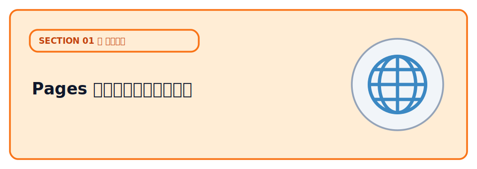
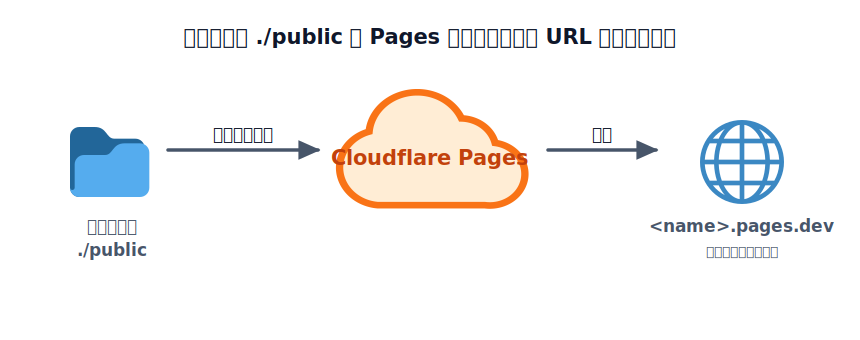
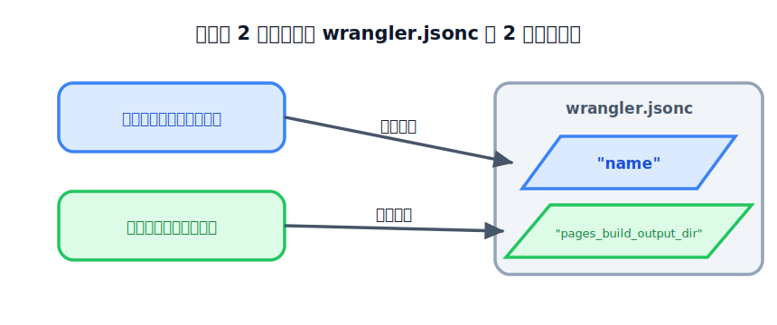

# Pages でフロントを公開する



アプリの公開で最初にやることは、多くの場合「画面（フロント）を見られる状態にする」ことです。
ここでは「ひとことボード」の HTML / CSS を **Cloudflare Pages** に公開し、世界中からアクセスできる URL を手に入れます。

Cloudflare Pages は、HTML・CSS・画像のような **静的ファイルをそのまま配信** するサービスです。
サーバーの管理は不要で、無料枠でも帯域は実質無制限。AI に作らせたランディングページや、フロントエンドフレームワーク（React など）のビルド結果を置く先として最適です。

## TODO

1. ローカルで動作確認をする
2. Cloudflare Pages に公開して、`*.pages.dev` の URL でアクセスできることを確認する
3. ファイルを直して再デプロイし、変更が反映されることを確認する
4. 不要になったプロジェクトを削除する（画面 / コマンドの両方）

## 学ぶこと

- 静的サイトのホスティングとは何か（サーバー管理なしで HTML を配信する）
- `wrangler pages dev` でローカル確認 → `wrangler pages deploy` で公開、という基本の流れ
- 「フロントだけでは保存ができない」こと。動的な処理（投稿の保存）には次章の API が要る、という
  役割分担

## 説明

### TODO 1: ローカルで確認する

このレクチャーのコマンドは、すべて **`sections/01-publish/02-pages/` フォルダの中** で実行します。

:::notice
まだリポジトリを手元に用意していない場合は、先に [リポジトリを入手する](../../00-environment/03-repository/LECTURE.md) で
`git clone` か ZIP ダウンロードでフォルダを取得し、VSCode で開いておいてください。
:::

まず、リポジトリのルート（`cloudflare-introduction-handson/`）からこのフォルダへ移動し、依存をインストールします。

```bash
cd sections/01-publish/02-pages
npm install
```

:::notice
VSCode で開いている場合は、　``Ctrl + ` ``　（バッククォート）でターミナルを開くとリポジトリのルートにいることが多いです。`pwd`（Windows は `cd`）で今いる場所を確認できます。
:::

同じ `02-pages` フォルダのまま、ローカルプレビューを起動します。

```bash
npx wrangler pages dev ./public
```

`http://localhost:8788`（ポートは変わることがあります）が表示されます。
ブラウザで開くと「ひとことボード」が表示されます。投稿フォームに入力して送信すると、一覧に追加され、リロードしても残ります。

ただしこの保存先は **あなたのブラウザの中（localStorage）だけ** で、他の人や別の端末とは共有されません。みんなで共有できる保存は、次章以降で API とデータベースをつなぐと動くようになります。

中身は [public/index.html](./public/index.html)（見た目）と [public/main.js](./public/main.js)（投稿の保存・表示）です。

HTML と JavaScript で、スタイルは Bootstrap（CDN）を読み込んで当てています。

### TODO 2: Cloudflare Pages に公開する

引き続き `02-pages` フォルダで作業します。`npx wrangler pages dev` を起動したままなら、`Ctrl + C` で
止めてから（または別のターミナルを同じフォルダで開いて）進めてください。まず、ログインしているか確認します
（まだなら [前の章](../01-account/LECTURE.md) を参照）。

```bash
npx wrangler whoami
```

#### まずは設定なしで公開してみる

Pages に公開するとき、wrangler が最低限知りたいのは次の **2 つだけ** です。

- **どのフォルダを公開するか** … 今回は静的ファイルの入った `./public`
- **Cloudflare 上でのプロジェクト名** … 公開 URL（`https://<name>.pages.dev`）になる名前

まずはこの 2 つを設定ファイルなしで、コマンドと対話で渡してみます。公開フォルダは引数で指定します。

```bash
npx wrangler pages deploy ./public
```

初めて実行すると、wrangler が対話で質問してきます。

1. **プロジェクトを選ぶ / 新規作成** → 新規作成を選ぶ
2. **プロジェクト名** → 他の人と重複しない名前を入力（例: `hitokoto-tanaka-02-pages`）。これが公開 URL になる
3. **本番ブランチ名** → 聞かれたら `main` でOK

つまり「**公開フォルダ（引数）**」と「**プロジェクト名（対話）**」の 2 つを渡しただけです。しばらくすると
公開 URL（`https://<name>.pages.dev`）が表示されます。ブラウザで開いて、さっきと同じ画面がインターネット
上に出ていれば成功です。スマホからも開いてみましょう。



<!-- genfig: 左に「ローカル(💻)」、その中に公開フォルダ「./public(📁)」を内包(CONTAINER)。中央のクラウド「Cloudflare Pages(☁️)」へ向けて connector を引き、ラベルは「wrangler pages deploy（アップロード）」。右に成果物としての公開 URL「<name>.pages.dev(🌐)」を置き、Pages から connector で結びラベル「配信」。左→中→右の一方向フロー。イメージスキーマ = SOURCE-PATH-GOAL + CONTAINER。絵文字割当: ローカル=💻 / 公開フォルダ=📁 / Cloudflare Pages=☁️ / 公開URL=🌐。 -->
*図: ローカルの `./public` を Pages にアップロード（Direct Upload）すると、`<name>.pages.dev` で配信される。*

:::notice
毎回フォルダの指定やプロジェクト名の入力をするのが面倒な場合は、これらを設定ファイルにまとめておけます。詳しくは [設定ファイル `wrangler.jsonc` とは](#設定ファイル-wranglerjsonc-とは) を参照してください。
:::

### TODO 3: 直して再デプロイする

[public/index.html](./public/index.html) の見出しやサンプルのひとことを書き換えて、`02-pages`
フォルダでもう一度デプロイしてみましょう。`./public` を指定し、プロジェクトは **さっき作ったものを選ぶ**
だけです。数十秒で URL の内容が更新されます。

```bash
npx wrangler pages deploy ./public
```

このように Pages は「静的ファイルを置くと URL で配信される」シンプルな仕組みです。

### TODO 4: 公開したものを削除する

公開したプロジェクトは、不要になったら削除できます。削除すると `https://<name>.pages.dev` の URL も
表示されなくなります。削除の方法は **ダッシュボード（画面）から** と **CLI（コマンド）から** の 2 通りが
あります。どちらでも結果は同じなので、やりやすい方で構いません。

:::danger
削除は元に戻せません。消すのは「このハンズオンで作った練習用プロジェクト」だけにしてください。
名前（`<name>`）をよく確認してから実行しましょう。
:::

#### 方法 A: ダッシュボード（画面）から削除する

1. [Cloudflare ダッシュボード](https://dash.cloudflare.com/) を開く
2. 左メニューの **Compute (Workers)** → **Workers & Pages** を開く
3. 一覧から今回作ったプロジェクト（`hitokoto-あなたの名前-02-pages`）を選ぶ
4. **Settings（設定）** タブを開き、一番下までスクロール
5. **Delete project（プロジェクトを削除）** を押す。確認のためプロジェクト名の入力を求められるので、
   同じ名前を入力して削除を確定する

画面から消すと「今どんなプロジェクトがあるか」を一覧で見ながら操作できるので、最初はこちらが
分かりやすいです。

#### 方法 B: CLI（コマンド）から削除する

コマンドでも削除できます。まず、自分のアカウントにあるプロジェクトの一覧を確認します。

```bash
npx wrangler pages project list
```

表示された中から削除したいプロジェクト名を確認し、名前を指定して削除します。

```bash
npx wrangler pages project delete hitokoto-あなたの名前-02-pages
```

確認のメッセージが出るので `y` で進めます（`--yes` を付けると確認を省略できますが、消し間違いを防ぐため
最初は付けずに 1 つずつ確認するのがおすすめです）。

```bash
# 確認を省略して一気に消す場合（取り扱い注意）
npx wrangler pages project delete hitokoto-あなたの名前-02-pages --yes
```

削除後にもう一度 `npx wrangler pages project list` を実行し、一覧から消えていれば完了です。

## コラム

### フロントエンドとバックエンド

フロントエンドとは、ユーザーが直接触れる部分のことです。ブラウザで表示される画面や、スマホアプリの見た目・操作部分がこれにあたります。
バックエンドとは、ユーザーが直接触れない部分で、データの保存や処理を行うサーバー側のことです。API やデータベースの操作などがこれに含まれます。

例えば、HTMLやCSSで作られた「ひとことボード」の画面はフロントエンドです。ユーザーが投稿ボタンを押すと、バックエンドの API が呼ばれてデータベースに保存されます。フロントエンドは見た目や操作性を提供し、バックエンドはデータの管理や処理を担当します。


### Cloudflare Pages に向いているものは

ホームページやブログのような、**静的ファイルだけで完結するサイト**は Pages に向いています。HTML・CSS・画像などを置くだけで公開でき、サーバーの管理も不要です。

QRコードの生成やBMIの計算、テトリスのようなゲームなどの**簡単なツール**も、フロントだけで作れる場合は Pages で公開できます。ユーザーが入力した値を計算して結果を表示するだけなら、バックエンドは不要です。

### 設定ファイル `wrangler.jsonc` とは

TODO 2 では、公開のたびに「公開フォルダ（`./public`）」を引数で渡し、「プロジェクト名」を対話で
入力しました。この **毎回必要な情報を保存しておく** のが `wrangler.jsonc` という設定ファイルです。

`02-pages` フォルダの直下に、次の内容で `wrangler.jsonc` を作成します（`name` は自分が作った
プロジェクト名に合わせます）。

```jsonc
{
  // wrangler.jsonc は JSONC（コメントが書ける JSON）です
  // Cloudflare 上のプロジェクト名。公開 URL は https://<name>.pages.dev になります
  "name": "hitokoto-あなたの名前-02-pages",
  // 公開する静的ファイルのフォルダ
  "pages_build_output_dir": "./public"
}
```

見比べると分かるとおり、`name` と `pages_build_output_dir` は、さっき **対話で答えた「プロジェクト名」と
引数で渡した「公開フォルダ」がそのまま入っている** だけです。これが Pages デプロイの基本構造です。



<!-- genfig: 左列にデプロイ時に渡した2つの値「プロジェクト名（対話）」「公開フォルダ ./public（引数）」を上下に並べる。右列に設定ファイル「wrangler.jsonc(📜)」を CONTAINER として描き、その中に「name」「pages_build_output_dir」の2行を入れる。左の各項目から右の対応する行へ水平 connector を引き、上の connector ラベル「= name」、下の connector ラベル「= pages_build_output_dir」。左→右の対応マッピング。イメージスキーマ = PART-WHOLE + BALANCE（左右対応）。絵文字割当: 設定ファイル=📜 / 公開フォルダ=📁。 -->
*図: デプロイ時に渡した「プロジェクト名」と「公開フォルダ」が、そのまま `wrangler.jsonc` の 2 項目に対応する。*

設定ファイルがあると、wrangler はそこから 2 つの情報を読み取るので、次回からは **引数も対話もなしで**
コマンド一発で公開できます。

```bash
npx wrangler pages deploy
```

「アプリを作る」セクション（Workers / D1）のレクチャーでは、各章に用意した `wrangler.example.jsonc` を
`wrangler.jsonc` にコピーし、`name` を自分用に書き換えてから公開していきます。

### npm scripts でコマンドを短くする

このレクチャーでは `npx wrangler pages dev ./public` のように **そのままのコマンド** を打ってきました。
よく使うコマンドは [package.json](./package.json) の `scripts` に名前を付けて登録しておくと、短い名前で
呼べます。

```jsonc
{
  "scripts": {
    "dev": "wrangler pages dev ./public",       // npm run dev
    "deploy": "wrangler pages deploy ./public"  // npm run deploy
  }
}
```

```bash
npm run dev      # = npx wrangler pages dev ./public
npm run deploy   # = npx wrangler pages deploy ./public
```

このフォルダの `package.json` には最初からこの scripts が入っているので、`npm run dev` のように呼んでも
同じことが動きます。本ハンズオンでは中で何が動くかを見せるため、レクチャー本文ではあえて
`npx wrangler ...` の形で書いています。

## 次の章へ

フロントが公開できたら、次は [ウェブアプリの基本](../03-webapp/LECTURE.md) で、
ウェブアプリがどんな部品でできているかを整理してから、アプリ作りに進みます。
