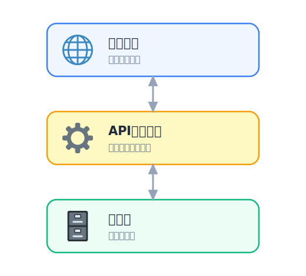

# ウェブアプリの基本

前のセクションでは、HTML を **Pages** に置いて「静的なサイト」を公開しました。表示はできますが、投稿を
受け取って保存したり、保存した内容を一覧で返したりはできません。

今回のハンズオンでは、こうした **処理とデータ** を持つものを「ウェブアプリ」と呼ぶことにします。

次のセクションから実際にウェブアプリを作っていきます。
その前に、ウェブアプリがどんな部品でできているかを整理しておきましょう。

## 学ぶこと

- 静的サイトと **ウェブアプリ** の違い
- **クライアントとサーバー**、HTTP の「リクエストとレスポンス」
- アプリを支える **3 つの層**（フロント / API / データ）

## 静的サイトとウェブアプリ

**静的サイト** は、あらかじめ用意したファイル（HTML・CSS・画像）をそのまま返すだけのものです。
誰が見ても同じ内容で、前のセクションで公開したフロントもこれにあたります。

**ウェブアプリ** は、利用者の操作に応じて中身が変わります。
「ひとことボード」なら、投稿を受け取って保存し、次に開いたときには保存済みの一覧を返します。
これには **その場で動くプログラム** と、**データをためておく場所** が必要です。

## クライアントとサーバー

ウェブの通信は、おおまかに **2 人の登場人物** のやり取りです。

- **クライアント**：利用者の手元（ブラウザ）。「一覧をください」「これを投稿します」と **要求** を出す側。
- **サーバー**：要求を受けて処理し、返答する側。

この「要求＝ **リクエスト**」が、その「返事＝ **レスポンス**」です。


<!-- genfig: ブラウザ(🌐)とサーバー(🖥️)を左右に置き、往路「リクエスト」を濃い矢印・復路「レスポンス」を薄い矢印で結ぶ往復図。イメージスキーマ = SOURCE-PATH-GOAL + CYCLE。 -->
*図: ブラウザ（クライアント）が「お願い（リクエスト）」を出し、サーバーが「返事（レスポンス）」を返す。*

この通信のルールが **HTTP** で、やり取りするデータの形式にはよく **JSON**が使われます。

**JSON の例**

```json
{
  "name": "Alice",
  "message": "Hello, world!"
}
```

クライアント側で動くプログラムは利用者が容易に変更できます。これはセキュリティの考え方にとって重要です。


## アプリを支える3つの層

ウェブアプリの構造を簡単に３つに分けて理解してみましょう。



<!-- genfig: 上から「フロント=Pages(🌐)」「API=Workers(⚙️)」「データ=D1(🗄️)/R2(📦)」を縦に積んだ3層図。各層を上下の矢印でつなぐ。イメージスキーマ = VERTICALITY + PART-WHOLE。 -->
*図: ウェブアプリを支える3つの層と、Cloudflare での対応。*

### 掲示板を例に考える

ユーザーが自分の名前と内容、画像を投稿できる掲示板を例に考えます。投稿の受け取り・保存・一覧返却の処理は、3つの層で分担します。

| 層 | 役割 | 掲示板では |
|---|---|---|
| **フロント** | 見た目・入力。ブラウザで動く | 投稿フォームと一覧の表示 |
| **API（処理）** | リクエストを受けて処理する | 投稿の受け取り・一覧の返却 |
| **データ** | 処理が終わっても残す | 投稿の本文や画像 |

## 代表的なデータ

代表的なデータに次の 2 種類があります。どちらも「投稿」に必要な情報ですが、保存の仕方が違います。

- **構造化データ**（名前・本文・日時のような表で扱える情報）→ データベース（**D1**）
- **ファイル**（画像・PDF・動画のようなまとまり）→ オブジェクトストレージ（**R2**）


<!-- genfig: 中央に投稿(📝)、そこから2方向に分岐。左「構造化データ(📊)→D1(🗄️)」右「ファイル(🖼️)→R2(📦)」。イメージスキーマ = SPLITTING + CONTAINER。 -->
*図: 投稿のデータは、種類によって D1 と R2 に振り分けて保存する。*

「ひとことボード」では、投稿の本文を D1 に、添付画像を R2 に分けて保存します。この使い分けも、後の章で手を動かして確かめます。

## まとめ

- ウェブアプリ＝**処理（API）＋データ** を持つサイト。静的サイトとはここが違う
- 通信は **リクエストとレスポンス**。フロントのチェックは迂回できるので、確認は **サーバー側でも**
- アプリは **フロント（Pages）/ API（Workers）/ データ（D1・R2）** の層でできている

## 次の章へ

仕組みのイメージができたら、アプリを作る前に土台を固めます。次は
[セキュリティの3要素](../../02-security/01-basic/LECTURE.md) で、公開・運用するときに
押さえておきたい考え方を確認します。
