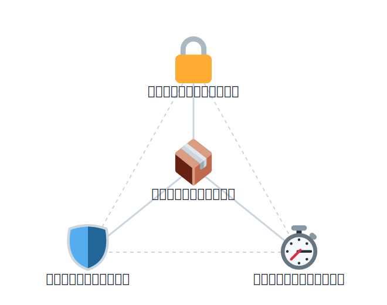
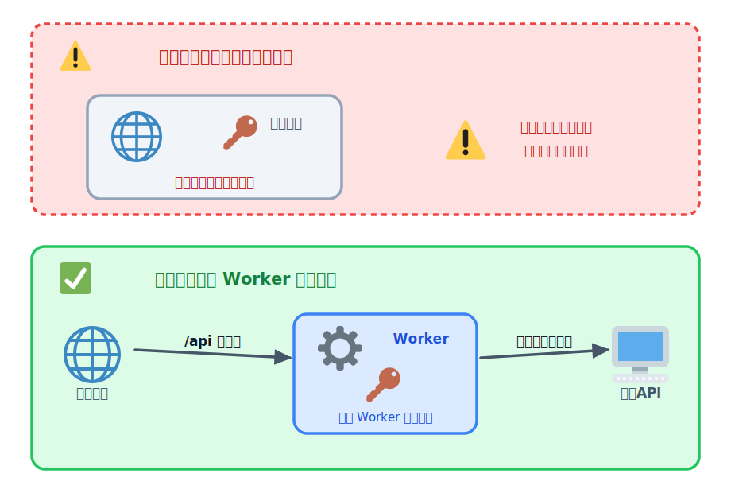
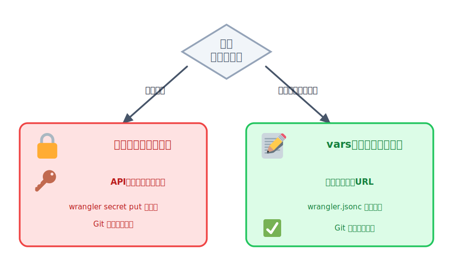
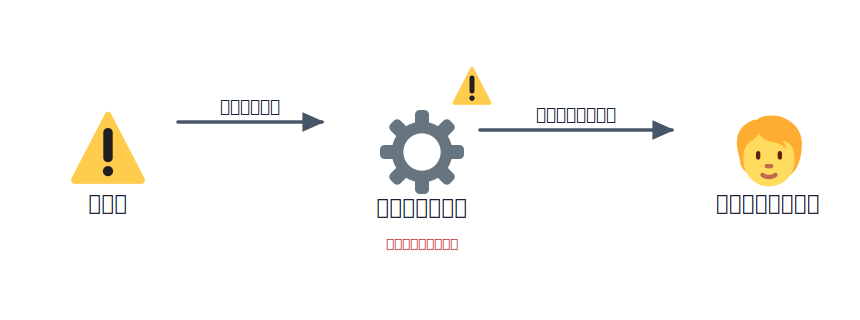
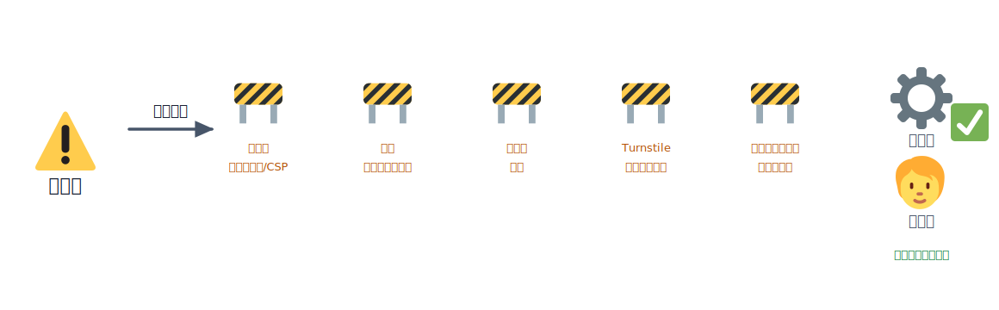

# セキュリティの3要素（可用性・機密性・完全性）

アプリをインターネットに公開するということは、**世界中の誰でもあなたのアプリにアクセスできる**ように
なる、ということです。そこには善意の利用者だけでなく、シークレットを盗もうとする人、あなたのアプリを
悪用しようとする人、大量のアクセスでサービスを止めようとする人もいます。

「何をどう守ればいいのか」は、やみくもに考えると際限がありません。そこで役立つのが、セキュリティを
**3つの要素**に分けて捉える古典的な枠組みです。この章では、その3要素を
公開したアプリにあてはめながら、アプリを守るための考え方を読み物として整理します。コードは書きませんが、
考え方と、後の章で実際に手を動かすポイントはここで押さえます。

## 学ぶこと

- セキュリティは「可用性・機密性・完全性（CIA）」の3要素で捉えると整理しやすいこと
- **機密性**：秘密（API キー等）は見える場所に置かず、サーバー側に閉じ込めること
- **完全性**：投稿を勝手に書き換えさせない・踏み台にさせないこと（保存型 XSS・スパム対策）
- **可用性**：止まっても戻せる（バックアップ）・気づける（監視）ようにしておくこと
- 3要素はトレードオフし、すべてを最大化はできないこと
- これらの対策の多くは、後の 03-build-app のレクチャーで実際に手を動かすこと

## 説明

### セキュリティを「3要素」で捉える（CIA とは）

情報セキュリティでは、守るべきものを次の3つの性質に分けて考えます。頭文字を取って **CIA** と呼びます。

| 要素 | 英語 | ひとことで言うと | 崩れると何が起きるか |
| --- | --- | --- | --- |
| **機密性** | Confidentiality | 見てよい人だけが見られる | 秘密の値・個人情報が漏れる |
| **完全性** | Integrity | 中身が正しく保たれる | データが勝手に書き換えられる・踏み台にされる |
| **可用性** | Availability | 使いたいときに使える | サービスが止まる・データが消える |

大切なのは、**この3つはどれか1つだけでは足りない**ということです。秘密を厳重に守っても（機密性）、
データが書き換えられたら（完全性）意味がありませんし、そもそもサービスが止まっていたら（可用性）
使えません。3つの角度から自分のアプリを点検する、そのための枠組みが CIA です。

<!-- genfig: 中央に「守りたいもの（あなたのアプリ／データ）」を置き、それを3方向から囲む三角形の頂点として「機密性🔒（見てよい人だけ）」「完全性🛡️（中身が正しい）」「可用性⏱️（いつでも使える）」を配置する。3つが揃ってはじめてアプリが守られる、という三点支持の構図。中央から各頂点へ支える線を引く。絵文字割当: 機密性/鍵=🔒(1f512)、完全性/盾=🛡️(1f6e1)、可用性/時間=⏱️(23f1)、中央のアプリ=📦(1f4e6)。イメージスキーマ = CENTER-PERIPHERY（守る対象を3要素が囲む）+ BALANCE（3点で支える三角形）。 -->

*図: セキュリティは「機密性・完全性・可用性」の3点で支える。どれか1つが欠けても守れない。*

以下、この3要素を公開したアプリに順にあてはめていきます。

### 機密性：秘密は見える場所に置かない

**機密性**は「見てよい人だけが見られる」ことです。アプリを運用しはじめると、外部サービスの API キーやトークン、データベースのパスワードなど、人に見せてはいけない**秘匿情報（シークレット）**を扱う場面が出てきます。

これらは「あなたであることの証明書」であり、持っている人はあなたとして外部サービスを呼び出せます。

一度漏れると、不正利用や高額請求につながり、しかもインターネットや GitHub に公開された値は「なかったこと」にできません。

#### 秘密は必ずサーバー（Worker）側に置く

特に多い事故が、**公開されるフロント側にシークレットを書いてしまう**ことです。

`index.html` やそこから読み込まれる JavaScript は、ブラウザに丸ごとダウンロードされます。

つまり**誰でも開発者ツールやソース表示で中身を読めます**。ここに API キーを書くのは、世界中に公開したのと同じです。

正しくは、シークレットを使った外部 API 呼び出しは**必ずサーバー（Worker）側で行い**、フロントは自分のWorker（API）だけを呼ぶ構成にします。

フロントは自分の `/api/...` を叩くだけにして、外部サービスの鍵は Worker の中だけに留めます。


*図: 鍵をフロントに置くと丸見え（上）。鍵は Worker の中だけに閉じ込め、外部 API は Worker から呼ぶ（下）。*

#### 暗号化シークレットと公開してよい設定値

Cloudflare Workers では、Worker に値を渡す方法が大きく2つあります。秘密にすべきかどうかで使い分けます。

| 観点 | 暗号化シークレット | 平文の設定値（vars） |
| --- | --- | --- |
| 設定方法 | `npx wrangler secret put NAME`（対話入力） | `wrangler.jsonc` の `vars` に記述 |
| 値の見え方 | ダッシュボードでも値は表示されない（書き換えのみ） | 設定ファイルに平書きされ、Git にも残る |
| 向いている用途 | API キー、トークン、DB パスワードなど | 公開してよい設定（機能フラグ、公開 URL、表示名など） |
| Git に入れてよいか | 値は入れない（コマンドで投入） | 入れてよい（秘密ではない前提） |

秘密にしたい値は必ず暗号化シークレットにします。


*図: 値は「秘密かどうか」で振り分ける。秘密は暗号化シークレット、公開してよい値だけ vars に書く。*

本番のシークレットはコマンドで投入します。このとき**値をコマンドの引数に書かないでください**。
引数に書くとシェルの履歴（`~/.zsh_history` 等）に平文で残ってしまいます。`wrangler secret put NAME` は対話入力（プロンプト）で受け取る設計なので、そのまま貼り付けます。

```bash
npx wrangler secret put EXTERNAL_API_KEY
# 実行するとプロンプトが出るので、そこに値を貼り付ける
```

ローカルで `wrangler dev` を動かすときは、本番のシークレットを使わず、ローカル用の値を `.dev.vars`
ファイル（形式は `.env` と同じ `KEY=VALUE`）に書きます。ここで最重要なのは、**`.dev.vars` を絶対に
Git に入れないこと**です。`.gitignore` に次の行が入っていることを確認します。

```text
.dev.vars
.wrangler/
```

シークレットも `vars` も、Worker のコードからは**環境（env）経由**で参照します（Hono なら
`c.env.EXTERNAL_API_KEY`）。こうしておけば、ローカルでは `.dev.vars` の値、本番では
`wrangler secret put` で入れた値が、コードを変えずに自動で切り替わります。

:::danger
「画面に出していない」＝「隠せている」ではありません。フロントに書いた値は、表示していなくても
まるごとブラウザに届いています。顧客の個人情報・API キー・パスワードをフロントに書いてはいけません。
万一 Git に上げてしまった鍵は、その時点で「漏れたもの」として発行元で**無効化（ローテーション）**します。
:::

### 完全性：勝手に書き換え・踏み台にさせない

**完全性**は「中身が正しく保たれる」ことです。掲示板やコメント欄のように、不特定多数が自由にテキストや
リンクを投稿し、それが他の閲覧者に配信される **UGC（User Generated Content＝ユーザー投稿型）のアプリ**
では、誰でも書き込め、書いた内容がそのまま他人に届きます。この性質は便利な反面、**投稿を通じてアプリの
中身を勝手に書き換えられたり、第三者への攻撃の「踏み台」にされたり**する弱点になります。

#### 「踏み台にされる」とは

「踏み台」とは、攻撃者が自分の正体を隠し、被害を他人に届けるために**間に挟む中継地点**のことです。

攻撃者はあなたのアプリを通り道にして、その先の第三者を攻撃します。

被害を受けるのはあなた自身ではなく、あなたのアプリを経由した先の第三者（別の利用者・外部サイト・検索エンジンなど）で、その「発信元」としてあなたが責任を問われます。


*図: 被害者は「あなた」ではなく、あなたの掲示板を経由した先の「第三者」。アプリが攻撃の中継地点・発信元（踏み台）にされる。*

掲示板が踏み台にされる代表的な手口には、次のようなものがあります。

- **リンクスパム**：フィッシングや詐欺サイトへのリンクを投稿し、あなたのドメインの信頼を借りて配る
- **SEO スパム**：大量のリンクを投稿し、掲示板を攻撃者の「被リンク製造機」にする
- **保存型 XSS**：投稿に `<script>` を紛れ込ませ、表示した他の利用者のブラウザ上で実行させる
- **違法情報・なりすまし・誹謗中傷の発信元**：あなたのサービス名義で第三者に害が届く

> **踏み台にされると自分にも跳ね返る**：被害の直接の相手は第三者ですが、「発信元・管理者」はあなたです。
> ドメイン評価の失墜、ブロックリスト入り、アカウント停止、法的責任など、めぐりめぐって自分の損害になります。

#### 対策は「複数重ねる」

ひとつの対策で完璧にはなりません。守りを複数重ね、「割に合わない標的」にするのが基本です。


*図: 単一の対策ではなく、表示時エスケープ・投稿検証・レート制限・Turnstile・モデレーションを重ねて、踏み台化を「割に合わない」ものにする多層防御。*

- **表示時のエスケープ**：投稿は**データとして表示し、コードとして実行させない**のが鉄則です。表示時に
  HTML を必ずエスケープすれば、`<script>` を投稿されても文字列として表示されるだけで実行されません。
- **サーバー側での投稿バリデーション**：入力チェックは**必ずサーバー（Worker）側で**行います。フロントの
  チェックは攻撃者が API を直接叩けば回避されます。文字数上限・URL 数の制限・空投稿の拒否などを検査します。
  このサーバー側検証や CORS の扱いは、後の [Workers で API を動かす](../../03-build-app/01-workers/LECTURE.md)
  で実際に手を動かします。また、DB に値を渡すときのプレースホルダ（SQL インジェクション対策）は
  [D1 でデータを保存する](../../03-build-app/02-d1/LECTURE.md)、アップロード画像の種類・サイズ制限は
  [R2 で画像を保存する](../../03-build-app/03-r2/LECTURE.md) で扱います。
- **レート制限（Rate Limiting / WAF）**：同じ相手からの短時間の大量投稿を制限します。Cloudflare には
  Rate Limiting Rules や WAF があり、「1分あたり N 回まで」の制限だけでもボットのスパムはかなり抑えられます。
- **Turnstile（人間かボットかの判定）**：投稿フォームに検証を挟むと、ボットによる自動投稿を大きく減らせます。
  具体的な導入は付録の [Turnstile](../../04-appendix/03-turnstile/LECTURE.md) で扱います。
- **モデレーション・通報・削除・ログ**：後から確認・削除でき、利用者が通報でき、誰がいつ何を投稿したかを
  たどれるようにしておきます。踏み台化は完全には防げない前提で、「早く気づいて止める」体制が効きます。

※利用できる機能やプラン条件は変わるため、最新は公式ドキュメントを確認してください。

### 可用性：止まっても戻せる・気づける

**可用性**は「使いたいときに使える」ことです。アプリは公開したら終わりではなく、安定して稼働し続けること
が目的です。動いている間には、攻撃・障害・自分の改修ミスなどで、データが壊れたりサービスが止まったり
します。そこで、**壊れても前の状態に戻せる（バックアップ）**、**おかしくなったら気づける（監視）**、
**そもそも問題を起こさない（予防）**の3つを用意します。投稿データを D1（データベース）に
保存するアプリなら、まず守る対象はこのデータです。

#### バックアップ：壊れても前に戻せる

データは、攻撃や障害、自分のスキーマ変更・バグのあるデプロイなどで失われたり壊れたりします。投稿データが
消えたら取り返しがつきません。だから定期的にバックアップを取り、**一度は実際に「戻せること」を確認**して
おきます。バックアップは持ち続けるほどコストがかかるので、「すぐ戻す用（短期）」と「長期保存用（アーカイブ）」
を目的に応じて分けて考えると整理しやすくなります。

Cloudflare の D1 にも、データを守る仕組みがあります。

- **PITR（Point In Time Recovery／ポイントインタイムリカバリ）**：過去の任意の時点に巻き戻せる機能。
  「昨日の 15 時の状態に戻す」といった復元ができます。
- **Workflows などによる定期バックアップ**：定期的に自動でバックアップを取る運用を組めます。

※機能名や条件はプランや時期で変わるため、最新は公式ドキュメントを確認してください。

#### 監視：動き続けているかを確認する

対処するには、まず「いま何が起きているか」が見えている必要があります。とくに、リリース直後は軽快だったのに
**時間の経過とともに重くなる・エラーが増える**といった変化はじわじわ進みます。気づくには**ログを取り、
定期的に見る**のが基本です。Workers ではログやメトリクス（リクエスト数・エラー・処理時間など）を
ダッシュボードや `wrangler tail`（リアルタイムのログ表示）で確認できます。

もう一段シンプルな監視が**死活監視（healthcheck）**です。「生きているかを答えるだけの入口」を用意し、
外部の監視サービスから定期的にアクセスして、応答が返らなくなったら**自分が見ていなくても気づける**ように
します。

#### 予防：問題が起きないようにする

監視は「気づく」仕組みですが、気づいたときにはもう被害が出ていることもあります。だから、そもそも問題が
起きないようにする設定もあわせて用意します。とくに注意したいのが**外部 API の従量課金**です。想定外の
アクセスやバグ、悪意ある大量リクエスト（財布攻撃）で**利用料金が一気に膨れ上がる**ことがあります。

- 使う API の**利用上限・予算アラート**を設定しておく
- Cloudflare 側でも、想定外のアクセス増加に気づけるよう**課金・使用量の通知**を設定しておく

「この金額を超えたら止める／知らせる」という予防線を先に引いておく。これが、個人開発でも最初にやって
おきたい守りです。

### 3要素がどう効くか

3要素を、投稿型アプリの具体的な守りにあてはめると次のようになります。

| 要素 | 崩れ方の例 | 主な対策 |
| --- | --- | --- |
| 機密性 | API キーがフロントから漏れる／個人情報が丸見え | 秘密は Worker 側・暗号化シークレット・`.dev.vars` を Git に入れない |
| 完全性 | 保存型 XSS・スパム投稿・踏み台化 | 表示時エスケープ・サーバー側検証・レート制限・Turnstile・モデレーション |
| 可用性 | 投稿データが消える・サービスが止まる・課金爆発 | バックアップ（D1 PITR）・ログ／死活監視・料金上限とアラート |

### まず最低限やること

完璧を目指さず、まずは次から始めれば十分です。

1. **機密性**：API キー・トークンは `wrangler secret put` で入れ、`.dev.vars` は `.gitignore` で除外する。
   フロントにシークレットを書かない。
2. **完全性**：表示時に必ずエスケープし、投稿はサーバー側で検証する。スパムが続くならレート制限や
   Turnstile を足す。
3. **可用性**：D1 のデータを定期的にバックアップして一度は戻せることを確認し、ログと料金の上限・アラートを
   設定しておく。

## コラム

### 3要素はトレードオフする

3要素は「すべてを最大化」できるわけではなく、しばしば**互いに引っ張り合います**。たとえば機密性を突き詰めて
「ログインした人しか何もできない」ようにすると、気軽に使える手軽さ（可用性の一部）は下がります。完全性の
ために投稿を1件ずつ人が承認すれば安全ですが、すぐ反映されない分だけ使い勝手は落ちます。可用性を上げようと
バックアップを大量に持てば、保管コストと、そこから情報が漏れる機密性のリスクが増えます。

だから現実の設計は「全部を100点」ではなく、**そのアプリにとってどれをどれだけ重視するかのバランス取り**に
なります。気軽な掲示板なら手軽さ（可用性）を重めに、個人情報を扱うなら機密性を
重めに、と天秤を意識するのが、セキュリティを考える出発点です。

### これらの対策は後の章でも実際に手を動かす

この章では3要素を読み物として整理しましたが、ここで挙げた対策の多くは、次のセクション以降で**実際に
コードを書いて**扱います。

- サーバー側での入力検証・CORS → [Workers で API を動かす](../../03-build-app/01-workers/LECTURE.md)
- プレースホルダによる SQL インジェクション対策 → [D1 でデータを保存する](../../03-build-app/02-d1/LECTURE.md)
- 画像アップロードの種類・サイズ制限 → [R2 で画像を保存する](../../03-build-app/03-r2/LECTURE.md)
- ボット対策の Turnstile → [Turnstile](../../04-appendix/03-turnstile/LECTURE.md)

いまは「なぜやるのか」を CIA の枠組みで押さえておけば、後の章で「何を守るための一手なのか」が
つながって見えてきます。

## 次の章へ

[OSS のセキュリティ](../02-oss/LECTURE.md)
