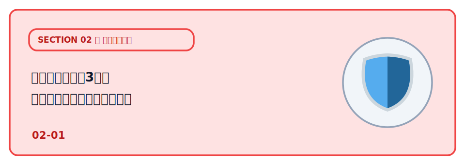
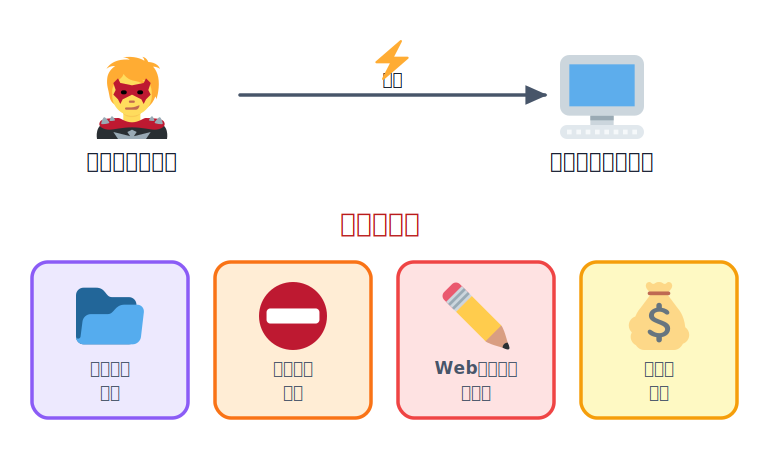
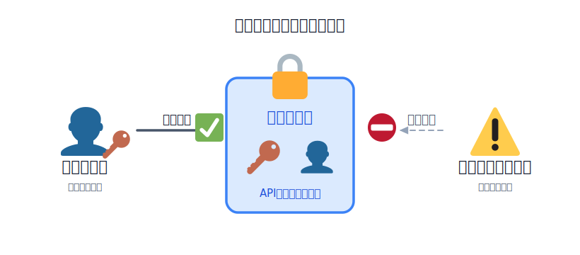
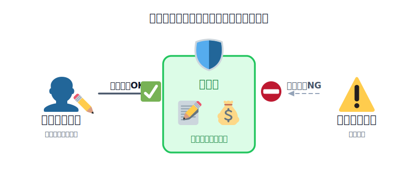
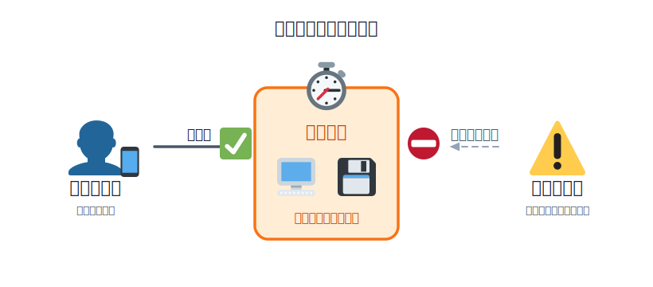
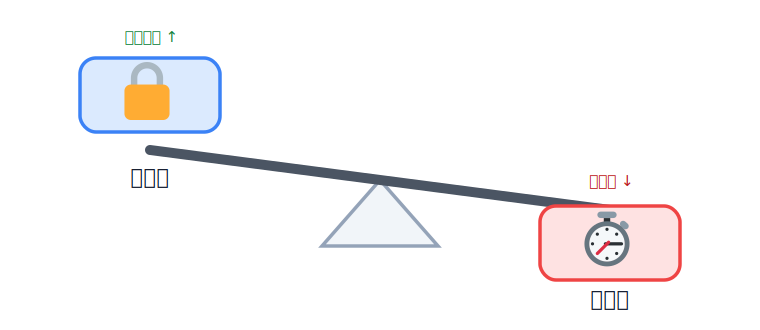
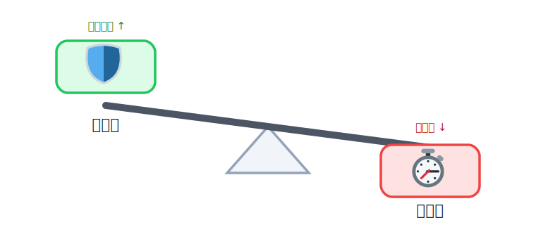
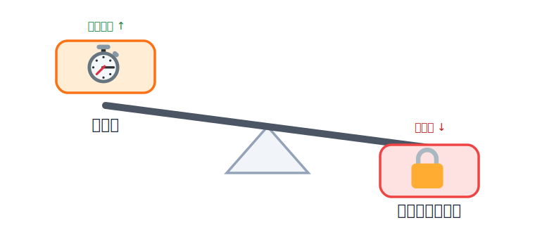

# セキュリティの3要素（可用性・機密性・完全性）

アプリを公開するということは、**世界中の誰でもアクセスできる**ということです。
その中にはシークレットを盗む人、アプリを悪用する人、大量アクセスでサービスを止める人もいます。

*図: 公開したアプリには攻撃者も到達できる。目的はデータの窃取・サービス停止・改ざん・金銭要求などさまざま。*

## 学ぶこと

- セキュリティは「機密性・完全性・可用性（CIA）」の3要素で捉えると整理しやすい
- **機密性**：秘密（API キー等）はフロントに置かず、サーバー側に閉じ込める
- **完全性**：投稿を勝手に書き換えさせない・踏み台にさせない
- **可用性**：止まっても戻せる（バックアップ）・気づける（監視）ようにする
- 3要素はトレードオフし、すべてを最大化はできない

## セキュリティを「3要素」で捉える（CIA とは）

守るべきものを次の3つの性質に分けて考えます。頭文字を取って **CIA** と呼びます。

| 要素 | 英語 | ひとことで言うと | 崩れると何が起きるか |
| --- | --- | --- | --- |
| **機密性** | Confidentiality | 見てよい人だけが見られる | 秘密の値・個人情報が漏れる |
| **完全性** | Integrity | 中身が正しく保たれる | データが書き換えられる・踏み台にされる |
| **可用性** | Availability | 使いたいときに使える | サービスが止まる・データが消える |

**どれか1つだけでは足りません。** 秘密を守っても（機密性）データを書き換えられたら（完全性）意味がなく、そもそも止まっていたら（可用性）使えません。

*図: 「機密性・完全性・可用性」の3点で支える。どれか1つが欠けても守れない。*

## 機密性

<!-- genfig: CONTAINER+BLOCKAGE。中央=鍵付きの箱(機密データ/APIキー・個人情報)、左=鍵を持つ人は入れて見られる(✅)、右=鍵の無い人は境界で止まる(⛔)。build: scratchpad/build_confidentiality.py -->

*図: 機密性は「鍵を持つ人だけが中を見られる」こと。鍵を持たない人は境界で止まり、中の秘密・個人情報に届かない。*

機密性は **「見てよい人だけが見られる」** ことです。守る対象は、API キーや DB パスワードなどの**あなたのシークレット**と、氏名・メールなど**利用者から預かった個人情報**のようなものがあります。これらが漏れると、あなたや利用者に直接的な被害が及びます。

### 被害

OpenAI や Gemini のような外部サービスの API キーが漏洩すると他の人が簡単にあなたになりすましてサービスを使えてしまい、**不正利用や高額請求**につながります。個人情報が漏洩すると、利用者に直接的な被害が及び、信頼を失います。

またあなたのサービスに含まれる個人情報が漏れれば、利用者に直接被害が及びます。会社の顧客情報などをいれた社内ツールの場合は、**会社の信用失墜・損害賠償**につながります。

### 対策

原則は**見える場所に置かない**ことです。

- **秘密は必ずサーバー側に置く**：`index.html` や JavaScript はブラウザに丸ごと届き、**誰でも中身を読めます**。シークレットを使う外部 API 呼び出しはサーバー側で行い、フロントは自分のサーバー（`/api/...`）だけを呼びます。
- **秘密の値と公開設定を分ける**：API キー等は暗号化シークレットに、機能フラグや公開 URL は設定ファイルに、と振り分けます。本番の値はシークレット管理に投入し（コマンド引数に書かない＝履歴に残る）、ローカルは `.env` に書いて**Git に入れない**（`.gitignore` で除外）。コードからは環境変数（env）経由で参照します。
- **個人情報を守る**：画面で使わない項目まで API で返さない、必要以上に集めない、パスワードはハッシュ化・通信は HTTPS、本人以外が見られない状態にする。

:::danger
「画面に出していない」＝「隠せている」ではありません。フロントに書いた値は表示していなくてもブラウザに届いています。万一 Git に上げてしまった鍵は、発行元で**無効化（ローテーション）**します。
:::

## 完全性

<!-- genfig: CONTAINER+BLOCKAGE。中央=盾で守られたデータ(投稿・残高・在庫)、左=権限のある人は書き換えOK(✅)、右=権限のない人は境界で止まり改ざんできない(⛔)。09-confidentiality と対の構図。build: scratchpad/build_integrity.py -->

*図: 完全性は「書き換えてよい人だけが書き換えられる」こと。権限のない人は境界で止まり、データを改ざんできない。*

完全性は **「データが正しく保たれる」** ことです。許可されていない人に、データを勝手に書き換え・消去・破壊されない**ことを保証します。たとえ誰にも盗まれていなくても（機密性は守れていても）、中身が書き換えられていれば、その情報は信頼できず価値を失います。

### 被害

本来その権限を持たない第三者に、データを改ざん・消去されてしまいます。

- メルカリの出品価格を、出品者ではない他人が勝手に書き換える
- 掲示板で、他人の投稿を書き換える・削除する
- 残高・在庫・注文数など、書き換えられると困る値がいじられる

「誰が書き込んだか分からない」「あとから正しい状態に戻せない」状態だと、被害に気づくことも復旧することもできません。

### 対策

「書き換えてよい人・操作」だけに限定し、万一壊れても戻せるようにします。

- **アクセス権限を適切に設定する**：本人（や管理者）だけが自分のデータを書き換え・削除できるようにする。「URL や ID を変えれば他人のデータを操作できる」状態を作らない。
- **サーバー側でチェックする**：誰が・何を変更しようとしているかは必ずサーバー側で検証する（フロントのチェックは API を直接叩けば回避される）。詳しくは [Workers で API を動かす](../../03-build-app/01-workers/LECTURE.md)、DB へ安全に値を渡す方法は [D1 でデータを保存する](../../03-build-app/02-d1/LECTURE.md) で扱います。
- **記録を残す**：誰がいつ何を変更したかをログに残し、不正な変更に気づけるようにする。
- **バックアップで戻せるようにする**：改ざん・消去されても正しい状態に復元できるよう、定期的にバックアップを取る（→ [可用性](#可用性)とも共通）。

## 可用性

<!-- genfig: CONTAINER+BLOCKAGE。中央=動き続けるサービス(サーバー・データ/止まらない・戻せる)、左=使いたい人はいつでも使える(✅)、右=障害・攻撃(ダウン・財布攻撃)は備えで止められない(⛔)。09-confidentiality/10-integrity と対の構図。build: scratchpad/build_availability.py -->

*図: 可用性は「使いたいときに使える」こと。障害や攻撃に遭っても、戻せる・気づける・起こさないの備えでサービスを止めない。*

可用性は **「使いたいときに使える」** ことです。アプリは公開して終わりではなく、安定して動き続けることが目的です。

### 被害

攻撃・障害・改修ミスでデータが壊れたりサービスが止まったりします。とくに外部 API の従量課金は、想定外の大量リクエスト（財布攻撃）で**利用料金が一気に膨らむ**ことがあります。

### 対策

**対策**：**戻せる・気づける・起こさない**の3つを用意します。

- **バックアップ（戻せる）**：定期的にバックアップを取り、**一度は実際に「戻せること」を確認**する。過去の時点に巻き戻せる PITR などの仕組みを使う。
- **監視（気づける）**：ログを取り定期的に見る。さらに死活監視（healthcheck）を用意すれば、応答が止まったときに自分が見ていなくても気づける。
- **予防（起こさない）**：使う API の利用上限・予算アラート、インフラ側の課金・使用量の通知を設定しておく。

## 3要素はトレードオフする

3要素はすべてを同時に最大化できるとは限らず、実際のシステムでは**片方を上げると別の片方が下がる**トレードオフになることがよくあります。天秤のように、一方に重みをかけると反対側が持ち上がってしまう関係です。代表的な組み合わせを3つ見てみましょう。

### 機密性を上げると → 可用性が下がる

機密性を高める一番の方法は「見られる人・使える人を絞る」ことです。たとえばログインに多要素認証（MFA）を必須にすれば、パスワードが漏れても不正アクセスを防げます。しかしその分、認証サーバーが障害を起こすと正規の利用者までログインできなくなり、手続きも増えて「気軽に使えない」サービスになります。社内システムで USB メモリや社外からのアクセスを一律禁止するのも同じで、情報漏えいは防げても日々の業務効率は確実に落ちます。守りを固めるほど、使いやすさ（可用性）は削られていきます。

*図: 機密性を強くするほど、使いやすさ（可用性）は下がる。*

### 完全性を上げると → 可用性が下がる

完全性を高めるには「正しい状態を厳密に守る」仕組みが要りますが、それは処理の重さや待ち時間と引き換えになります。たとえばデータベースで厳密なトランザクションやロックをかければ、同時更新による矛盾は防げますが、順番待ちが増えて性能は落ちます。掲示板で「投稿はすべて運営が1件ずつ承認してから公開」にすれば、誤った内容や荒らしは確実に止められますが、投稿してもすぐには表示されず、リアルタイムに使えるという可用性は損なわれます。正確さを突き詰めるほど、すぐ使えるという快適さは犠牲になります。

*図: 完全性を強くするほど、すぐ使える快適さ（可用性）は下がる。*

### 可用性を上げると → 機密性・完全性が下がる

逆に「いつでも・誰でも・すぐ使える」を優先すると、今度は機密性や完全性が緩みます。たとえば認証なしで誰でも叩ける公開 API を用意すれば使い勝手は最高ですが、その分だけ情報漏えいのリスクは高まります（機密性↓）。また、障害時でもサービスを止めないようにキャッシュやレプリカ（コピー）を優先して返すと、アクセスは途切れませんが、一時的に古い・食い違ったデータが表示されることがあります（完全性↓）。止めない・待たせないことを優先するほど、秘密や正確さのほうが緩みます。

*図: 可用性を強くするほど、秘密（機密性）や正確さ（完全性）は下がる。*

このように、どれか1つを100点にしようとすると別の要素が犠牲になります。だから現実の設計は「全部100点」ではなく、**そのアプリで何を一番守りたいかを決めて、バランスを取る**ことになります。

たとえば――

- **気軽な雑談掲示板** なら、多少荒れても使いやすさが大事なので **可用性を重め** に。
- **氏名や住所を扱う会員サービス** なら、漏れたら取り返しがつかないので **機密性を重め** に。
- **お金や在庫を扱うアプリ** なら、数字を1円でも狂わせたくないので **完全性を重め** に。

「このアプリでは何が一番痛いか」を先に決めるのが、セキュリティ設計の出発点です。

## 理解度チェック

この章の内容を◯✕で確認しましょう。全10問、最後に何問正解だったかが出ます。

:::questions
- セキュリティは「機密性・完全性・可用性（CIA）」の3つの角度から点検すると整理しやすい [o]
- 公開したフロントの JavaScript に書いた API キーは、画面に表示していなければ利用者には読まれない [x]
- シークレットを使った外部 API の呼び出しは、必ずサーバー側で行う [o]
- 機能フラグや公開 URL のような秘密でない設定値は、設定ファイルに書いて Git に入れてよい [o]
- ローカル開発用の値を書いた `.env` のような環境変数ファイルは `.gitignore` で Git から除外する [o]
- 完全性とは、許可されていない人にデータを勝手に書き換え・消去・破壊されないことである [o]
- データが誰にも盗まれていなくても、中身を勝手に書き換えられれば情報の信頼性は失われる [o]
- 「URL や ID を変えれば他人のデータを操作できる」状態でも、完全性は守れている [x]
- 可用性のためのバックアップは、取るだけでなく一度は実際に「戻せること」を確認しておくとよい [o]
- 機密性・完全性・可用性はすべてを同時に最大化でき、トレードオフは起きない [x]
:::

## 次の章へ

[OSS のセキュリティ](../02-oss/LECTURE.md)
