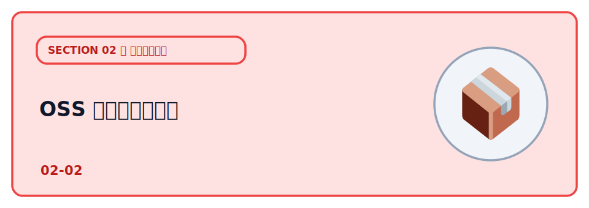
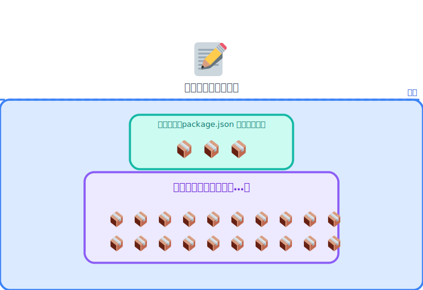
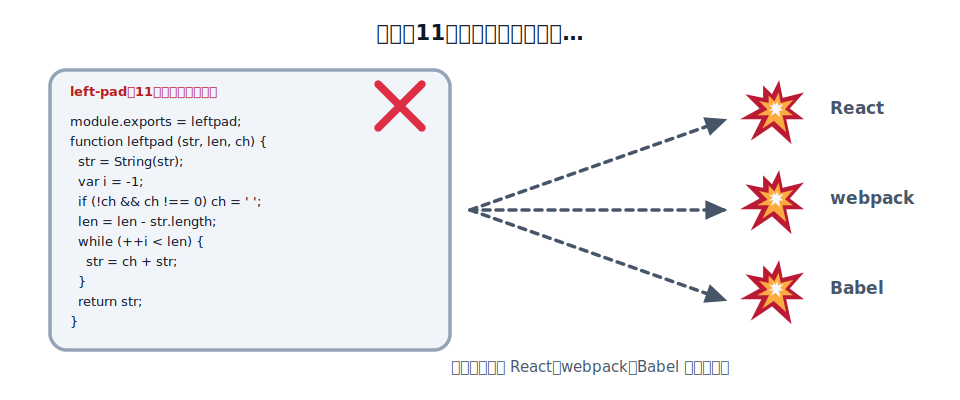
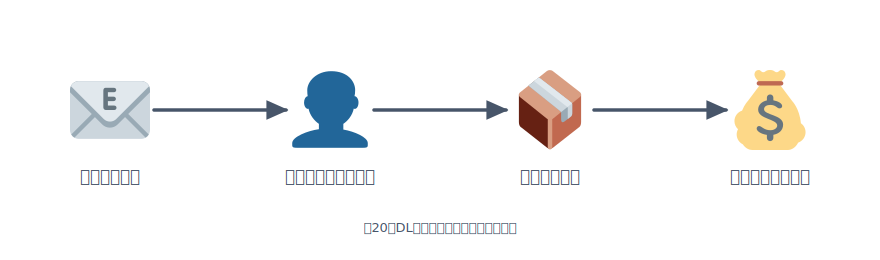
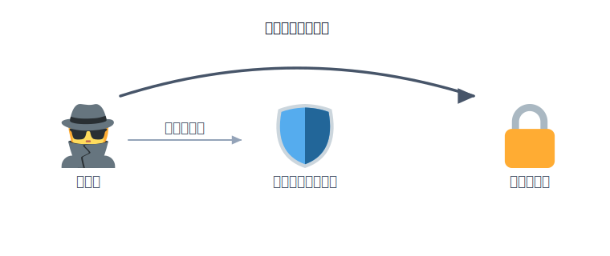

# OSS のセキュリティ

このハンズオンでも、`npm install` を打つたびに大量のパッケージがダウンロードされてきました。
あれは**他人が書いたコード（OSS）** です。自分のアプリは、自分で書いた部分よりも、はるかに多くの「他人のコード」の上に乗っています。

便利さの裏側で、その「他人のコード」が **攻撃の入り口** になる事故が、近年くり返し起きています。
このレクチャーではOSS とサプライチェーンという考え方を押さえていきましょう。

## OSS とソフトウェアサプライチェーン

OSS（オープンソースソフトウェア） は、ソースコードが公開され、だれでも利用できるソフトウェアです。npmでインストールするパッケージの多くがOSSであり、世界中の開発者が作成した部品を組み合わせてアプリを作っています。

しかし、自分が利用するパッケージは、さらに別のパッケージに依存しています。このような依存の依存を推移的依存関係と呼びます。そのため、package.jsonには数個しか書いていなくても、実際には数百ものパッケージがインストールされることも珍しくありません。

このように、多くのソフトウェア部品が連鎖してアプリが作られる仕組みをソフトウェアサプライチェーンと呼びます。この途中に悪意のあるコードや脆弱性が入り込むと、それを利用するすべてのアプリに影響が及びます。これがサプライチェーン攻撃です。

さらに、一部のnpmパッケージは、インストール時に `postinstall` スクリプトを自動実行できます。本来はビルドなどに使われる仕組みですが、悪用される危険もあります。そのため、近年は pnpm がインストール時のスクリプトを既定でブロックし、利用者が明示的に許可したものだけ実行する仕組みを採用しています。

## left-pad 事件　（2016）

2016年3月22日、JavaScriptのパッケージ管理サービス npm で公開されていた left-pad が作者によって削除されました。left-pad は、文字列の左側を指定した文字で埋めるだけの、わずか11行ほどの小さなプログラムでした。

しかし、この小さなパッケージは多くのライブラリから利用されていました。Reactやwebpack、Babelなどが間接的に依存していたため、npm install やビルドが世界中で失敗する事態となり、多くの開発者が作業できなくなりました。

原因は、作者が npm 社とパッケージ名を巡るトラブルになり、自分が公開していたパッケージをまとめて削除したことでした。小さなライブラリでも、多くのソフトウェアから利用されていれば、世界中のシステムに大きな影響を与えることがあると示した出来事です。

この事件を受け、npm は数時間後に left-pad を復元しました。また、公開から24時間以上経過し、他のパッケージが利用しているものは簡単に削除できないようルールを変更しました。この出来事は、ソフトウェア開発では自分が直接使うライブラリだけでなく、間接的な依存関係も重要であることを学ぶ代表的な事例として知られています。

参考:

- [npm 公式ブログ「kik, left-pad, and npm」](https://blog.npmjs.org/post/141577284765/kik-left-pad-and-npm)
- [The Register の報道（2016）](https://www.theregister.com/2016/03/23/npm_left_pad_chaos/)
- [Wikipedia: npm left-pad incident](https://en.wikipedia.org/wiki/Npm_left-pad_incident)

## npm 人気パッケージのメンテナ乗っ取り　（2025）

2025年9月、JavaScriptのパッケージ管理サービス npm で、大規模なサプライチェーン攻撃が発生しました。人気ライブラリ chalk や debug の管理者が、本物そっくりのフィッシングメールにだまされ、アカウントを乗っ取られたことが原因でした。

攻撃者は乗っ取ったアカウントを使い、悪意のあるバージョンのパッケージを公開しました。これらのパッケージは週に20億回以上ダウンロードされるほど広く利用されており、多くの開発者が影響を受ける可能性がありました。悪意のあるコードは、暗号資産の送金先アドレスを利用者に気付かれないよう書き換えるものでした。

被害は広がりましたが、公開から数時間後には管理者がアカウントの乗っ取りに気付き、公表しました。その後、問題のバージョンは削除され、多くの利用者に対して速やかに更新や確認が呼びかけられました。

この事件は、有名なライブラリでも安全とは限らないことを示しました。ソフトウェアの安全性は、プログラムの品質だけでなく、開発者のアカウント管理や認証情報の保護にも左右されます。

参考:

- [Socket「npm author Qix compromised」](https://socket.dev/blog/npm-author-qix-compromised-in-major-supply-chain-attack)
- [The Hacker News（週20億DL規模の解説）](https://thehackernews.com/2025/09/20-popular-npm-packages-with-2-billion.html)
- [Wiz Blog（影響範囲の分析）](https://www.wiz.io/blog/widespread-npm-supply-chain-attack-breaking-down-impact-scope-across-debug-chalk)

## Next.js の認証バイパス　CVE-2025-29927 （2025）

2025年、Webアプリ開発で広く使われている Next.js に、深刻な脆弱性（CVE-2025-29927）が見つかりました。この問題は、攻撃者がアプリを改ざんしたのではなく、フレームワーク自体の設計上の問題 が原因でした。

Next.jsでは、ログイン済みかどうかを確認する処理を「ミドルウェア」に実装することがあります。しかし、特定のHTTPヘッダを付けてリクエストを送ると、ミドルウェアの実行をスキップできる不具合がありました。その結果、本来はログインが必要なページにも、不正にアクセスできる可能性がありました。

影響を受けるバージョンには修正版が公開され、利用者には速やかな更新が呼びかけられました。すぐに更新できない場合は、Webサーバー側で問題のHTTPヘッダを受け付けないよう設定することが、一時的な対策として案内されました。

この事例は、フレームワークを使っているだけでは安全とは限らないことを示しています。開発者は、利用しているライブラリやフレームワークを定期的に更新し、セキュリティ情報を確認する必要があります。また、認可のような重要な処理は、一つの仕組みだけに頼らず、多重に対策を行うことも大切です。

参考:

- [NVD: CVE-2025-29927](https://nvd.nist.gov/vuln/detail/CVE-2025-29927)
- [JFrog による解説](https://jfrog.com/blog/cve-2025-29927-next-js-authorization-bypass/)
- [Datadog Security Labs の技術分析](https://securitylabs.datadoghq.com/articles/nextjs-middleware-auth-bypass/)

## 理解度チェック

この章の内容を◯✕で確認しましょう。全3問、最後に何問正解だったかが出ます。

:::questions
- `package.json` に 10 個ほどしか書いていなくても、その先の推移的依存として数百〜千を超える他人のコードが取り込まれることがある [o]
- 有名で広く使われているパッケージは乗っ取られる心配がないので、公開直後の最新版にすぐ飛びついてよい [x]
- CI や本番では `npm install` ではなく `npm ci` を使い、lockfile を git にコミットしておくとよい [o]
:::

## 次の章へ

OSS という「他人のコード」を取り込むリスクを見てきました。次は、いま急速に広がっている
もうひとつの「他人（人ではないもの）に任せる」リスク ―― [AI エージェントの暴走](../03-ai-agents/LECTURE.md)
を扱います。
