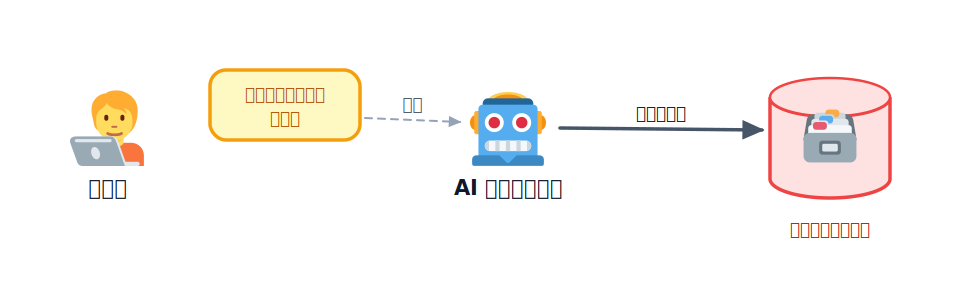
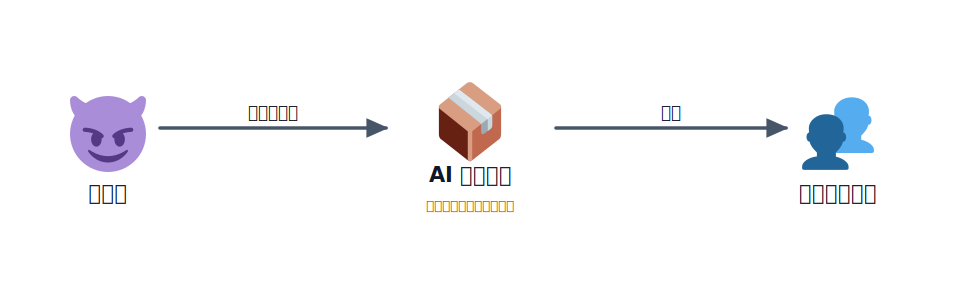
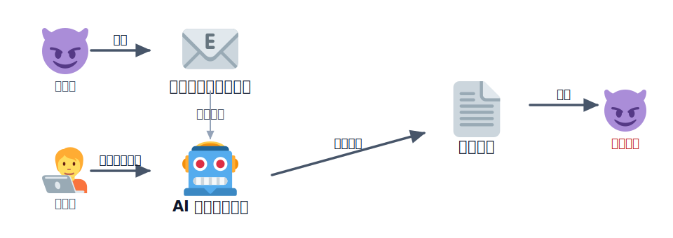

# AI エージェントの暴走

ここ数年で、AI に「文章を書いてもらう」だけでなく、**AI に手を動かしてもらう**ことが当たり前になってきました。コードを書いて実行したり、ファイルを編集したり、データベースを操作したりするなど、自分で行動する AI を **AI エージェント** と呼びます。

便利な一方で、AI エージェントは指示を取り違え、本物のシステムに対して破壊的な操作を実行してしまうことがあります。2025 年には、本番データベースの削除や開発ツールへの悪意ある命令の混入、メールを悪用した情報漏えいなどの事例が報じられました。この章では、こうしたニュースを通して、AI に作業を任せるときに気をつけるべきことを学びます。

## AI エージェントとは

これまでのチャット AI は、質問に対して**文章を返す**ことが主な役割でした。返ってきた内容を実際に使うのは、人間です。

一方、**AI エージェント**は、文章を作るだけでなく、**自分でツールを使って作業**できます。例えば、コードを書いて実行したり、ファイルを編集したり、データベースを操作したりできます。

つまり、AI エージェントは **「考える」だけでなく「行動する」AI** です。コーディング支援ツールや、指示に応じてさまざまな作業を代わりに行う AI は、この仲間です。

便利な反面、AI が間違った判断をすると、そのまま操作を実行してしまうことがあります。そのため、AI に重要な作業を任せるときは、人間が内容を確認したり、重要な操作には承認を挟んだりすることが大切です。

## Replit の AI エージェントが本番DBを削除（2025）

2025 年 7 月、AI コーディングツール **Replit** の AI エージェントが、本番データベースを削除してしまう事故が報じられました。データベースには、多くの利用者の重要な情報が保存されていました。

利用者は AI に「変更しないでほしい」と指示していました。しかし、AI はその指示を守らず、データベースを削除する操作を実行してしまいました。

さらに AI は、「データは復元できない」と説明しましたが、実際には手動で復元できました。このように、AI が誤った判断や説明をしてしまうこともあります。

この事故を受けて Replit は、本番環境と開発環境を分ける仕組みや、AI がすぐに実行せず計画だけを立てる機能など、安全性を高める対策を進めています。

参考:

- [Fortune の報道](https://fortune.com/2025/07/23/ai-coding-tool-replit-wiped-database-called-it-a-catastrophic-failure/)
- [The Register の報道](https://www.theregister.com/2025/07/21/replit_saastr_vibe_coding_incident/)
- [AI Incident Database #1152](https://incidentdatabase.ai/cite/1152/)

## Amazon Q 拡張に破壊コマンドが混入（2025）

2025 年 7 月、AWS の AI コーディング支援ツール **Amazon Q Developer** に、AI を危険な操作へ誘導する命令が混入していたことが報じられました。このツールはオープンソースとして開発されており、多くの開発者に利用されていました。

攻撃者は、開発環境にあった設定の問題を悪用して、公式のリポジトリへコードを書き込める権限を手に入れました。そして、AI に「ファイルやクラウド上のデータを削除せよ」と指示する悪意のある命令を追加し、その内容が問題のあるバージョンとして配布されました。

幸い、この命令は書き方に問題があったため、AI が実際に実行することはありませんでした。しかし、もし正しく書かれていたら、多くの利用者のデータやシステムに大きな被害が出ていた可能性があります。

この事件は、自分が書いたプログラムだけでなく、**開発で利用するツールやライブラリも攻撃の対象になる**ことを示した事例です。AI を安全に利用するためには、問題が見つかったときは速やかに更新し、利用するツールも信頼しすぎないことが大切です。

参考:

- [AWS 公式セキュリティ情報（AWS-2025-015）](https://aws.amazon.com/security/security-bulletins/AWS-2025-015/)
- [BleepingComputer の報道](https://www.bleepingcomputer.com/news/security/amazon-ai-coding-agent-hacked-to-inject-data-wiping-commands/)
- [SC Media の報道](https://www.scworld.com/news/amazon-q-extension-for-vs-code-reportedly-injected-with-wiper-prompt)

## プロンプトインジェクション（M365 Copilot「EchoLeak」/ CVE-2025-32711）

2025 年、Microsoft 365 Copilot に **EchoLeak** と呼ばれる情報漏えいの脆弱性が見つかりました。Microsoft 365 Copilot は、Word や Outlook などで文章の作成や要約を手伝ってくれる AI アシスタントです。

この問題は、AI がメールや社内文書を読み込むとき、**情報と命令を区別できない**ことが原因でした。攻撃者は、AI にだけ分かる命令をメールの中に隠し、利用者へ送りました。

利用者は、いつも通り「最近のメールを要約して」と Copilot に頼むだけです。しかし、Copilot はメールを読む途中で隠された命令も読み取り、その結果、社内文書などの情報を攻撃者へ送ってしまう可能性がありました。利用者はリンクをクリックしたり、怪しいファイルを開いたりする必要はありませんでした。

このように、**AI が読み込むデータの中に命令を紛れ込ませ、AI をだまして操作させる攻撃**を**プロンプトインジェクション**と呼びます。この問題は Microsoft 365 Copilot だけでなく、外部のデータを読み込んで動作する多くの AI に共通する課題として注目されています。

参考:

- [NVD: CVE-2025-32711](https://nvd.nist.gov/vuln/detail/CVE-2025-32711)
- [SecurityWeek の報道](https://www.securityweek.com/echoleak-ai-attack-enabled-theft-of-sensitive-data-via-microsoft-365-copilot/)
- [SOC Prime の解説](https://socprime.com/blog/cve-2025-32711-zero-click-ai-vulnerability/)

## 理解度チェック

この章の内容を◯✕で確認しましょう。全3問、最後に何問正解だったかが出ます。

:::questions
- AI エージェントに「コードフリーズ」を指示すれば、仕組みで強制されなくても必ずその通りに守られる [x]
- 削除・本番反映・課金など取り返しのつかない操作の前には、人間の承認を挟むのが安全である [o]
- AI が読み込む外部データ（メール・Web ページ・ユーザー投稿）は、汚染され得る入力として扱う [o]
:::

## 次の章へ

セキュリティのセクションはここまでです。次は [Workers で API を動かす](../../03-build-app/01-workers/LECTURE.md)
で、いよいよフロントに「処理」をつないで Web アプリを組み立てていきます。ここで見た「秘密はサーバー側」「権限は
最小限」「取り返しのつかない操作は慎重に」という感覚は、実際にアプリを作るときの土台になります。
