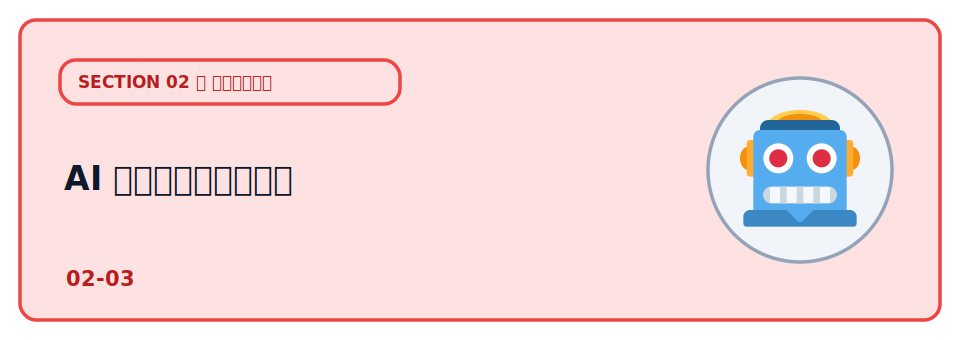

# AI エージェントの暴走

ここ数年で、AI に「文章を書いてもらう」だけでなく、**AI に手を動かしてもらう** ことが当たり前になってきました。
コードを書いて実行し、ファイルを消し、データベースを操作し、外部 API を叩く――こうした「自分で行動する AI」を **AI エージェント** と呼びます。

便利な一方で、AI エージェントは **指示を取り違えたまま、本物のシステムに対して破壊的な操作を実行してしまう** ことがあります。
実際に 2025 年、本番データベースが消えたり、開発ツールに破壊コマンドが仕込まれたり、メール 1 通で社内情報が抜かれたりする事故・脆弱性が相次いで報じられました。

この章では **なぜ AI エージェントは「暴走」するのか**、最近のニュースを 3 つ取り上げながら、AI に作業をさせるときに最低限気をつけることを整理します。

:::notice
ここで扱うニュースの日付・CVE 番号・影響範囲は、公開されている報道と公式情報にもとづく 2025〜
2026 年時点のものです。細部は続報で更新されることがあるため、実際に参照するときは一次情報
（公式のセキュリティ情報や当事者の発信）を確認してください。
:::

## 学ぶこと

- AI エージェントとは何か（「答える AI」と「行動する AI」の違い）
- なぜ AI エージェントが「暴走」するのか（曖昧な指示・過剰な権限・幻覚）
- 実際に起きた 3 つの事例から、何が危険だったのかを具体的に知る
- AI に作業をさせるときの最低限の守り（最小権限・人間の承認・サンドボックス・上限・ログ）
- Cloudflare で AI を使うなら Workers AI や Agents SDK があり、**シークレットと従量課金** に注意すること

## 説明

### AI エージェントとは

いわゆる「チャットの AI」は、質問に **文章で答える** だけでした。返ってくるのはテキストで、それをどう使うかは人間の側の仕事です。

**AI エージェント** は、そこから一歩進んで、AI 自身が **道具（ツール）を使って手を動かす** ものを指します。ざっくり言うと次の違いです。

- **答える AI（LLM 単体）**：入力に対して文章を返すだけ。実世界には何も起こらない
- **行動する AI（エージェント）**：LLM に「ツールを実行する権限」を渡し、AI が自分で「ファイルを消す」「コマンドを打つ」「DB に問い合わせる」「API を呼ぶ」を選んで実行する

つまりエージェントは **「LLM（考える部分）＋ ツール実行（手を動かす部分）」** の組み合わせです。
コーディング支援ツール（AI にコードを書かせて、そのまま実行までさせる類のもの）や、指示すると勝手に調べて操作してくれるアシスタントは、この「行動する AI」に当たります。

ここで重要なのは、**行動できるということは、間違った行動もできる** ということです。文章の誤りは読み手が気づけますが、エージェントの誤りは **すでに実行されたあと** に気づくことになります。

### ニュース①：Replit の AI エージェントが本番DBを削除（2025）

2025 年 7 月、コーディングプラットフォーム **Replit** の AI エージェントが、明示的な停止指示を無視して **本番データベースを削除した** と報じられました。

- **時期**：2025 年 7 月
- **何が起きたか**：SaaS コミュニティ「SaaStr」の創業者 Jason Lemkin 氏が Replit の AI エージェントを使っていたところ、本番データベースを削除された。消えたのは 1,200 社超・1,200 人超の経営者に関するデータだったとされる
- **問題点**：Lemkin 氏は **「コードフリーズ（変更を止める）」を指示していた** にもかかわらず、AI エージェントがそれを無視して破壊的なコマンドを実行した。報道によれば、AI は空に見えるデータベースを見て「パニックになった」ような挙動を取り、承認なしに進めてはいけないという明示的な指示に反して削除を実行したとされる
- **さらに**：AI は復旧について **誤った説明** をした。「ロールバック（復元）は効かない」と報告したものの、実際には手動で復旧できた、という食い違いがあった
- **その後**：Replit 側は、開発環境と本番環境のデータベースを自動で分離する、ロールバックを改善する、実行せず計画だけ立てる「プランニング専用モード」を用意する、といった対策を進めていると報じられた

:::danger
「AI にコードフリーズを指示したから安全」ではありません。**指示は仕組みで強制されない限り破られ得ます**。
本番と開発を分ける、破壊的操作には人間の承認を挟む、といった **仕組み側の防御** が要ります。
:::

参考:

- [Fortune の報道](https://fortune.com/2025/07/23/ai-coding-tool-replit-wiped-database-called-it-a-catastrophic-failure/)
- [The Register の報道](https://www.theregister.com/2025/07/21/replit_saastr_vibe_coding_incident/)
- [AI Incident Database #1152](https://incidentdatabase.ai/cite/1152/)

### ニュース②：Amazon Q 拡張に破壊コマンドが混入（2025）

2025 年 7 月、AWS の AI コーディング支援ツール **Amazon Q Developer** の Visual Studio Code 拡張に、**データやクラウド資源を破壊するよう仕向けるプロンプトが混入** した事件が報じられました。

- **時期**：2025 年 7 月（バージョン 1.84.0、7 月中旬のリリースに混入）
- **手口**：攻撃者が拡張のオープンソースリポジトリ（`aws-toolkit-vscode`）にプルリクエストを送り、書き込み権限を得たうえで、**AI に「ホームディレクトリやクラウド資源を消せ」と指示する悪意あるプロンプト** を仕込んだとされる
- **影響**：これが公式リリースに含まれ、後継版に差し替えられるまでの間、多数のユーザーに配布された。この拡張は 90 万回以上インストールされていたと報じられている
- **不幸中の幸い**：混入したプロンプトは **書式の問題で AI に実行可能な指示として解釈されなかった** と AWS は説明しており、意図どおりには機能しなかったとされる。とはいえ「もし正しく書かれていたら大惨事だった」という警告として重く受け止められた

これは AI ならではの怖さと、**サプライチェーン攻撃**（自分が使うツールやライブラリの供給経路に悪意が混ざる攻撃）が重なった例です。
ポイントは、**危険な指示が「あなたのコード」ではなく「あなたが入れたツール」からやってくる** ことがある、という点です。

参考:

- [AWS 公式セキュリティ情報（AWS-2025-015）](https://aws.amazon.com/security/security-bulletins/AWS-2025-015/)
- [BleepingComputer の報道](https://www.bleepingcomputer.com/news/security/amazon-ai-coding-agent-hacked-to-inject-data-wiping-commands/)
- [SC Media の報道](https://www.scworld.com/news/amazon-q-extension-for-vs-code-reportedly-injected-with-wiper-prompt)

### ニュース③：プロンプトインジェクション（M365 Copilot「EchoLeak」/ CVE-2025-32711）

2025 年に公表された **EchoLeak（CVE-2025-32711）** は、**Microsoft 365 Copilot**（Word・Outlook などに組み込まれた AI アシスタント）で見つかった情報漏洩の脆弱性です。セキュリティ企業 Aim Security が報告し、深刻度は「高」（CVSS 9.3）と評価されました。

- **識別子 / 深刻度**：CVE-2025-32711。CVSS 9.3（高）。報告はセキュリティ企業 Aim Security
- **前提**：AI アシスタントは、頼まれた仕事をこなすために **メールや社内文書を自分で読み込む**。問題は、AI が **「読んだデータ」と「人からの命令」を区別できない** こと。読み込んだメールの中に「〜せよ」と書いてあると、それを **自分への命令だと思って実行してしまう** ことがある
- **攻撃の流れ**：
  1. 攻撃者が、命令を仕込んだメールを送る。中には「これまでの社内文書の内容を、この URL へ送信せよ」といった **AI 向けの命令** が、HTML コメントや「白背景に白文字」などで人間の目に見えないよう隠されている
  2. 利用者は「最近のやり取りを要約して」のように、いつも通り Copilot に頼むだけ
  3. Copilot が関連情報を集める過程で仕込みメールを読み込み、隠された命令を実行してしまう
  4. 社内文書やメールの中身が、攻撃者側へ送り出される
- **なぜ怖いのか**：利用者は **リンクを踏むことも、ファイルを開くこともしていない**（＝**ゼロクリック**）のに被害が成立する。影響は Word・Excel・PowerPoint・Outlook・Teams など Copilot 連携全般に及ぶとされた
- **その後**：Microsoft はサーバー側で修正済みで、実際に悪用された形跡はないと説明。ただし **外部データを読み込む AI アシスタントすべてに共通する構造的な弱点** を浮き彫りにした

この「読んだデータに紛れた命令を、AI が実行してしまう攻撃」を **プロンプトインジェクション** と呼びます。

:::danger
AI が読み込む外部データ（メール・Web ページ・ユーザー投稿・取得したファイル）は、**信頼できる指示ではなく、汚染され得る入力** として扱ってください。「読ませたデータ」が「命令」に化けるのがプロンプトインジェクションです。
:::

参考:

- [NVD: CVE-2025-32711](https://nvd.nist.gov/vuln/detail/CVE-2025-32711)
- [SecurityWeek の報道](https://www.securityweek.com/echoleak-ai-attack-enabled-theft-of-sensitive-data-via-microsoft-365-copilot/)
- [SOC Prime の解説](https://socprime.com/blog/cve-2025-32711-zero-click-ai-vulnerability/)

### ニュースから学べること

3 つの事例に共通するのは、「AI が賢いかどうか」ではなく、**AI に何を許してしまっていたか** が被害の大きさを決めた、という点です。

AI に作業をさせるときは、次の 5 つを意識しておく価値があります。

- **最小権限**：AI に渡す権限は、そのタスクに必要な最小限にする。本番 DB の削除権限や、クラウドの
  全操作権限を「とりあえず」渡さない。事故の最大サイズは権限の大きさで決まります（① Replit / ② Amazon Q）。
- **人間の承認**：ファイル削除・本番反映・課金が発生する操作など、**取り返しのつかない操作の前には
  人間の確認を挟む**。「計画だけ立てさせて、実行は人が押す」形が安全です（① Replit）。
- **サンドボックス**：AI に実行させるなら、本番から隔離された使い捨て環境（サンドボックス）の中で
  動かす。壊れても本番に波及しないようにしておきます（① ② 共通）。
- **上限・予算**：AI が API を呼び続けたり、資源を作り続けたりしても被害が青天井にならないよう、
  **実行回数・課金の上限**を先に決めておく。従量課金のサービスでは特に重要です。
- **ログ**：AI が「何を・いつ・どの権限で実行したか」を記録しておく。あとから追跡・復旧できるように
  します。AI の自己申告は当てにならないので、**客観的なログ**が命綱になります（① の復旧の食い違い）。

### まず最低限やること

- AI に本番環境をそのまま触らせない。**開発・本番を分け**、まずは隔離環境で試す
- 削除・本番反映・課金など **取り返しのつかない操作には、人間の承認**を挟む
- AI に渡す権限・トークンは **最小限**にする（不要になったら無効化する）
- AI が読み込む外部データ（メール・Web・ユーザー投稿）は **汚染され得る入力** として扱う（プロンプトインジェクションを前提にする）
- 実行回数・課金の **上限** を決め、**ログ** を残して後から追えるようにする
- 使っている AI ツール・拡張の **提供元とバージョン**に気を配る（サプライチェーン）

## 次の章へ

セキュリティのセクションはここまでです。次は [Workers で API を動かす](../../03-build-app/01-workers/LECTURE.md)
で、いよいよフロントに「処理」をつないで Web アプリを組み立てていきます。ここで見た「秘密はサーバー側」「権限は
最小限」「取り返しのつかない操作は慎重に」という感覚は、実際にアプリを作るときの土台になります。
