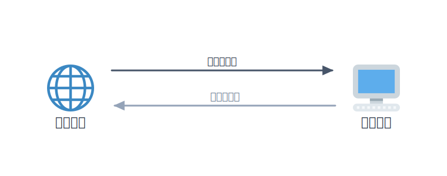
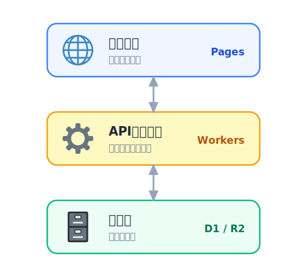
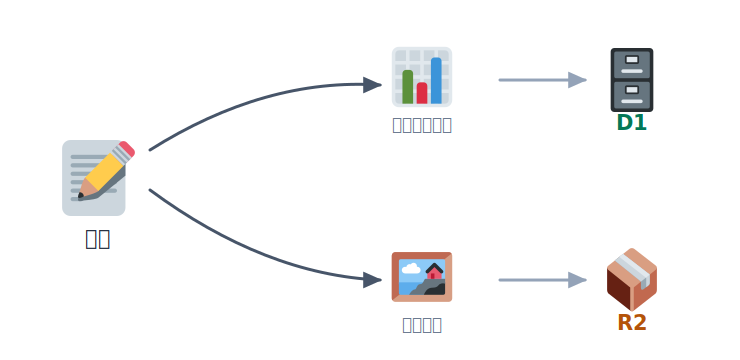

# ウェブアプリの基本

前のセクションでは、HTML を **Pages** に置いて「静的なサイト」を公開しました。表示はできますが、投稿を
受け取って保存したり、保存した内容を一覧で返したりはできません。こうした **処理とデータ** を持つものを
「ウェブアプリ」と呼びます。

次のセクションから実際にアプリを作っていきます。その前に、ウェブアプリがどんな部品でできているかを
整理しておきましょう。ここは手を動かさず、仕組みを言葉で理解する章です。

## 学ぶこと

- 静的サイトと **ウェブアプリ** の違い
- **クライアントとサーバー**、HTTP の「リクエストとレスポンス」
- アプリを支える **3 つの層**（フロント / API / データ）
- それぞれが Cloudflare の何に対応するか（Pages / Workers / D1・R2）

## 静的サイトとウェブアプリ

**静的サイト** は、あらかじめ用意したファイル（HTML・CSS・画像）をそのまま返すだけのものです。誰が見ても
同じ内容で、前のセクションで公開したフロントもこれにあたります。

**ウェブアプリ** は、利用者の操作に応じて中身が変わります。「ひとことボード」なら、投稿を受け取って保存し、
次に開いたときには保存済みの一覧を返します。これには **その場で動くプログラム** と、**データをためておく
場所** が必要です。

## クライアントとサーバー

ウェブの通信は、おおまかに **2 人の登場人物** のやり取りです。

- **クライアント**：利用者の手元（ブラウザ）。「一覧をください」「これを投稿します」と **お願い** を出す側。
- **サーバー**：お願いを受けて処理し、結果を返す側。

この「お願い」が **リクエスト**、その「返事」が **レスポンス** です。通信のルールが **HTTP** で、
やり取りするデータの形式にはよく **JSON**（`{"name": "...", "body": "..."}` のような形）が使われます。

<!-- genfig: ブラウザ(🌐)とサーバー(🖥️)を左右に置き、往路「リクエスト」を濃い矢印・復路「レスポンス」を薄い矢印で結ぶ往復図。イメージスキーマ = SOURCE-PATH-GOAL + CYCLE。 -->
*図: ブラウザ（クライアント）が「お願い（リクエスト）」を出し、サーバーが「返事（レスポンス）」を返す。*

大事なのは、**フロントのチェックは利用者側にあるので簡単に迂回できる** ということ。だから入力の確認や
保存の可否は、必ず **サーバー側でも** 行います（このあとのコードでも繰り返し出てきます）。

## アプリを支える3つの層

多くのウェブアプリは、役割の違う 3 つの層でできています。

<!-- genfig: 上から「フロント=Pages(🌐)」「API=Workers(⚙️)」「データ=D1(🗄️)/R2(📦)」を縦に積んだ3層図。各層を上下の矢印でつなぐ。イメージスキーマ = VERTICALITY + PART-WHOLE。 -->
*図: ウェブアプリを支える3つの層と、Cloudflare での対応。*

| 層 | 役割 | 「ひとことボード」では | Cloudflare では |
|---|---|---|---|
| **フロント** | 見た目・入力。ブラウザで動く | 投稿フォームと一覧の表示 | **Pages** |
| **API（処理）** | リクエストを受けて処理する | 投稿の受け取り・一覧の返却 | **Workers** |
| **データ** | 処理が終わっても残す | 投稿の本文や画像 | **D1**（表）/ **R2**（ファイル） |

層を分けておくと、「見た目だけ直す」「保存先だけ替える」といった変更がしやすくなります。フロントと API は
別々の URL（オリジン）で動くことも多く、その場合はブラウザの安全機構（**CORS**）への対応が必要になります
——これも次のセクションで実際に出てきます。

## 代表的なデータ

代表的なデータに次の 2 種類があります。どちらも「投稿」に必要な情報ですが、保存の仕方が違います。

- **構造化データ**（名前・本文・日時のような表で扱える情報）→ データベース（**D1**）
- **ファイル**（画像・PDF・動画のようなまとまり）→ オブジェクトストレージ（**R2**）

<!-- genfig: 中央に投稿(📝)、そこから2方向に分岐。左「構造化データ(📊)→D1(🗄️)」右「ファイル(🖼️)→R2(📦)」。イメージスキーマ = SPLITTING + CONTAINER。 -->
*図: 投稿のデータは、種類によって D1 と R2 に振り分けて保存する。*

「ひとことボード」では、投稿の本文を D1 に、添付画像を R2 に分けて保存します。この使い分けも、後の章で手を動かして確かめます。

## まとめ

- ウェブアプリ＝**処理（API）＋データ** を持つサイト。静的サイトとはここが違う
- 通信は **リクエストとレスポンス**。フロントのチェックは迂回できるので、確認は **サーバー側でも**
- アプリは **フロント（Pages）/ API（Workers）/ データ（D1・R2）** の層でできている

## 次の章へ

仕組みのイメージができたら、いよいよ手を動かします。次は
[Workers で API を動かす](../../03-build-app/01-workers/LECTURE.md) で、「処理」の部分を作ります。
