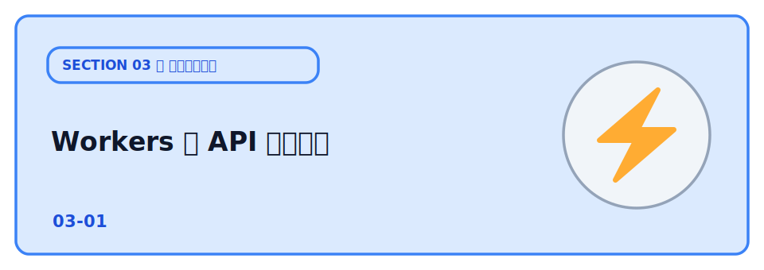
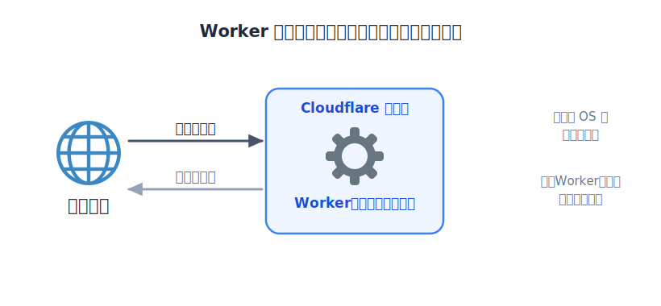
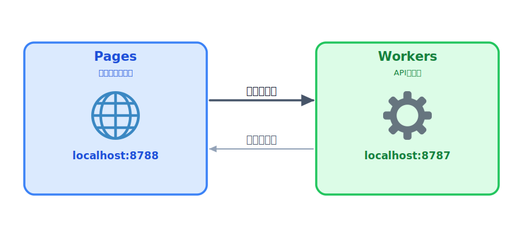
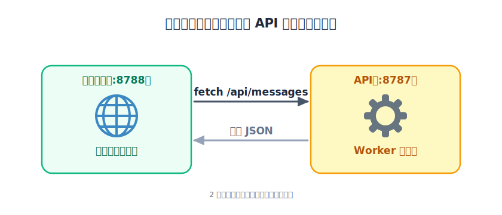
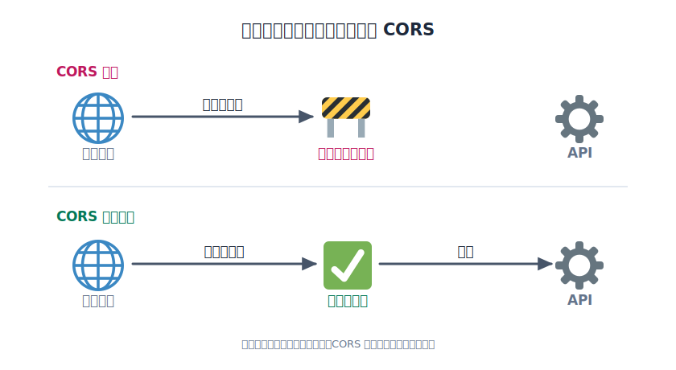

# Workers で API を動かす



[ウェブアプリの基本](../../01-publish/03-webapp/LECTURE.md) で見たとおり、アプリには「フロント」
「API（処理）」「データ」の層があります。フロント（見た目）はすでに Pages に公開しました。次は、投稿を
保存したり一覧を返したりする「処理」を作る番です。そこで登場するのが **Cloudflare Workers** です。

Workers は、リクエストを受けてプログラムを実行する **サーバーレス** の仕組みです。

サーバーの台数やOS を管理する必要はなく、コードを書いて `wrangler deploy` するだけで、世界中の Cloudflare の拠点で動きます。

ここでは [Hono](https://hono.dev/) という軽量フレームワークで API を作ります。



この章ではまだデータベースを使いません。一覧は固定のサンプルを返し、投稿は「受け取るだけ」にします。保存は次章の D1 で実装します。

## TODO

1. Worker の API をローカルで起動し、ブラウザでレスポンスを確認する
2. フロントから API を呼び出し、一覧が表示されることを確認する
3. Worker を Cloudflare に公開する
4. 不要になった Worker を CLI（コマンド）で削除する

## 学ぶこと

- サーバーレス（Workers）とは何か。「処理」をどこで動かすのか
- API の基本（GET で取得、POST で送信、JSON でやり取り）
- 入力チェックは **サーバー側でも必ず行う**（フロントのチェックは迂回できる）
- **CORS**：フロント（Pages）と API（Workers）が別の URL（オリジン）にあると、ブラウザは既定でリクエストをブロックする。サーバー側で「このオリジンからは許可」と返す必要がある

## 説明

### 2つのアプリを動かす

ここからは **フロントのアプリ（Pages）** と **API のアプリ（Workers）** の 2 つを組み合わせて使います。
役割が分かれた **別々のアプリ** で、動かす場所（URL・ポート）も別々です。

- **Pages** … 画面を表示するアプリ（例: `http://localhost:8788`）
- **Workers** … データを処理する API のアプリ（例: `http://localhost:8787`）

このように役割ごとにアプリを分けて、それぞれを独立して動かす構成を
**サーバーレスアーキテクチャ** と呼びます。1 つのサーバーに全部を載せるのではなく、
アプリが役割ごとに分かれているため、**ローカルで動かすときも 2 つのアプリを別々に立ち上げる** 必要があります。



### TODO 1: API をローカルで起動する

まず、このセクション用の設定ファイル `wrangler.jsonc` を用意します。

リポジトリにはテンプレートの`wrangler.example.jsonc` が入っているので、**同じフォルダ上でこのファイルを複製し、複製した方の名前を `wrangler.jsonc` に変更**します。

エクスプローラーや VSCode でファイルをコピー＆ペーストし、名前を付け替えるだけで大丈夫です。

複製した [wrangler.jsonc](./wrangler.jsonc) を開き、`name` の「あなたの名前」の部分を自分用に書き換えます（例: `hitokoto-tanaka-01-workers`）。

他の人と同じ名前だと公開時にぶつかるので、必ず自分だけの名前にしてください。

次に、このフォルダで依存をインストールし、Worker を起動します。

```bash
npm install
npx wrangler dev
```

`wrangler dev` が `http://localhost:8787` で起動します。ブラウザで起動を確認しましょう。

ブラウザのアドレスバーに `http://localhost:8787/api/messages` を入力して開くと次のように表示されます。これで動作確認ができます。

```json
[
  {
    "id": 2,
    "name": "さとう",
    "body": "Cloudflare で公開してみた"
  },
  {
    "id": 1,
    "name": "たなか",
    "body": "はじめての投稿です！"
  }
]
```

これは本来データベースから取得するべき投稿の一覧です。

### TODO 2: フロントから呼び出す

VS Code から 新たにターミナルを起動して、フロントのアプリケーションを起動します。

```bash
npx wrangler pages dev ./public --port 8788
```

`http://localhost:8788` を開くと同時にAPI を呼び、一覧を表示します。フォームから投稿すると、画面に追加され「まだ保存されない」案内が出ます。



フロントの呼び出し先は [public/main.js](./public/main.js) の `API_BASE` で指定しています。

### TODO 3: Cloudflare に公開する

```bash
npx wrangler deploy
```

`wrangler.jsonc` の `name` は TODO 1 で自分用に変えてあるはずです（例: `hitokoto-tanaka-01-workers`）。

公開されると Worker の URL（`https://<name>.<サブドメイン>.workers.dev`）が表示されます。ブラウザで `<その URL>/api/messages` を開くと、インターネット越しに JSON が返ります。

公開した Pages から公開した Worker を呼ぶには、[public/main.js](./public/main.js) の `API_BASE` をこの Worker の URL に書き換えて、フロントを再デプロイします（前章 Pages で使ったのと同じ `wrangler pages deploy` の手順）。

### TODO 4: 公開したものを削除する（CLI）

前章 [Pages](../../01-publish/02-pages/LECTURE.md) では、公開したものを **ダッシュボード（画面）** から削除しました。

ここでは同じ「削除」を **CLI（コマンド）** でやってみます。慣れると画面を開くより速く、
`wrangler.jsonc` の `name` に書いた Worker をそのまま消せます。

:::danger
削除は元に戻せません。消すのは「このハンズオンで作った練習用 Worker」だけにしてください。
:::

このフォルダ（`wrangler.jsonc` のあるフォルダ）で次を実行すると、`name` の Worker が削除されます。

```bash
npx wrangler delete
```

確認のメッセージが出るので、消える Worker の名前を確かめてから進めます。削除すると
`https://<name>.<サブドメイン>.workers.dev` の URL も応答しなくなります。

:::notice
Worker を消しても、前章 Pages で公開したフロントを残したままなら、それは別のプロジェクトなので
消えずに残ります。そのフロントも消したい場合は、前章 Pages と同じ手順（ダッシュボード）で削除してください。
:::

## コラム

### CORS とは

フロントは `:8788`、API は `:8787` と **別のオリジン** です。ブラウザはセキュリティのため、別オリジンへの
リクエストを既定でブロックします（同一オリジンポリシー）。これを許可するのが **CORS** です。



[src/index.js](./src/index.js) の冒頭で、Hono の `cors()` を使って許可を返しています。

```js
app.use('/api/*', cors({
  origin: '*',
  allowMethods: ['GET', 'POST', 'OPTIONS'],
  allowHeaders: ['Content-Type'],
}));
```

試しにこの `app.use('/api/*', cors({...}))` の行をコメントアウトして保存し、ブラウザの DevTools（Console / Network タブ）を見ると、CORS エラーで一覧が取得できなくなることが確認できます。

確認したら戻しておきましょう。

:::warning[本番では `origin: '*'` を避ける]
本番では `origin: '*'` を避けるのが基本です。自分の Pages の URL
（例: `'https://hitokoto-board-tanaka.pages.dev'`）に絞ると、他サイトから API を勝手に使われる
リスクを減らせます。
:::

### npm scripts でコマンドを短くする

このレクチャーでは `npx wrangler dev` のように **そのままのコマンド** を打ってきましたが、毎回フルで入力するのは大変です。よく使うコマンドは [package.json](./package.json) の `scripts` に名前を付けて登録しておけます。

```jsonc
{
  "scripts": {
    "dev": "wrangler dev",
    "front": "wrangler pages dev ./public --port 8788",
    "deploy": "wrangler deploy"
  }
}
```

こうしておくと、長いコマンドの代わりに短い名前で同じことが実行できます。

```bash
npm run dev
npm run front
npm run deploy
```

このフォルダの `package.json` には最初からこの scripts が入っているので、`npm run dev` のように呼んでも動きます。

中身（どんなコマンドが動くのか）を理解しておくと、トラブル時に追いやすくなります。

## 次の章へ

API ができたら、いよいよ投稿を **保存** します。次は [D1 でデータを保存する](../02-d1/LECTURE.md)
に進みます。
