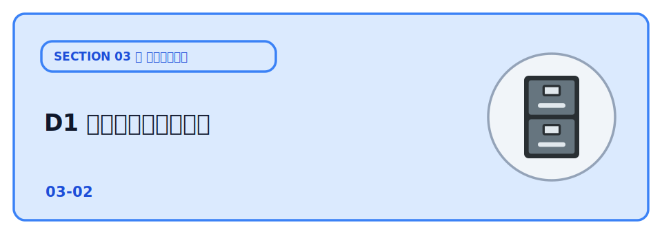
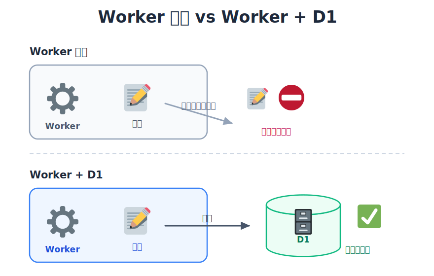
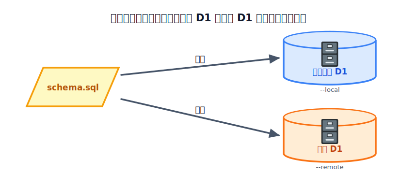

# D1 でデータを保存する



前章の API は、投稿を受け取っても保存していませんでした（Worker は基本的に状態を持たないため、変数にためても次のリクエストでは消えてしまいます）。

データを **ずっと残す** には、データベースが必要です。

ここで使うのが **Cloudflare D1**。SQLite ベースのデータベースで、Worker から直接読み書きできます。
これでようやく「ひとことボード」が完成します。



## TODO

1. D1 データベースを作り、`wrangler.jsonc` に binding を設定する
2. `schema.sql` を流してテーブルを作る
3. ローカルで投稿が保存されることを確認する
4. 本番に公開して、インターネット越しに保存できることを確認する
5. 不要になったリソース（Worker / D1）を削除する

## 学ぶこと

- データベースの役割（処理が終わってもデータが残る）
- D1 の基本：`prepare(...).bind(...).all()/run()` で SQL を実行する
- テーブルは `schema.sql` を流して作る（ローカルで開発し、公開時に本番にも同じ SQL を流す）

## 説明

### はじめに: プロジェクトを用意する

このレクチャーのサンプルを ZIP で配布しています。次の手順で手元に用意してください。

1. 下の「サンプルコードをダウンロード」ボタンからプロジェクト ZIP をダウンロードする
2. ダウンロードした ZIP を解凍する（展開すると `02-d1` フォルダができます）
3. その `02-d1` フォルダを VSCode で開く（File → Open Folder、またはフォルダをドラッグ&ドロップ）
4. VSCode で[ターミナルを開く](../../00-environment/01-tools/LECTURE.md)。以降のコマンドは、この開いたフォルダ（`02-d1`）の中で実行します。

:::download
[サンプルコードをダウンロード](./project.zip)
:::

### TODO 1: D1 を作る

まず、このセクション用の設定ファイル `wrangler.jsonc` を用意します。

テンプレートの `wrangler.example.jsonc` を **同じフォルダ上で複製し、複製した方の名前を `wrangler.jsonc` に変更**します（このステップでも新しく自分専用のアプリを作ります）。

複製した [wrangler.jsonc](./wrangler.jsonc) を開き、`name` の「あなたの名前」を自分用に書き換えます（例: `hitokoto-tanaka-02-d1`）。他の人とぶつからないよう、必ず自分だけの名前にしてください。

次に、このフォルダで依存をインストールし、データベースを作ります。

```bash
npm ci
npx wrangler d1 create hitokoto-db-02-d1
```

```bash
% npm ci

（依存パッケージがインストールされます）
% npx wrangler d1 create hitokoto-db-02-d1

 ⛅️ wrangler x.x.x
────────────────────
✅ Successfully created DB 'hitokoto-db-02-d1' in region APAC
Created your new D1 database.

To access your new D1 Database in your Worker, add the following snippet to your configuration file:
{
  "d1_databases": [
    {
      "binding": "hitokoto_db_02_d1",
      "database_name": "hitokoto-db-02-d1",
      "database_id": "xxxxxxxx-xxxx-xxxx-xxxx-xxxxxxxxxxxx"
    }
  ]
}
✔ Would you like Wrangler to add it on your behalf? … no
```

#### 途中で聞かれる質問について

`wrangler d1 create` は DB を作ったあと、「この設定を `wrangler.jsonc` に書き込むのを手伝おうか？」と対話で聞いてきます。

- **Would you like Wrangler to add it on your behalf?**
  「D1 の設定を、あなたの代わりに `wrangler.jsonc` に自動で追記しようか？」
- **What binding name would you like to use?**
  （yes のとき）「コードから呼ぶときの名前（binding）を何にする？」。デフォルトは DB 名がそのまま提案されます。
- **For local dev, do you want to connect to the remote resource instead of a local resource?**
  「ローカル開発（`wrangler dev`）のとき、手元の DB ではなく本番の D1 につなぐ？」。yes にすると `"remote": true` が付きます。

この教材では、**1つ目を No** にして、`wrangler.jsonc` は次の手順で自分で書き換えるのをおすすめします（確実で分かりやすいため）。

> [!IMPORTANT]
> Wrangler に任せる（1つ目を Yes にする）場合は、次の2点を必ず守ってください。
> - binding 名は **`DB`**（デフォルトのままにしない。コードが `c.env.DB` を参照しているため）
> - 「connect to the remote resource…」は **No**（ローカル開発は手元の DB を使う。`"remote": true` を付けない）
>
> ここを間違える（binding が `DB` 以外・remote が Yes）と、`Cannot read properties of undefined (reading 'prepare')` エラーになります。

実行すると `database_id` が表示されます。これを [wrangler.jsonc](./wrangler.jsonc) の `database_id` に貼り付けます。

```jsonc
"d1_databases": [
  {
    "binding": "DB",
    "database_name": "hitokoto-db-02-d1",
    "database_id": "（ここに貼る）"
  }
]
```

`binding` の `"DB"` が、Worker のコードで `c.env.DB` として使う名前です。

### TODO 2: テーブルを作る

テーブル定義は [schema.sql](./schema.sql) にあります。この SQL をデータベースに流すことで、投稿を保存するためのテーブルが作られます。

```bash
npx wrangler d1 execute hitokoto-db-02-d1 --local --file=./schema.sql
```

`--local` は手元の開発用 D1（`wrangler dev` が使う SQLite）にだけ流します。本番側へは TODO 4 の
公開のときに同じ SQL をもう一度流すので、今はローカルだけで大丈夫です。

### TODO 3: ローカルで保存を確認する

ターミナルを 2 つ使います。

:::notice
2 つ目のターミナルも、VSCode でこのフォルダを開いていればこのフォルダの中から始まります。それぞれのターミナルで `pwd`（Windows は `cd`）を実行し、末尾が `.../02-d1` になっていることを確認しておきましょう。
:::

```bash
npx wrangler dev
npx wrangler pages dev ./public --port 8788
```

`http://localhost:8788` を開いて投稿し、**ページを再読み込みしても残っている** ことを確認します。
保存されたデータは次のコマンドでも確認できます。

```bash
npx wrangler d1 execute hitokoto-db-02-d1 --local --command "SELECT * FROM messages"
```

### TODO 4: 本番に公開する

本番の D1 はローカルとは別のデータベースなので、公開前に同じ `schema.sql` を本番側にも流しておきます（`--local` を `--remote` に変えます）。



```bash
npx wrangler d1 execute hitokoto-db-02-d1 --remote --file=./schema.sql
npx wrangler deploy
```

公開 Worker の URL を `public/main.js` の `API_BASE` に設定し、フロントを再デプロイすれば、インターネット上の「ひとことボード」が完成です。

本番 D1 の中身も確認できます。

```bash
npx wrangler d1 execute hitokoto-db-02-d1 --remote --command "SELECT * FROM messages"
```

### TODO 5: 公開したものを削除する

この章で作った Worker と D1 データベースは、不要になったら削除できます。削除の方法は
**ダッシュボード（画面）** と **CLI（コマンド）** のどちらでも構いません。やりやすい方で消してください。

:::danger
削除は元に戻せません。消すのは「このハンズオンで作った練習用のもの」だけにしてください。
:::

CLI（コマンド）で消す場合は次のとおりです。

```bash
npx wrangler delete                      # この章の Worker を削除
npx wrangler d1 delete hitokoto-db-02-d1       # D1 データベースを削除
```

ダッシュボードから消す場合は、**Workers & Pages** で Worker を、**Storage & Databases → D1** で
データベースを、それぞれ選んで削除します。

:::notice
各章は独立していて、リソースは章ごとに作り直します。この章で作った D1（`hitokoto-db-02-d1`）は、
確認が終わったら遠慮なく削除して構いません。次章の R2 では、また自分でその章専用の D1 を作るので、
この章のものを残しておく必要はありません。
:::

## まとめ

ここまでで、**フロント（Pages）＋ API（Workers）＋ データベース（D1）** という、現代的なフルスタック
アプリの最小構成を、すべて Cloudflare の無料枠で公開できました。

次の章では、これに **画像の添付（R2）** を足して、データの種類ごとに保存先を使い分けます。

## コラム

### npm scripts でコマンドを短くする

この章では `npx wrangler d1 execute hitokoto-db-02-d1 --local --file=./schema.sql` のような **長いコマンド** を
打ちました。よく使うものは [package.json](./package.json) の `scripts` に名前を付けて
登録しておくと、短い名前で呼べます。

```jsonc
{
  "scripts": {
    "dev": "wrangler dev",                                          // npm run dev
    "front": "wrangler pages dev ./public --port 8788",             // npm run front
    "deploy": "wrangler deploy",                                    // npm run deploy
    "db:create": "wrangler d1 create hitokoto-db-02-d1",                  // npm run db:create
    "db:setup": "wrangler d1 execute hitokoto-db-02-d1 --local --file=./schema.sql",    // npm run db:setup
    "db:setup:remote": "wrangler d1 execute hitokoto-db-02-d1 --remote --file=./schema.sql"  // npm run db:setup:remote
  }
}
```

こうしておくと、次のように短く実行できます。

```bash
npm run db:create           # = npx wrangler d1 create hitokoto-db-02-d1
npm run db:setup            # = npx wrangler d1 execute hitokoto-db-02-d1 --local --file=./schema.sql
npm run db:setup:remote     # = npx wrangler d1 execute hitokoto-db-02-d1 --remote --file=./schema.sql
npm run dev                 # = npx wrangler dev
npm run front               # = npx wrangler pages dev ./public --port 8788
npm run deploy              # = npx wrangler deploy
```

このフォルダの `package.json` には最初からこの scripts が入っているので、`npm run db:setup`
のように呼んでも動きます。`db:setup:remote` のような **打ち間違えると本番に影響するコマンド** ほど、
名前で固定しておくと安全です。

## 次の章へ

次は [R2 で画像を保存する](../03-r2/LECTURE.md) で、投稿に画像を添付できるようにし、
**ファイルは R2・構造化データは D1** という保存先の使い分けを体験します。
