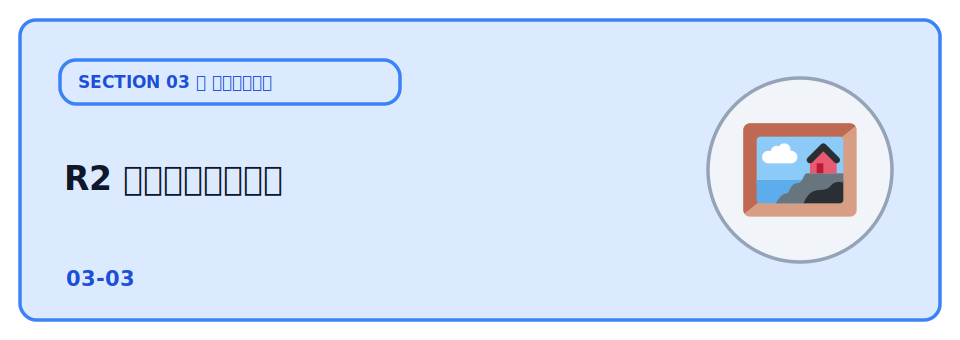

# R2 で画像を保存する



前章で「ひとことボード」の投稿を D1 に保存できるようになりました。次は **画像** を付けられるようにします。

ただし、画像のような **ファイル** をデータベース（D1）に入れるのは向いていません。D1 は「文字や数値の表」を扱うのが得意で、大きなバイナリはサイズも料金も配信も不利になります。ファイルには **オブジェクトストレージ** が適しています。Cloudflare のそれが **R2** です。

R2 は Amazon S3 と互換の API を持ち、最大の特徴は **下り（egress）転送が無料** なこと。画像をたくさん配信するアプリでも、転送量の請求に怯えずに済みます。

この章では、**本文は D1・画像は R2** と保存先を分け、両者を組み合わせて 1 つの投稿として表示します。

:::notice[はじめに：カード登録とローカル動作について]
これまでの章（Workers / Pages / D1）は無料プランのまま進められましたが、**R2 だけは本番で使うときにクレジットカードなど支払い方法の登録を求められることがあります**（無料枠内なら課金はされません）。

ただし、**ローカルで動かすだけ（TODO 4 まで）ならカード登録は不要**です。`wrangler dev` / `wrangler pages dev` はローカルにファイルを保存して動くため、実際の R2 バケットがなくても画像つき投稿の保存・表示を最後まで体験できます。カードを登録したくない場合は、TODO 4 のローカル確認までを試し、本番公開（TODO 5）はスキップすれば大丈夫です。詳しくは TODO 1 とTODO 5 の注記を参照してください。
:::

## TODO

1. R2 バケットを作り、`wrangler.jsonc` に binding を設定する
2. テーブルに画像のキーを持たせる（`image_key` 列）
3. Worker が D1 と R2 をどう使い分けているかコードを読む
4. ローカルで画像つきの投稿が保存・表示されることを確認する
5. 本番に公開して、インターネット越しに画像を配信できることを確認する
6. 使ったリソース（Worker / D1 / R2）をすべて削除する

## 学ぶこと

- データベースと **オブジェクトストレージの使い分け**（構造化データは D1、ファイルは R2）
- R2 の基本：`env.BUCKET.put(key, body)` で保存、`env.BUCKET.get(key)` で取得
- 画像本体は R2 に置き、D1 には **キーだけ** を保存する設計
- アップロードのキーは **一意にする**（ファイル名そのままは上書き・衝突の元）
- 受け取るファイルの **種類・サイズを制限** する（踏み台対策の基本）

## 説明

### TODO 1: R2 バケットを作る

まず、このセクション用の設定ファイル `wrangler.jsonc` を用意します。テンプレートの
`wrangler.example.jsonc` を **同じフォルダ上で複製し、複製した方の名前を `wrangler.jsonc` に変更**
します（このステップでも新しく自分専用のアプリを作ります）。

複製した [wrangler.jsonc](./wrangler.jsonc) を開き、`name` の「あなたの名前」を自分用に書き換えます
（例: `hitokoto-tanaka-03-r2`）。`database_id` は、次で `npx wrangler d1 create` を実行すると表示される
この章の D1 の ID を貼り付けます（下のコマンドの出力）。

次に、このフォルダで依存をインストールし、この章で使う D1 と R2 バケットを用意します。

```bash
npm install
npx wrangler d1 create hitokoto-db-03-r2
npx wrangler r2 bucket create hitokoto-images-03-r2
```

`wrangler.jsonc` には R2 の binding も入っています。

```jsonc
"r2_buckets": [
  {
    "binding": "BUCKET",
    "bucket_name": "hitokoto-images-03-r2"
  }
]
```

`binding` の `"BUCKET"` が、Worker のコードで `c.env.BUCKET` として使う名前です。D1 と違い、R2 には
`database_id` のような ID を貼る作業はありません（バケット名で結びつきます）。

:::warning[R2 の課金について（この章だけ前の章と少し違います）]
R2 には無料枠があり（ストレージ 10GB/月・Class A 操作 100 万/月・Class B 操作 1000 万/月、
そして **下り転送は無料**）、このハンズオンの規模なら無料枠に十分収まります。**無料枠内で使う
限り請求は発生しません**。

ただし R2 を **有効化（サブスクライブ）するときに、クレジットカードなどの支払い方法の登録を求められることがあります**。これは「登録した瞬間に課金される」という意味ではなく、無料枠を超えたときに備えた登録です。

Workers・Pages・D1 は無料プランのまま使えたのに対し、R2 だけはこのカード登録のハードルがある点に注意してください。

**カード登録なしで進めたい場合**は、本番の R2 バケットを作らずに **TODO 4（ローカル確認）まで**を体験できます。

`wrangler dev` / `wrangler pages dev` はローカルにファイルを保存して動くため、実際の R2 バケットがなくても画像つき投稿の保存・表示は確認できます。本番公開（TODO 5）だけスキップする形になります。
:::

### TODO 2: テーブルに画像のキーを持たせる

画像の本体は R2 に保存し、D1 には **その場所を指す目印（キー）だけ** を持たせます。

[migrations/0001_init.sql](./migrations/0001_init.sql) に `image_key` 列を足してあります。

```sql
CREATE TABLE IF NOT EXISTS messages (
  id          INTEGER PRIMARY KEY AUTOINCREMENT,
  name        TEXT NOT NULL,
  body        TEXT NOT NULL,
  image_key   TEXT,                       -- R2 のキー（画像なしの投稿では NULL）
  created_at  TEXT NOT NULL DEFAULT CURRENT_TIMESTAMP
);
```

マイグレーションを適用します（**ローカルと本番は別物** なので、それぞれに流します）。

```bash
npx wrangler d1 migrations apply hitokoto-db-03-r2 --local
npx wrangler d1 migrations apply hitokoto-db-03-r2 --remote
```

:::notice
このフォルダは単体で動く完成形です。この章で作った D1 に上の migration をそのまま適用すれば、`image_key` 列まで含んだテーブルができあがります。
:::

### TODO 3: D1 と R2 の使い分けを読む

[src/index.js](./src/index.js) を見ます。投稿は **画像ファイルを送れる形式（multipart/form-data）** で
受け取り、画像があれば先に R2 へ保存して、そのキーを D1 に書きます。

```js
let imageKey = null;

if (image && image.size > 0) {
  // キーは一意にする。ファイル名そのままだと上書き・衝突が起きる。
  const ext = image.type.split('/')[1];
  imageKey = `${Date.now()}-${crypto.randomUUID()}.${ext}`;

  await c.env.BUCKET.put(imageKey, image.stream(), {
    httpMetadata: { contentType: image.type },
  });
}

await c.env.DB.prepare(
  'INSERT INTO messages (name, body, image_key) VALUES (?, ?, ?)',
).bind(name, body, imageKey).run();
```

ポイントは、**画像本体は R2・目印は D1** と役割を分けていることです。一覧を返すときは `image_key` も一緒に返し、ブラウザはそのキーから画像の URL を組み立てます。


画像の配信は Worker 経由で行います。

```js
app.get('/api/images/:key', async (c) => {
  const obj = await c.env.BUCKET.get(c.req.param('key'));
  if (!obj) return c.notFound();

  const headers = new Headers();
  obj.writeHttpMetadata(headers);   // 保存時の Content-Type を復元
  return new Response(obj.body, { headers });
});
```

`put` のときに保存した `contentType` が、`writeHttpMetadata` で配信時に復元されるので、ブラウザが画像として正しく表示できます。


:::warning[キーは必ず一意に]
ファイル名をそのままキーにすると、同じ名前のアップロードで前の画像を上書きしてしまいます。

ここでは `時刻 + ランダムなID` を使っています。また、誰でもアップロードできる状態は[踏み台](../../02-security/01-basic/LECTURE.md) のリスクになるので、コードでは **種類（png/jpeg/gif/webp）とサイズ（5MB）** を制限しています。本番ではさらに認証も検討します。
:::

### TODO 4: ローカルで確認する

ターミナルを 2 つ使います。

```bash
npx wrangler dev
npx wrangler pages dev ./public --port 8788
```

`http://localhost:8788` を開いて、画像を選んで投稿します。一覧に画像が表示され、**再読み込みしても残っている** ことを確認しましょう。

ローカルでは実際の R2 バケットがなくても、ローカルに保存されて動きます。保存された画像のキーは、次のコマンドでも確認できます。

```bash
npx wrangler d1 execute hitokoto-db-03-r2 --local --command "SELECT id, name, image_key FROM messages"
```

### TODO 5: 本番に公開する

```bash
npx wrangler deploy
```

公開後の Worker から本番の D1 / R2 を使うには、TODO 1〜2 の本番側（`bucket:create` と `db:migrate:remote`）が済んでいる必要があります。

公開 Worker の URL を `public/main.js` の `API_BASE` に設定し、フロントを再デプロイすれば、画像つきの「ひとことボード」が完成です。

:::warning[本番の R2 バケット作成には、R2 の有効化（支払い方法の登録）が必要です]
TODO 1 で触れたとおり、R2 だけは有効化の際にカード登録を求められることがあります。

まだ登録していない場合は、ここで `npx wrangler r2 bucket create hitokoto-images-03-r2` が失敗するので、Cloudflare ダッシュボードで R2 を
有効化してから再実行してください。

カード登録を避けたい場合は、この TODO 5 をスキップして **TODO 4 のローカル確認まで** で止めておけば大丈夫です。
:::

### TODO 6: 使ったものをすべて削除する

これがアプリ作りの最後の章です。ハンズオンで作ったリソース（Worker・D1・R2）は、確認が終わったら削除しておきましょう。

削除の方法は **ダッシュボード（画面）** と **CLI（コマンド）** のどちらでも構いません。

:::danger
削除は元に戻せません。消すのは「このハンズオンで作った練習用のもの」だけにしてください。
:::

CLI（コマンド）でまとめて消す場合は次のとおりです。

```bash
npx wrangler delete
npx wrangler d1 delete hitokoto-db-03-r2
npx wrangler r2 bucket delete hitokoto-images-03-r2
```

:::notice
R2 バケットは **中身が空でないと削除できない** ことがあります。
その場合は、先にダッシュボードの **R2** から画像（オブジェクト）を消すか、バケットごとダッシュボードで削除するのが手軽です。ダッシュボードなら、**Workers & Pages**（Worker）・**Storage & Databases → D1**（DB）・**R2**（バケット）から、それぞれ選んで削除できます。
:::

## まとめ

データには **構造化データ（D1）** と **ファイル（R2）** の 2 種類があり、それぞれ適した保存先が違うことを体験しました。

画像の本体は R2 に、その目印だけを D1 に持たせ、両者を組み合わせて 1 つの投稿として表示する——これは実際のアプリでもよく使われる定番の設計です。

これで **フロント（Pages）＋ API（Workers）＋ データベース（D1）＋ ファイル（R2）** という、現代的なフルスタックアプリの構成を、すべて Cloudflare の無料枠で公開できました。

## コラム

### なぜ画像を Worker 経由で配信したのか

R2 には、バケットを公開する方法がいくつかあります。

- **r2.dev のURL**：開発・確認用にバケットを手早く公開できる。ただし本番運用は非推奨。
- **カスタムドメイン**：自分のドメインを R2 に割り当てて、CDN 経由で直接配信する（本番向き）。
- **Worker 経由**：この章のやり方。配信前に「ログインしているか」「公開してよい画像か」などの
  チェックを挟める。

この章では仕組みが見えやすく、アクセス制御も足しやすい **Worker 経由** を選びました。配信量が増えて
きたら、画像はカスタムドメインで直接配信し、Worker はアップロードや認可だけを担当する、といった
分担に切り替えるのが定石です。

## 次の章へ

次は付録の [公開先の比較](../../04-appendix/01-compare/LECTURE.md) で、公開先の選び方を 3 段階に
分けて整理し、Cloudflare をいつ選ぶと良いかをはっきりさせます。
