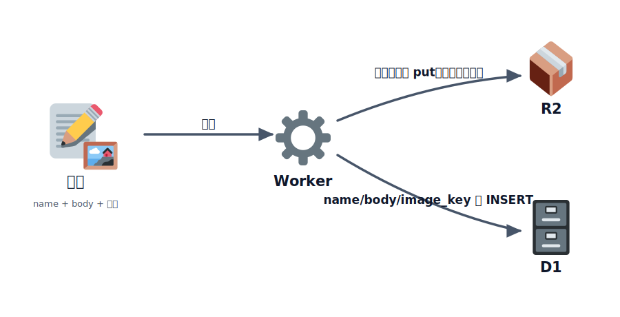
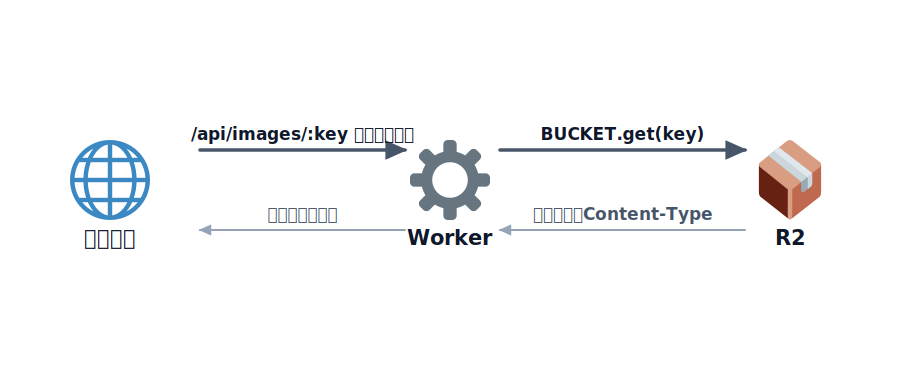

# R2 で画像を保存する

前章で「ひとことボード」の投稿を D1 に保存できるようになりました。次は **画像** を付けられるように
します。

ただし、画像のような **ファイル** をデータベース（D1）に入れるのは向いていません。D1 は「文字や数値の
表」を扱うのが得意で、大きなバイナリはサイズも料金も配信も不利になります。ファイルには **オブジェクト
ストレージ** が適していて、Cloudflare のそれが **R2** です。

R2 は Amazon S3 と互換の API を持ち、最大の特徴は **下り（egress）転送が無料** なこと。画像をたくさん
配信するアプリでも、転送量の請求に怯えずに済みます。

この章では、**本文は D1・画像は R2** と保存先を分け、両者を組み合わせて 1 つの投稿として表示します。

## TODO

1. R2 バケットを作り、`wrangler.jsonc` に binding を設定する
2. テーブルに画像のキーを持たせる（`image_key` 列）
3. Worker が D1 と R2 をどう使い分けているかコードを読む
4. ローカルで画像つきの投稿が保存・表示されることを確認する
5. 本番に公開して、インターネット越しに画像を配信できることを確認する

## 学ぶこと

- データベースと **オブジェクトストレージの使い分け**（構造化データは D1、ファイルは R2）
- R2 の基本：`env.BUCKET.put(key, body)` で保存、`env.BUCKET.get(key)` で取得
- 画像本体は R2 に置き、D1 には **キー（場所の目印）だけ** を保存する設計
- アップロードのキーは **一意にする**（ファイル名そのままは上書き・衝突の元）
- 受け取るファイルの **種類・サイズを制限** する（踏み台対策の基本）

## 説明

### TODO 1: R2 バケットを作る

このフォルダで依存をインストールし、D1（前章と同じもの）と R2 バケットを用意します。

```bash
npm install
npx wrangler d1 create hitokoto-db          # 前章で作成済みならスキップ
npx wrangler r2 bucket create hitokoto-images
```

`wrangler.jsonc` に R2 の binding を追加してあります。

```jsonc
"r2_buckets": [
  {
    "binding": "BUCKET",
    "bucket_name": "hitokoto-images"
  }
]
```

`binding` の `"BUCKET"` が、Worker のコードで `c.env.BUCKET` として使う名前です。D1 と違い、R2 には
`database_id` のような ID を貼る作業はありません（バケット名で結びつきます）。

> R2 の利用には、無料枠の範囲でも支払い方法の登録を求められることがあります。

### TODO 2: テーブルに画像のキーを持たせる

画像の本体は R2 に保存し、D1 には **その場所を指す目印（キー）だけ** を持たせます。
[migrations/0001_init.sql](./migrations/0001_init.sql) に `image_key` 列を足してあります。

```sql
CREATE TABLE IF NOT EXISTS messages (
  id          INTEGER PRIMARY KEY AUTOINCREMENT,
  name        TEXT NOT NULL,
  body        TEXT NOT NULL,
  image_key   TEXT,                       -- R2 のキー（画像なしの投稿では NULL）
  created_at  TEXT NOT NULL DEFAULT CURRENT_TIMESTAMP
);
```

マイグレーションを適用します（前章と同じく **ローカルと本番は別物**）。

```bash
npx wrangler d1 migrations apply hitokoto-db --local
npx wrangler d1 migrations apply hitokoto-db --remote
```

> 前章の `hitokoto-db` を作り直したくない場合は、`ALTER TABLE messages ADD COLUMN image_key TEXT;` を
> 新しいマイグレーションとして足す方法もあります。このフォルダは単体で動く完成形なので、上の定義を
> そのまま使えば大丈夫です。

### TODO 3: D1 と R2 の使い分けを読む

[src/index.js](./src/index.js) を見ます。投稿は **画像ファイルを送れる形式（multipart/form-data）** で
受け取り、画像があれば先に R2 へ保存して、そのキーを D1 に書きます。

```js
let imageKey = null;

if (image && image.size > 0) {
  // キーは一意にする。ファイル名そのままだと上書き・衝突が起きる。
  const ext = image.type.split('/')[1];
  imageKey = `${Date.now()}-${crypto.randomUUID()}.${ext}`;

  await c.env.BUCKET.put(imageKey, image.stream(), {
    httpMetadata: { contentType: image.type },
  });
}

await c.env.DB.prepare(
  'INSERT INTO messages (name, body, image_key) VALUES (?, ?, ?)',
).bind(name, body, imageKey).run();
```

ポイントは、**画像本体は R2・目印は D1** と役割を分けていることです。一覧を返すときは `image_key` も
一緒に返し、ブラウザはそのキーから画像の URL を組み立てます。



<!-- genfig: 左に投稿(📝、name+body+画像🖼️)。中央に Worker(⚙️)。Worker から右上の R2(📦) へ画像本体を保存する矢印（ラベル「画像本体を put（一意なキー）」）、右下の D1(🗄️) へ目印を保存する矢印（ラベル「name/body/image_key を INSERT」）。1 つの投稿が 2 つの保存先に分岐する構図。イメージスキーマ = SPLITTING + SOURCE-PATH-GOAL。絵文字割当: 投稿=📝 画像=🖼️ Worker=⚙️ R2=📦 D1=🗄️。関係はすべて矢印ラベルで表す。 -->
*図: 1 つの投稿を、画像本体は R2 に・目印（キー）は D1 に分けて保存する。*

画像の配信は Worker 経由で行います。

```js
app.get('/api/images/:key', async (c) => {
  const obj = await c.env.BUCKET.get(c.req.param('key'));
  if (!obj) return c.notFound();

  const headers = new Headers();
  obj.writeHttpMetadata(headers);   // 保存時の Content-Type を復元
  return new Response(obj.body, { headers });
});
```

`put` のときに保存した `contentType` が、`writeHttpMetadata` で配信時に復元されるので、ブラウザが
画像として正しく表示できます。



<!-- genfig: 左にブラウザ(🌐)、中央に Worker(⚙️)、右に R2(📦) を横一列に配置。往路: ブラウザ→Worker（ラベル「/api/images/:key をリクエスト」）、Worker→R2（ラベル「BUCKET.get(key)」）。復路: R2→Worker（ラベル「画像本体＋Content-Type」）、Worker→ブラウザ（ラベル「画像レスポンス」）。経路を通って取りに行き、同じ経路で戻ってくる往復構図。イメージスキーマ = SOURCE-PATH-GOAL + CYCLE。絵文字割当: ブラウザ=🌐 Worker=⚙️ R2=📦。関係（リクエスト/get/レスポンス）はすべて矢印ラベルで表し絵文字ノードにしない。 -->
*図: 画像は R2 から直接ではなく、Worker を経由して配信する（途中でアクセス制御を挟める）。*

> **キーは必ず一意に**。ファイル名をそのままキーにすると、同じ名前のアップロードで前の画像を上書き
> してしまいます。ここでは `時刻 + ランダムなID` を使っています。また、誰でもアップロードできる状態は
> [踏み台](../../02-security/01-basic/LECTURE.md) のリスクになるので、コードでは **種類（png/jpeg/gif/webp）と
> サイズ（5MB）** を制限しています。本番ではさらに認証も検討します。

### TODO 4: ローカルで確認する

ターミナルを 2 つ使います。

```bash
npx wrangler dev                                 # ターミナル1: Worker（API）:8787
npx wrangler pages dev ./public --port 8788      # ターミナル2: フロント :8788
```

`http://localhost:8788` を開いて、画像を選んで投稿します。一覧に画像が表示され、**再読み込みしても
残っている** ことを確認しましょう。ローカルでは実際の R2 バケットがなくても、ローカルに保存されて
動きます。

保存された画像のキーは、次のコマンドでも確認できます。

```bash
npx wrangler d1 execute hitokoto-db --local --command "SELECT id, name, image_key FROM messages"
```

### TODO 5: 本番に公開する

```bash
npx wrangler deploy
```

公開後の Worker から本番の D1 / R2 を使うには、TODO 1〜2 の本番側（`bucket:create` と
`db:migrate:remote`）が済んでいる必要があります。公開 Worker の URL を `public/main.js` の
`API_BASE` に設定し、フロントを再デプロイすれば、画像つきの「ひとことボード」が完成です。

## まとめ

データには **構造化データ（D1）** と **ファイル（R2）** の 2 種類があり、それぞれ適した保存先が
違うことを体験しました。画像の本体は R2 に、その目印だけを D1 に持たせ、両者を組み合わせて 1 つの
投稿として表示する——これは実際のアプリでもよく使われる定番の設計です。

これで **フロント（Pages）＋ API（Workers）＋ データベース（D1）＋ ファイル（R2）** という、
現代的なフルスタックアプリの構成を、すべて Cloudflare の無料枠で公開できました。

## コラム

### なぜ画像を Worker 経由で配信したのか

R2 には、バケットを公開する方法がいくつかあります。

- **r2.dev のURL**：開発・確認用にバケットを手早く公開できる。ただし本番運用は非推奨。
- **カスタムドメイン**：自分のドメインを R2 に割り当てて、CDN 経由で直接配信する（本番向き）。
- **Worker 経由**：この章のやり方。配信前に「ログインしているか」「公開してよい画像か」などの
  チェックを挟める。

この章では仕組みが見えやすく、アクセス制御も足しやすい **Worker 経由** を選びました。配信量が増えて
きたら、画像はカスタムドメインで直接配信し、Worker はアップロードや認可だけを担当する、といった
分担に切り替えるのが定石です。

## 次の章へ

次は付録の [公開先の比較](../../04-appendix/01-compare/LECTURE.md) で、公開先の選び方を 3 段階に
分けて整理し、Cloudflare をいつ選ぶと良いかをはっきりさせます。
