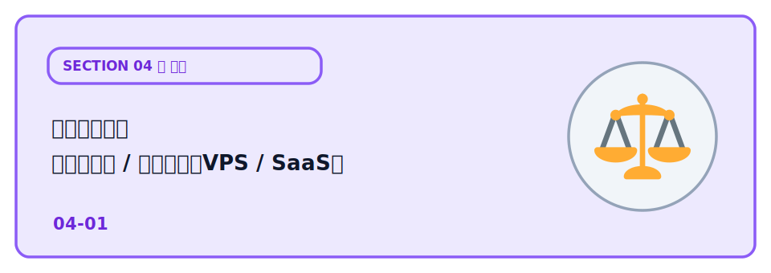
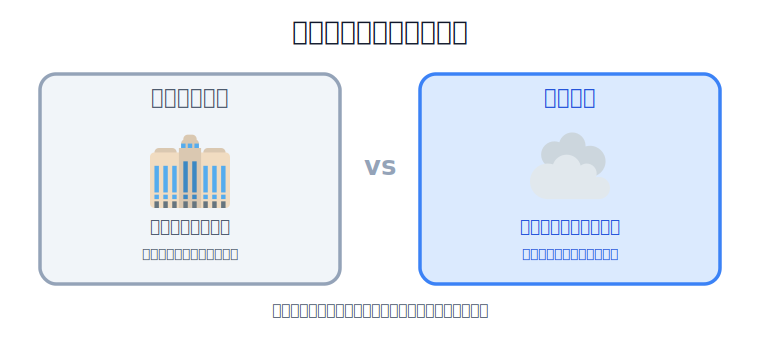
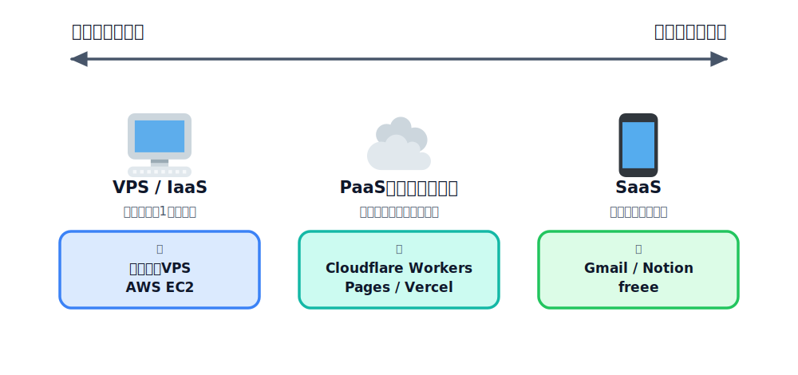
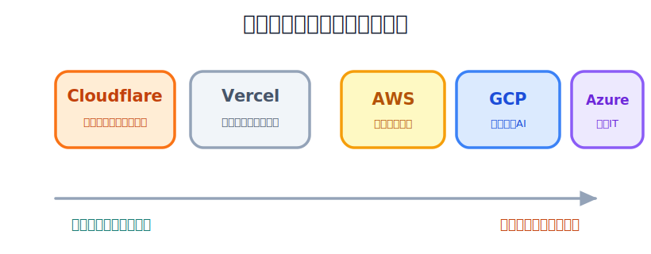
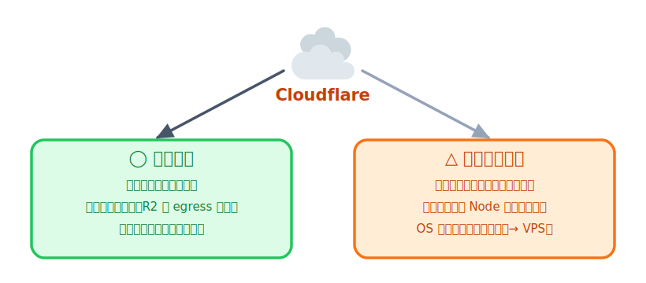

# 公開先の比較（オンプレ/クラウド・VPS/SaaS・ベンダー）

Cloudflare には Pages・Workers・D1・R2 などがあり、Web アプリを公開するためのさまざまな機能がそろっています。しかし、アプリを公開できるサービスは Cloudflare だけではありません。Vercel や AWS、GCP、Azure、VPS など、目的に応じてさまざまな選択肢があります。

AI を使えばアプリを作ることは以前よりずっと簡単になりました。その一方で、「作ったアプリをどこで公開すればよいのか」は迷うポイントです。どのサービスにも得意・不得意があり、「一番良いサービス」があるわけではありません。

このレクチャーでは、公開先をどのような観点で比較すればよいのかを整理します。これから作るアプリに合った公開先を自分で選べるようになることを目指しましょう。

## オンプレ vs クラウド

アプリを公開する方法を大きく分けると、サーバーを自分で用意する オンプレミス と、事業者が用意したサーバーを借りる クラウド があります。

**オンプレミス（オンプレ）** は、サーバーとして使う機器を自分や自社で購入し、社内のサーバールームなどに設置して運用する方法です。機器だけでなく、電源、ネットワーク、空調、故障対応なども自分たちで管理します。

**クラウド** は、Cloudflare や AWS などの事業者が管理しているサーバーを、インターネット越しに借りて使う方法です。自分で機器を購入する必要はなく、必要な機能や容量を選んで利用します。

オンプレミスは、機器やネットワークを細かく管理できるため、自由度が高いことが特徴です。一方で、最初に機器を購入する費用がかかり、設置や保守にも時間と人手が必要です。利用量を増やす場合は、新しい機器を購入して追加しなければなりません。

クラウドは、アカウントを作ればすぐに利用を始められ、必要に応じて容量や機能を増減しやすいことが特徴です。機器の故障対応などは事業者が行いますが、継続的に利用料金が発生し、利用量が増えるほど料金も増える場合があります。

| 観点 | オンプレミス | クラウド |
|---|---|---|
| サーバーの所有 | 自分・自社で所有する | 事業者の設備を借りる |
| 初期費用 | 機器の購入費用がかかる | 小さな費用で始めやすい |
| 利用開始まで | 調達・設置が必要 | アカウント作成後すぐ使える |
| 運用・保守 | 自分たちで対応する | 機器の管理は事業者が行う |
| 容量の増減 | 機器の追加や撤去が必要 | 設定変更で増減しやすい |
| 自由度 | 機器やOSを細かく管理できる | サービスごとの制約がある |
| 料金の特徴 | 購入時の費用が大きい | 利用量に応じて料金が変わる |

## いろんなクラウド

同じクラウドでも、自分で管理する範囲によって大きく **VPS / IaaS**、**PaaS・サーバーレス**、**SaaS** の3つに分けられます。

**VPS / IaaS**（VPS = Virtual Private Server／仮想専用サーバー、IaaS = Infrastructure as a Service／インフラをサービスとして借りる形）は、仮想サーバーを借りて使う方法です。OS の設定や Web サーバーの構築、セキュリティ更新なども自分で行います。自由度が高い反面、管理する内容も多くなります。

**PaaS・サーバーレス**（PaaS = Platform as a Service／アプリを動かす土台をサービスとして借りる形）は、OS やサーバーの管理を事業者に任せ、利用者はアプリケーションを開発・公開することに集中できます。Cloudflare Workers・Pages や Vercel がこの分類に入ります。

**SaaS**（Software as a Service／完成したソフトウェアをサービスとして使う形）は、完成しているサービスをそのまま利用する形です。Gmail や Notion、freee のように人が直接使うサービスだけでなく、Stripe（決済）、Mailgun（メール送信）、Sentry（エラー監視）など、アプリから API を通して利用するサービスも SaaS に含まれます。決済・メール送信・エラー監視といった機能を自分で一から作らず、その分野を専門にしているサービスに任せられるのが特徴です。自分のアプリでは本当に作りたい部分に集中し、それ以外の機能の実装は外部のサービスに任せる、という使い分けができます。

3つの違いは、「どこまで自分で管理するか」です。左に行くほど自由度は高くなりますが管理する内容も増え、右に行くほど管理は少なくなりますが自由に変更できる範囲も小さくなります。

| 観点 | VPS / IaaS | PaaS・サーバーレス | SaaS |
|---|---|---|---|
| サーバー | 借りる | 借りる | 利用しない（サービスを使う） |
| アプリ開発 | 自分 | 自分 | 不要（サービスを利用する） |
| OS の管理 | 自分 | 事業者 | 事業者 |
| Web サーバーなどの設定 | 自分 | 事業者 | 事業者 |
| セキュリティ更新 | 自分 | 事業者 | 事業者 |
| 自由度 | 高い | 中くらい | 低い |
| 管理の手間 | 多い | 少ない | ほとんどない |
| 代表例 | さくらの VPS、AWS EC2 | Cloudflare Workers、Pages、Vercel |  Stripe、Mailgun、Sentry |

## どこのクラウドを使う？

代表的なサービスには **Cloudflare**、**Vercel**、**AWS**、**GCP**、**Azure** があります。それぞれ得意分野が異なるため、作るアプリに合わせて選びます。

**Cloudflare** は、Workers・Pages・D1・R2 などを組み合わせてアプリを公開できるサービスです。無料枠が充実しており、小規模な Web アプリを手軽に公開できます。

**Vercel** は、React や Next.js のアプリを公開することを得意としています。GitHub と連携すると、自動でビルド・公開できるため、フロントエンド開発でよく利用されています。

Vercel は Next.js 以外のアプリも公開できます。詳しくは次の記事を参照してください。
[ついにVercelでバックエンドが動く！任意のDockerfileをそのままデプロイできるようになったので試してみた](https://dev.classmethod.jp/articles/vercel-run-any-dockerfile/)

**AWS・GCP・Azure** は、サーバーやデータベース、AI など幅広いサービスを提供する総合クラウドです。自由度は高い一方で、覚えることも多く、料金体系も複雑になります。

| サービス | 特徴 | 手軽さ | 得意分野 |
|---|---|---|---|
| Cloudflare | 無料枠が充実したフルスタック基盤 | ◎ | Web アプリ・API・配信 |
| Vercel | フロントエンドに特化 | ◎ | React・Next.js |
| AWS | 総合クラウド | △ | 幅広い用途 |
| GCP | 総合クラウド | △ | データ分析・AI |
| Azure | 総合クラウド | △ | Microsoft 製品との連携 |

## Cloudflare が適しているとき

Cloudflare は、すべてのアプリケーションに向いているわけではありません。エッジで実行するという特徴があるため、向いている用途と向いていない用途があります。

**Cloudflare が向いている場面** は、フロントエンドと API を組み合わせた Web アプリを手軽に公開したい場合です。Workers・Pages・D1・R2 を組み合わせることで、小規模なサービスから始めやすく、サーバー管理も必要ありません。また、R2 はデータのダウンロード（egress）が無料なため、画像や配布ファイルを扱うサービスとも相性が良いです。

**Cloudflare が向いていない場面** は、長時間動き続けるバックグラウンド処理や、OS・ミドルウェアまで細かく管理したい場合です。また、既存の Node.js アプリケーションをそのまま移行したい場合は、実行環境の違いから修正が必要になることがあります。

さらに、現時点ではデータの保存先リージョンを自由に指定できないため、データを特定の国や地域だけに保存しなければならない 要件がある場合は、他のクラウドサービスのほうが適していることがあります。

Cloudflare は「どんな用途にも最適なサービス」ではありません。しかし、今回のようなフロントエンド・API・データベースを組み合わせた Web アプリを、小さく始める用途には適しています。用途に合わせてサービスを選ぶことが大切です。

## 次の章へ

公開先の選び方が整理できたら、次は公開したアプリの様子を知る番です。
[Web Analytics でアクセス解析](../02-web-analytics/LECTURE.md) に進み、誰がどれくらい見にきているかを
つかめるようにしましょう。
