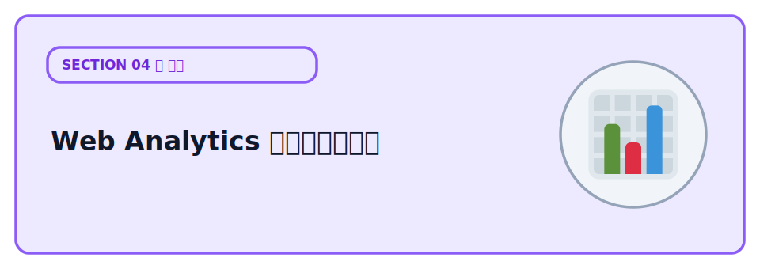

# Web Analytics でアクセス解析



サイトを公開したら、次に気になるのは「どれくらい見られているのか」です。Cloudflare Web Analytics を使うと、サイトへのアクセス状況を簡単に確認できます。このレクチャーでは、Web Analytics を組み込み、アクセス解析を始める方法を学びます。

## Web Analytics とは

Cloudflare Web Analytics は、Cloudflare が無料で提供しているアクセス解析ツールです。

サイトがどれくらい見られているかや、利用者がどのような環境でサイトを見ているかを簡単に確認できます。訪問者のプライバシーに配慮して設計されていることも特徴です。

ダッシュボードでは、次のような情報を確認できます。

| 項目 | 内容 |
| --- | --- |
| ページビュー | ページが表示された回数 |
| 訪問者数 | サイトを訪れたユーザーのおおよその数 |
| 参照元 | どのサイトやサービスから来たか |
| 国 | どの国からアクセスしているか |
| 人気ページ | よく見られているページ |
| Core Web Vitals | ページの表示速度などの指標 |

ブログや個人サイトなどで、「どれくらい見られているか」を手軽に確認したいときに便利なツールです。

## 導入する

Web Analytics は、計測用のコードをサイトに追加することで利用できます。

導入方法には 2 つあります。

- **スニペット方式** — 計測用のコードを HTML に追加する方法です。どのような環境でも利用できます。
- **自動方式（Automatic Setup）** — Cloudflare の対象ドメインでは、設定を有効にするだけで自動的に計測できます。

今回は `*.pages.dev` で公開しているため、スニペット方式を使います。

Cloudflare ダッシュボードでサイトを追加すると、計測用のコードが発行されます。そのコードを `public/index.html` の `</body>` の直前に追加し、もう一度デプロイすると計測が始まります。

```html
<script defer src="https://static.cloudflareinsights.com/beacon.min.js"
        data-cf-beacon='{"token": "発行されたトークン"}'></script>
```


## Google Analytics との違い

Google Analytics は、高機能なアクセス解析ツールです。ページが何回見られたかだけでなく、ユーザーがどのページを移動したかや、どこで離脱したかなど、詳しい行動まで分析できます。

その代わり、多くの機能を実現するために Cookie を利用してユーザーの行動を記録します。そのため、利用する国や運用方法によっては、Cookie の利用について利用者の同意が必要になることがあります。

一方、Cloudflare Web Analytics は、「どれくらい見られたか」を把握することに特化したシンプルなアクセス解析ツールです。ページビューや訪問者数、人気ページなど、基本的な情報を確認できます。

Cookie を使わずに計測するため、利用者のプライバシーに配慮しながら、手軽にアクセス解析を始められます。詳しいユーザー行動まで分析する必要がなければ、Cloudflare Web Analytics だけでも十分に活用できます。

## 次の章へ

アクセス解析でサイトの状況が見えるようになったら、次はフォームを悪用する bot への対策です。

[Turnstile で bot からフォームを守る](../03-turnstile/LECTURE.md)
