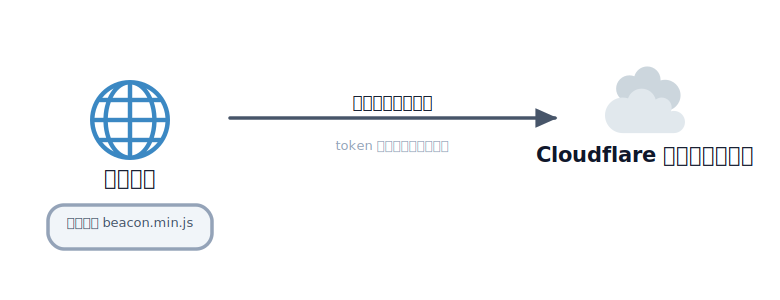
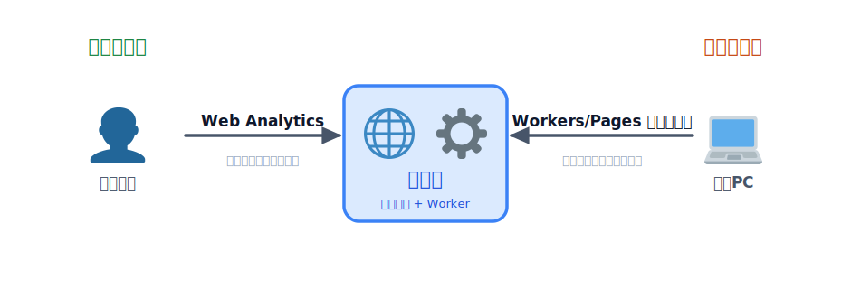

# Web Analytics でアクセス解析

サイトを公開したら、次に気になるのは「どれくらい見られているのか」です。Cloudflare Web Analytics を使うと、プライバシーに配慮しながら、ページビューや訪問者数、参照元といったアクセス状況を手軽に把握できます。このレクチャーでは、これまでに公開した「ひとことボード」に Web Analytics を組み込み、アクセス解析を始める方法を学びます。

### Cloudflare Web Analytics とは

Cloudflare Web Analytics は、Cloudflare が無料で提供しているアクセス解析ツールです。一言でいうと **「Cloudflare 版の Google Analytics」** のようなもので、「自分のサイトがどれくらい見られているのか」を知るためのサービスです。

ただし、Google Analytics ほど高機能ではありません。ページビュー・訪問者数・人気ページ・流入元（どこから来たか）といった、**基本的なアクセス解析に特化** しています。

「たくさんのことができるツール」ではなく「知りたいことを手早く知れるツール」だと考えると、性格をつかみやすいです。

### なぜシンプルな設計なのか

Web Analytics の一番の特徴は、**訪問者を追跡するための Cookie を使わずに計測する** ことです。多くのアクセス解析ツールは、Cookie を使って「同じ人が何回来たか」を細かく追いかけますが、Web Analytics はあえてそれをしません。この割り切りが、そのままメリットになっています。

- **プライバシーに配慮できる** — 利用者を個人として追跡しないため、訪問者に優しい設計です。
- **Cookie 同意バナーの対応がシンプルになりやすい** — 追跡用の Cookie を使わないため、いわゆる「Cookie 同意バナー」まわりの対応が軽くなる場合があります。
- **導入が簡単** — スニペットを 1 行貼るだけで始められます。
- **軽量でサイトへの負荷が少ない** — 計測スクリプトが小さく、表示速度への影響もほとんどありません。

つまり「あれもこれも計測できる」ことを目指すのではなく、**プライバシーと手軽さを優先した結果として、機能をシンプルに絞っている** のがこのツールの設計思想です。

その代わり、Cookie で個人を追跡しないぶん、**ユーザーごとの細かい行動分析や、購入・申し込みといったコンバージョン分析** などは、Google Analytics ほど詳しくは行えません。ここは「できないこと」として割り切っておく部分です。

### 何が分かるか

Web Analytics のダッシュボードでは、おもに次のような情報を確認できます。

| 項目 | 内容 |
| --- | --- |
| ページビュー | ページが表示された回数 |
| 訪問者数 | サイトを訪れたユーザーのおおよその数 |
| 参照元（リファラー） | どのサイトやサービスから来たか |
| 国 | 訪問者がどの国からアクセスしているか |
| 人気ページ | よく見られているページの一覧 |
| Core Web Vitals | LCP などの体感速度に関する指標 |

特に Core Web Vitals は、ユーザーが体感する「表示の速さ・安定性」を数値で示すもので、サイトの改善ポイントを見つける手がかりになります。

### どんなサイト・用途に向いているか

Web Analytics は「アクセス数や人気ページをざっくり知りたい」という用途にちょうどよいツールです。次のようなサイトと相性が良いです。

- **コーポレートサイト** — 会社紹介ページがどれくらい見られているか
- **ブログ** — どの記事が読まれているか、どこから読者が来たか
- **ドキュメントサイト** — よく参照されるページはどこか
- **個人サイト・ポートフォリオ** — とりあえずアクセス状況を把握したい

一方で、**EC サイトの購入導線の分析や、広告の効果測定** のように「ユーザーがどう動いて、最終的にどれだけ成果につながったか」を細かく追いたい場合は、Google Analytics のほうが向いています。

迷ったら、まずは **手軽な Web Analytics から始めて、より詳しい分析が必要になったら Google Analytics を検討する**、という順番で考えると分かりやすいです。両方を併用することもできます。

### 導入方法 1：スニペット方式

どんなホスティング環境でも使える、もっとも基本的な方法です。Cloudflare ダッシュボードの「Web Analytics」から対象サイトを追加すると、計測用の **トークン（token）** が発行されます。そのトークンを使って、次のスニペットを HTML の `</body>` 直前に追加します。

```html
<script defer src="https://static.cloudflareinsights.com/beacon.min.js"
        data-cf-beacon='{"token": "発行されたトークン"}'></script>
```

これまでに Cloudflare Pages で公開した「ひとことボード」であれば、フロントの `public/index.html` にこのスニペットを入れるだけで計測が始まります。`</body>` の直前に貼り付けて、再デプロイしましょう。



<!-- genfig: 左に「ブラウザ(🌐)」、そこに小さく「ビーコン(beacon.min.js)」が読み込まれている様子を示し、右の「Cloudflare ダッシュボード(☁️)」へ向けて1本の矢印を引く。矢印ラベルは「計測データを送信」。さらにブラウザ側からダッシュボードへ「token で対応づけ」を補足。一方向のみ（送信のみ）であることを強調。登場要素=ブラウザ・ビーコンスクリプト・Cloudflareクラウド。イメージスキーマ = SOURCE-PATH-GOAL。絵文字割当: ブラウザ=🌐(1f310)、Cloudflare/クラウド=☁️(2601)。関係(計測データ送信)は矢印ラベルで表現しノードにしない。 -->
*図: ビーコンが読み込まれると、ブラウザから Cloudflare へ計測データが一方向に送られる。*

### 導入方法 2：自動方式

対象のドメインを Cloudflare のプロキシ配下（DNS 設定で **オレンジクラウド** が有効な状態）で運用している場合は、さらに簡単です。ダッシュボードで Web Analytics を有効化するだけで、スニペットを書かなくても自動的に計測が始まります（Automatic Setup と呼ばれます）。

独自ドメインを Cloudflare で管理している場合はこちらが手軽です。一方、今回のように `*.pages.dev` のサブドメインで公開している場合や、ドメインを Cloudflare 管理下に置いていない場合は、スニペット方式を使います。

### 注意：CSP を設定している場合

サイトに Content Security Policy（CSP）を設定している場合は、ビーコンの読み込みと送信がブロックされないように、次のドメインを許可する必要があります。

- スクリプトの読み込み元：`static.cloudflareinsights.com`
- 計測データの送信先：`cloudflareinsights.com`

CSP を設定していて計測がうまくいかないときは、ブラウザの開発者ツールでブロックされていないか確認してみてください。

### ダッシュボードの見方

計測が始まると、Cloudflare ダッシュボードの「Web Analytics」から、期間を指定してページビューや訪問者数の推移をグラフで確認できます。人気ページや参照元、国別の内訳も一覧で表示されるので、「どこから来た人が、どのページをよく見ているか」を把握できます。

### Workers / Pages 自体のメトリクスとの違い

Cloudflare には、Web Analytics とは別に **Workers / Pages 自体のメトリクス** もあります。両者は見ている対象が異なります。



<!-- genfig: 中央にアプリ(🌐+⚙️)を置き、左右で見る視点を対比する左右対称の対比図。左側=「利用者目線」: ユーザー(👤)が Web Analytics を通してアプリの訪問者の行動(ページビュー・参照元)を見る。右側=「運用者目線」: 開発PC(💻)から Workers/Pages メトリクスを通してサーバー側の挙動(リクエスト数・エラー率・実行時間)を見る。中央のアプリを同じ対象として両側から異なる観点で眺めている構図にする。登場要素=ユーザー・アプリ(ブラウザ+Worker)・開発PC。イメージスキーマ = CENTER-PERIPHERY + BALANCE(左右対比)。絵文字割当: ユーザー=👤(1f464)、ブラウザ/フロント=🌐(1f310)、Worker=⚙️(2699)、開発PC=💻(1f4bb)。 -->
*図: 同じアプリでも、Web Analytics は「訪問者の行動」、Workers / Pages メトリクスは「サーバーの稼働状況」と、見る視点が違う。*

| | Web Analytics | Workers / Pages のメトリクス |
| --- | --- | --- |
| 見るもの | サイト訪問者の行動（ページビュー・参照元など） | サーバー側の挙動（リクエスト数・エラー率・実行時間など） |
| 視点 | 利用者目線のアクセス解析 | 運用者目線の稼働状況 |

「どれくらい見られているか」を知りたいときは Web Analytics、「アプリが正常に動いているか・エラーが出ていないか」を知りたいときは Workers / Pages のメトリクスを見る、と使い分けると分かりやすいです。

### 他ツールとの比較（Google Analytics / Matomo / Plausible）

アクセス解析ツールは Cloudflare Web Analytics のほかにもいくつもあります。ここでは代表的な 4 つを、いくつかの軸でざっくり比べてみます。それぞれ得意分野が違うので、「どれが一番良いか」ではなく「自分の用途に合うのはどれか」という目線で眺めてみてください。

| 軸 | Cloudflare Web Analytics | Google Analytics (GA4) | Matomo | Plausible |
| --- | --- | --- | --- | --- |
| プライバシー / Cookie 同意 | Cookie レスで個人を追跡しない。同意バナーの対応が軽くなりやすい | Cookie を使い個人・行動を追跡。同意バナーが必要になりやすい | 設定次第で Cookie レス運用も可能。プライバシー配慮を売りにしている | Cookie レス設計。プライバシー重視を掲げている |
| 計測できる粒度 | 基本指標（PV・訪問者・参照元・国・人気ページ・Core Web Vitals）に特化 | 非常に細かい。イベント・コンバージョン・ユーザー行動フローまで追える | GA に近い高機能。イベントやゴール計測も可能 | 主要指標にしぼったシンプルな構成 |
| ホスティング形態 | SaaS（Cloudflare が提供） | SaaS（Google が提供） | セルフホスト（自前サーバー）／クラウド版の両方 | SaaS（有料）／セルフホスト（OSS）の両方 |
| 料金 | 無料 | 無料枠が中心（大規模向けに有料版あり） | セルフホストはソフト自体は無料（サーバー費用は自己負担）／クラウド版は有料 | 有料 SaaS が中心／セルフホストは無料 |
| 導入難度 | かんたん（スニペット 1 行、または自動計測） | 中程度（タグ設置・設定項目が多い） | やや高い（セルフホストはサーバー構築・運用が必要） | かんたん（スニペット 1 行、セルフホストは要構築） |

<!-- genfig: プライバシー配慮(縦軸)と機能の多さ(横軸)の2軸マップ上に4ツールを配置する散布図。左上=Cloudflare Web Analytics(プライバシー高・機能シンプル)、右上=Plausible(プライバシー高・やや機能絞り)、右下=GA4(機能最多・プライバシー配慮低)、中央=Matomo(バランス型・セルフホスト)。イメージスキーマ=SCALE(2軸)。この図は任意なので生成は不要。 -->

上の数値・料金や機能の範囲は各社の方針変更で変わりやすい部分です。導入を検討するときは、必ず **各ツールの公式の料金ページ・仕様ページで最新の内容を確認** してください。

### どれを選ぶか

用途別に、おおまかな選び方の目安をまとめます。あくまで出発点なので、実際には試しながら判断するのがおすすめです。

- **個人サイト・小規模サイトで、まず状況をざっくり知りたい** — Cloudflare Web Analytics か Plausible。どちらも Cookie レスで手軽に始められます。すでに Cloudflare を使っているなら Web Analytics が無料でそのまま使えて相性が良いです。
- **広告効果やコンバージョン、ユーザー行動を細かく分析したい** — Google Analytics (GA4)。EC サイトの購入導線やキャンペーンの効果測定など、詳細な分析が必要なときの定番です。そのぶん Cookie 同意まわりの対応は必要になりやすい点に注意します。
- **データを自分の管理下に置きたい（データ主権を重視）** — Matomo のセルフホスト。解析データを自前のサーバーに保存でき、GA の代替として使われます。運用の手間は増えますが、データの置き場所を自分でコントロールできます。
- **プライバシー重視で、GA より軽く始めたい** — Plausible。シンプルな画面で主要指標を追え、有料 SaaS と OSS のセルフホストから選べます。

迷ったら、まずは手軽な Cloudflare Web Analytics や Plausible から始めて、「もっと詳しく知りたい」と感じたときに GA4 や Matomo を検討する、という順番だと無理がありません。複数のツールを併用することもできます。

## 次の章へ

アクセス解析でサイトの状況が見えるようになったら、次はフォームを悪用する bot への対策です。

[Turnstile で bot からフォームを守る](../03-turnstile/LECTURE.md)
