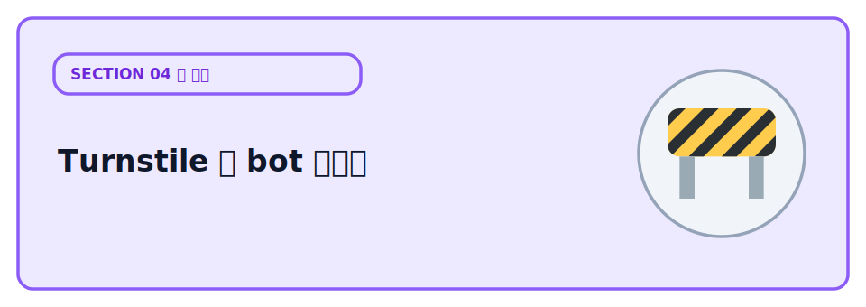
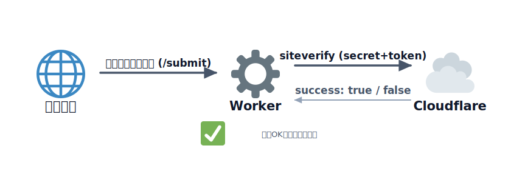
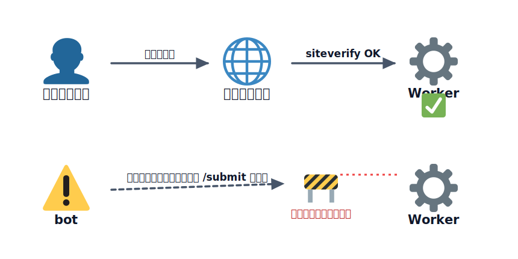

# Turnstile で bot からフォームを守る



フォームを公開すると、必ずと言っていいほど **bot（自動プログラム）によるスパム投稿** がやってきます。
前のセクションで触れた「踏み台にされる危険」の、最も身近な例です。

これを防ぐ定番が CAPTCHA ですが、画像選択のような操作はユーザーにとって面倒です。Cloudflare の
**Turnstile** は、多くの場合ユーザー操作なしで（裏側で）bot かどうかを判定してくれる、CAPTCHA の
代替です。無料で使えます。

このレクチャーでは、設定なしで試せるよう **テスト用キー** を使って、フォーム送信を Turnstile で
守る流れを体験します。

## TODO

1. フォーム付きの Worker を起動し、Turnstile を通して送信できることを確認する
2. サーバー側で `siteverify` して、検証に成功したときだけ処理が進むコードを読む
3. わざと「常に失敗するキー」に変えて、サーバー側で弾かれることを確認する
4. （任意）本番用に自分のウィジェットを作り、secret をシークレットとして登録する

## 学ぶこと

- CAPTCHA の役割と、Turnstile がそれをどう置き換えるか
- **検証は必ずサーバー側で行う**：フロントのウィジェット表示だけでは防御にならない。発行されたトークンを
  サーバーが Cloudflare に問い合わせて（`siteverify`）初めて意味がある
- sitekey は公開してよい値、secret は秘密（[秘匿情報の扱い](../../02-security/01-basic/LECTURE.md)
  と同じ原則）
- トークンは **1 回限り・有効期限あり**（使い回すと失敗する）

## 説明

### はじめに: プロジェクトを用意する

このレクチャーのサンプルを ZIP で配布しています。次の手順で手元に用意してください。

1. 下の「サンプルコードをダウンロード」ボタンからプロジェクト ZIP をダウンロードする
2. ダウンロードした ZIP を解凍する（展開すると `03-turnstile` フォルダができます）
3. その `03-turnstile` フォルダを VSCode で開く（File → Open Folder、またはフォルダをドラッグ&ドロップ）
4. VSCode で[ターミナルを開く](../../00-environment/01-tools/LECTURE.md)。以降のコマンドは、この開いたフォルダ（`03-turnstile`）の中で実行します。

:::download
[サンプルコードをダウンロード](./project.zip)
:::

### TODO 1: 起動して送信する

```bash
npm ci
cp .dev.vars.example .dev.vars
npm run dev
```

`http://localhost:8787` を開き、なまえを入れて送信します。Turnstile の確認（テスト用キーなので即成功）を
経て、「送信できました」と表示されれば成功です。

フロントは [public/index.html](./public/index.html) です。`<head>` で Turnstile のスクリプトを読み込み、
フォーム内に次のウィジェットを置いています。

```html
<div class="cf-turnstile" data-sitekey="1x00000000000000000000AA"></div>
```

`data-sitekey` は公開してよい値です。送信時、Turnstile はフォームに `cf-turnstile-response` という
隠しフィールド（トークン）を自動で追加します。

### TODO 2: サーバー側の検証を読む

肝心なのはサーバー側です。[src/index.js](./src/index.js) の `/submit` で、受け取ったトークンを
Cloudflare に問い合わせて検証します。



<!-- genfig: 左から右への横フロー。ブラウザ(🌐)→Worker(⚙️)→クラウド(☁️)を3ノードで並べる。ブラウザからWorkerへの矢印ラベル「トークン付き送信(/submit)」、WorkerからクラウドへのCloudflareへの矢印ラベル「siteverify(secret+token)」、クラウドからWorkerへ戻る矢印ラベル「success: true/false」。検証成功(✅)をWorkerの下に小さく添える。イメージスキーマ = SOURCE-PATH-GOAL（トークンが順に渡り検証結果が戻る経路）。絵文字: ブラウザ=🌐 1f310 / Worker=⚙️ 2699 / クラウド=☁️ 2601 / 成功=✅ 2705。関係はすべて矢印ラベルで表現しノード化しない。 -->
*図: トークンはブラウザ→Worker→Cloudflare（siteverify）と渡り、検証結果が Worker に返る。*

```js
const outcome = await verifyTurnstile(c.env.TURNSTILE_SECRET, token, ip);
if (!outcome.success) {
  return c.html(resultPage('検証に失敗しました', false), 403);
}
// 成功したときだけ本処理へ
```

`siteverify` は `secret` と `token` を Cloudflare に送り、`{ success: true/false }` を返します。
**この検証をサボって「ウィジェットを置いただけ」では、bot は直接 `/submit` を叩けるので無意味** です。
必ずサーバー側で検証します。



<!-- genfig: 上下2経路の対比図。上の経路: 正規ユーザー(👤)→ウィジェット(🌐)→Worker(⚙️) を通り、Workerでsiteverify成功(✅)して通過。下の経路: bot(⚠️)がウィジェットを飛び越えて直接Worker(⚙️)の/submitを叩こうとするが、Workerのサーバー側検証で遮断(🚧)され通れない。下の経路にブロックの障壁を置く。イメージスキーマ = FORCE:BLOCKAGE（サーバー側検証が不正なリクエストの前進を止める）+ SOURCE-PATH-GOAL。絵文字: ユーザー=👤 1f464 / bot・警告=⚠️ 26a0 / ウィジェット(ブラウザ)=🌐 1f310 / Worker=⚙️ 2699 / 成功=✅ 2705 / 遮断=🚧 1f6a7。関係は矢印ラベルで表現。 -->
*図: ウィジェット表示だけでは bot に直接叩かれる。サーバー側の siteverify があって初めて遮断できる。*

`TURNSTILE_SECRET` はコードに書かず、ローカルは `.dev.vars`、本番は `wrangler secret put` で渡します。

### TODO 3: わざと失敗させる

[public/index.html](./public/index.html) の `data-sitekey` を、常に失敗するテスト用キー
`2x00000000000000000000AB` に書き換えて保存し、もう一度送信してみましょう。今度はサーバー側の検証で
弾かれ、403（送信できませんでした）になります。確認できたら元のキーに戻します。

:::notice
トークンを使い回すと `timeout-or-duplicate` で失敗します。エラー時はウィジェットをリセット
（`turnstile.reset()`）して取り直すのが定石です。
:::

### TODO 4: 本番で使う（任意）

本番では、Cloudflare ダッシュボードの Turnstile で自分のウィジェットを作成し、発行された
**sitekey をフロントに**、**secret を `wrangler secret put TURNSTILE_SECRET` に** 登録します。

```bash
npx wrangler secret put TURNSTILE_SECRET
npm run deploy
```

## コラム

### Turnstile vs reCAPTCHA

CAPTCHA といえば Google の **reCAPTCHA** が長らく定番でした。Turnstile はその代替として登場した
もので、大きな方向性の違いがあります。ざっくり比較すると次のとおりです。

| 軸 | Cloudflare Turnstile | Google reCAPTCHA（v2 / v3 / Enterprise） |
|---|---|---|
| ユーザー体験 | 画像選択パズルなし。多くの場合クリックすら不要で裏側判定 | v2 は「信号機を選べ」等の画像パズルが出ることがある。v3 は裏側判定 |
| プライバシー / トラッキング | 行動データを広告目的で使わない方針。トラッキング Cookie に依存しない | Google のトラッキング懸念が指摘される。広告事業と地続き |
| 料金 / 上限 | 無料枠が寛容。詳細は公式ページ参照 | 無料枠はあるが Enterprise は有料。上限・料金は公式ページ参照 |
| Google 依存 | Cloudflare のみで完結。Google アカウント不要 | Google のサービスに依存 |
| 導入の手軽さ | スクリプト 1 本 + ウィジェット div + サーバー側 `siteverify` | 同様にスクリプト + サーバー側検証。仕組みは近い |

要点は、**Turnstile は「非トラッキング・画像パズルなし・無料枠が寛容」** を志向している点、
reCAPTCHA は高機能だが **Google への依存とトラッキング懸念** が付いて回る点です。導入の流れ
（フロントにウィジェット、サーバーでトークン検証）はどちらもよく似ています。

:::notice
無料枠の上限や料金は変動します。最新の数値は必ず [Turnstile の公式ページ](https://www.cloudflare.com/products/turnstile/)
や reCAPTCHA の公式ページで確認してください。
:::

### sitekey は公開・secret は秘密

Turnstile では 2 つの値を使い分けます。

- **sitekey**：フロントの HTML に埋め込む。**公開してよい値**（`data-sitekey` としてブラウザに出る）
- **secret**：サーバー側で `siteverify` に使う。**絶対に秘密**（コードに書かず `.dev.vars` /
  `wrangler secret put` で渡す）

これは [セキュリティの3要素](../../02-security/01-basic/LECTURE.md) の **機密性（Confidentiality）**
そのものです。secret が漏れると第三者が「検証済み」を偽装できてしまうため、sitekey と secret を
取り違えないよう注意してください。

## 次の章へ

次は [その他の無料で使える機能](../04-others/LECTURE.md) に進みます。
