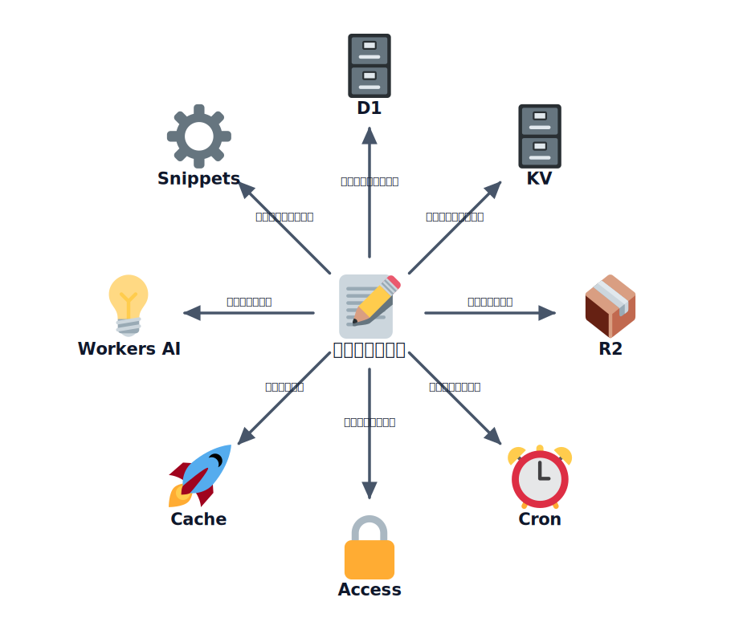

# その他の便利な機能と料金の見極め方

ここまでで Pages・Workers・D1・R2・Turnstile・Web Analytics を使ってきました。Cloudflare には、
これ以外にも **無料枠で始められる便利な機能** がたくさんあります。このレクチャーでは、ハンズオンの
「ひとことボード」を一歩先へ進めるときに役立つものを **最大 7 つ** ピックアップして紹介したうえで、
最後に「どこまで無料で、どこから課金になるのか」という **料金の見極め方** を整理します。

手を動かす章ではありません。「こういうものがある」と引き出しを増やしておき、必要になったときに公式
ドキュメントから使い始められる状態を目指します。

:::notice
無料枠や料金の数値・提供条件は変わることがあります。本レクチャーの数値は **2026 年時点の目安** です。
実際に使うときは、必ず各サービスの公式ページ（`developers.cloudflare.com`）で最新の条件を確認して
ください。
:::

## 学ぶこと

- Cloudflare の無料枠で使える、代表的な機能の「使いどころ」
- それぞれが「ひとことボード」のどんな場面で効くか
- どの機能をどんなときに調べに行けばよいか
- 「無料枠 → Workers Paid」という料金の階段構造と、想定外の課金を防ぐ考え方

## 紹介する機能（最大7つ）

### 1. Workers KV — 軽量なキーバリュー保存

キーと値だけのシンプルな保存先です。読み取りがとても速く、世界中に分散して配信されるので、
**設定値・フラグ・キャッシュ的なデータ** の置き場所に向いています。D1（表で扱う構造化データ）とは
役割が違い、「1 個のキーで 1 個の値を出し入れする」用途に最適です。

- 使いどころ：お知らせ文言の出し分け、機能の ON/OFF フラグ、簡単なアクセスカウンタ
- メモ：強い整合性より「速さと分散」を優先する設計。書き込み直後の反映に少し遅延が出ることがある

### 2. Cron Triggers — Worker の定期実行

Worker を **決まった時刻・間隔で自動実行** できます。サーバーを常駐させなくても、定期的な処理を
回せます。

- 使いどころ：古い投稿の自動削除、1 日 1 回の集計、外部 API の定期取り込み
- メモ：`wrangler.jsonc` の `triggers.crons` に cron 式を書くだけで設定できる

### 3. Email Routing — 独自ドメインのメール受信・転送

独自ドメイン宛のメールを、自分の普段のメールアドレスへ **無料で転送** できます。さらに Workers と
組み合わせると、届いたメールをプログラムで処理することもできます。

- 使いどころ：`info@あなたのドメイン` を Gmail に転送、問い合わせメールの自動仕分け
- メモ：送信専用ではなく「受信・転送」が主役。メール送信は別の仕組みが必要

### 4. Cloudflare Access（Zero Trust）— ページに認証をかける

公開したいけれど **特定の人だけに見せたい** ページに、ログイン（Google アカウント等）を被せられます。
小規模なら無料枠で始められます。

- 使いどころ：「ひとことボード」の管理画面、社内向けのプレビュー、関係者限定の資料置き場
- メモ：アプリ側にログイン機能を作らずに、入り口で認証をかけられるのが利点

### 5. Cache / Cache Rules — 配信を速く・安く

一度返したレスポンスを Cloudflare のエッジに **キャッシュ** して、次回以降を高速化します。オリジン
（Workers など）への到達回数も減るので、負荷とコストの両方に効きます。

- 使いどころ：更新頻度の低い一覧 API、画像などの静的アセットの配信
- メモ：キャッシュして良いもの／いけないものの線引きが大切（個人情報を含むレスポンスは要注意）

### 6. Workers AI — AI 推論を呼び出す

Cloudflare 上で動く **AI モデル** を Worker から呼び出せます。無料枠の範囲で試せます。

- 使いどころ：投稿の自動要約・翻訳、不適切な投稿の下処理、簡単なチャット応答
- メモ：モデルごとに得意分野と料金単位が違う。まずは小さく試して挙動を確かめる

### 7. Snippets / Redirect Rules — コードなしの軽い書き換え

Worker を書かなくても、ダッシュボードの設定だけで **リダイレクトやヘッダーの追加** など軽い処理を
行えます。

- 使いどころ：旧 URL から新 URL へのリダイレクト、共通セキュリティヘッダーの付与
- メモ：「Worker を書くほどではない」小さな調整に向く。複雑になってきたら Workers へ移す

## 選び方の目安

- **データを置きたい**：構造化データ → D1 / 単純なキー値 → KV / ファイル → R2
- **処理を自動で回したい** → Cron Triggers
- **見せる相手を絞りたい** → Cloudflare Access
- **速く・安く配信したい** → Cache
- **賢い処理を足したい** → Workers AI
- **設定だけで済ませたい** → Snippets / Redirect Rules

<!-- genfig: 中央に「ひとことボード」の中心ノード（📝）を置き、そこから「やりたいこと」ごとに放射状に分岐する CENTER-PERIPHERY + SPLITTING の振り分け図。中心から外側へ向かう各 connector のラベルに「やりたいこと」を書き、枝先のノードに対応機能を配置する。枝1: ラベル「構造化データを置く」→ D1(🗄️) / 枝2: ラベル「単純なキー値を置く」→ KV(🗄️) / 枝3: ラベル「ファイルを置く」→ R2(📦) / 枝4: ラベル「処理を自動で回す」→ Cron Triggers(⏰) / 枝5: ラベル「見せる相手を絞る」→ Access(🔒) / 枝6: ラベル「速く安く配信」→ Cache(🚀) / 枝7: ラベル「賢い処理を足す」→ Workers AI(💡) / 枝8: ラベル「設定だけで済ませる」→ Snippets(⚙️)。絵文字割当: 📝=ひとことボード, 🗄️=D1/KV, 📦=R2, ⏰=Cron, 🔒=Access, 🚀=Cache, 💡=Workers AI, ⚙️=Snippets。イメージスキーマ = CENTER-PERIPHERY + SPLITTING。 -->
*図: 「何をしたいか」から、使うべき機能へ振り分ける早見図。*

迷ったら「自分でコードを書く（Workers）」の前に、**設定や専用機能で済まないか** を一度考えると、
保守が楽になります。

## 料金の見極め

ここまで紹介した機能を含め、Cloudflare の各サービスはすべて無料枠から始められます。個人開発や小規模な
サービスであれば、無料枠の範囲で十分に運用できることがほとんどです。とはいえサービスを育てていくと、
「どこまで無料で、どこから課金になるのか」を知っておきたくなります。ここでは料金の考え方と、想定外の
課金を防ぐための見極め方を整理します。

### 料金の考え方：無料枠から始まる階段

Cloudflare の料金は、おおまかに次のような **階段** になっています。

1. **無料枠**：多くのサービスに、日次または月次の無料枠がある。小規模な利用ならここで完結する。
2. **Workers Paid**：無料枠を超えて使う場合は、月額固定費に従量課金が加わる有料プランに移行する。
3. **超過分の従量課金**：Paid プランでも一定量までは含まれ、それを超えた分だけ使った量に応じて課金される。

<!-- genfig: 左下から右上へ上る3段の階段。段が上がるほど費用が増えることを表す（VERTICALITY = 上＝高コスト、SCALE = 利用量が増えるほど右上へ）。1段目「無料枠（小規模はここで完結）」に ✅(2705)、2段目「Workers Paid（月額固定＋従量）」に ⚙️(2699)、3段目「超過分の従量課金（使った分だけ上乗せ）」に ☁️(2601)。左下から右上へ向かう太い上り矢印を全体に重ね、ラベル「利用量が増えるほど →」。イメージスキーマ = VERTICALITY + SCALE + SOURCE-PATH-GOAL。 -->

つまり「いきなり高額になる」のではなく、「無料 → 月額数ドル規模の固定費 → 使った分だけ上乗せ」という
段階を踏みます。まずは無料で始めて、必要になったら Paid に移行する、という流れを前提に考えると
分かりやすいです。

### 製品ごとの課金ポイント

主要なサービスについて、無料枠と「どこから課金が意識され始めるか」の目安をまとめます（2026 年時点の
目安。正確な値は各サービスの pricing ページを参照してください）。

| サービス | 無料枠の目安 | 課金が始まるポイント |
| --- | --- | --- |
| Workers | 1 日あたりのリクエスト数と CPU 時間に無料枠 | 無料枠を超えると Workers Paid（月額固定 + 従量） |
| Pages | 静的配信の帯域は実質無制限・無料。ビルド回数に月次上限 | 月次のビルド回数上限を超えると課金対象 |
| D1 | 読み書き行数の月次枠 + ストレージ（Free は数百 MB 級） | 読み書きした「行数」とストレージ量で課金 |
| R2 | ストレージとオペレーション回数に無料枠 | 無料枠超過分に課金。下り（egress）転送は無料 |
| Turnstile | 通常のフォーム保護用途では実質無料 | 一般的な利用ではほぼ気にしなくてよい |

ポイントを絞ると次のとおりです。

- **Workers**：リクエスト数と CPU 時間（処理にかかった時間）に無料枠。超えると Workers Paid へ移行。
- **Pages**：静的配信そのものはほぼ無料。意識すべきは **ビルド回数** の月次上限。
- **R2**：最大の強みは **下り（egress）転送が無料** な点。画像・ファイル配信でコストを抑えやすい。
- **Turnstile**：通常のフォーム保護なら実質無料。今回の範囲では気にしなくてよい。

### D1 は「行数課金」を意識したクエリ設計を

D1 の課金で特に重要なのは、**クエリの「回数」ではなく、読み書きした「行数」で課金される** という点です。
たとえばインデックスのないテーブルに条件検索をすると、内部的に多くの行を走査（＝読み取り）してしまい、
結果が 1 行でも読み取り行数は大きくなります。そのため D1 では次の設計がそのままコスト削減になります。

- 必要な行だけ取得するよう `WHERE` で絞り込み、`LIMIT` で件数を制限する
- 検索やソートに使う列には **インデックス** を張り、走査する行数を減らす
- 不要な全件取得（`SELECT *` の無条件取得など）を避ける

「クエリを減らす」よりも「触る行数を減らす」という視点が大切です。

### 想定外の課金を防ぐ考え方

無料枠で始めたつもりが、いつの間にか課金されていた、という事態を避けるために、次のような備えをして
おくと安心です。

- **通知（Notifications）を設定する**：ダッシュボードの Notifications で、使用量がしきい値に達したときに
  通知を受け取れます。気づかないうちに枠を超えるのを防げます。
- **超過時の挙動を把握する**：「超過したら止まる」のか「超過したら課金される」のかは、プランと
  サービスによって異なります。Paid に移行しない限り無料枠超過分は制限される、という動作を理解しておく。
- **トラフィック急増時の挙動を知っておく**：アクセスが急増したとき、無料枠でどう振る舞うか（制限が
  かかるのか、Paid なら従量で増えるのか）をあらかじめ理解しておくと慌てずに済みます。
- **D1 は行数課金を意識する**：前述のとおり、`LIMIT` とインデックスで読み書き行数を抑えることが、
  そのままコスト管理になります。

### 公式の料金ページを必ず確認する

料金体系や無料枠の数値は更新されることがあります。最新かつ正確な情報は、必ず公式ドキュメントで
確認してください。各サービスの料金は、Cloudflare 開発者ドキュメント（`developers.cloudflare.com`）の
各製品ページにある **Platform / Pricing** のセクションにまとまっています。運用前に一度目を通し、
無料枠の数値と課金単位（リクエスト数・CPU 時間・行数・ストレージなど）を確認しておきましょう。

## おわりに

これでこのハンズオンは最後のレクチャーです。全体を振り返ると、次のような道のりでした。

- **公開**：Cloudflare Pages で静的サイトを世界へ公開し、独自ドメインや基本の設定を体験した
- **アプリ構築**：Workers で API を動かし、D1 にデータを保存し、R2 で画像を扱って、「ひとことボード」を
  段階的に実用的なアプリへ育てた
- **セキュリティ**：Turnstile でフォームを bot から守り、Web Analytics でアクセスを把握するなど、
  公開後の運用に必要な守りを固めた
- **付録**：本レクチャーで、無料枠で使える便利な機能の引き出しと、料金の見極め方までを俯瞰した

無料枠の範囲で実際に動くものを作りながら、必要になったときにどこを有料化すればよいかまで見通せるように
なったことが、これからサービスを育てていくうえでの土台になります。なお、料金や無料枠の数値は変動する
ので、実運用の前には必ず公式の料金ページで最新の値を確認してください。

ここまでお疲れさまでした。各セクションを振り返りたいときは、[はじめに](../../../README.md) から
セクション一覧に戻れます。
