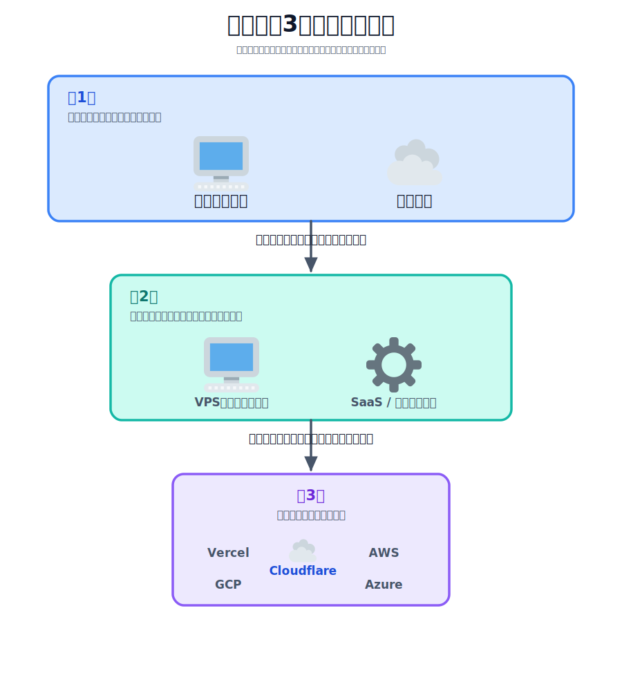

# 比較の全体像 — 3段階で絞り込む

ここまでで、フロント（Pages）・API（Workers）・データベース（D1）を Cloudflare の無料枠だけで公開
できました。ただ、世の中にはアプリを公開する方法が他にもたくさんあります。AI でアプリを作れるように
なった今、いざ「公開・運用」の段になると「Vercel と何が違うの？」「AWS のほうがいいの？」「サーバーを
借りる（VPS）べき？」と迷うのは自然なことです。

このセクションでは **コードを書きません**。代わりに、公開先の選び方を **3 段階の絞り込み** として
整理します。いきなり「Cloudflare と AWS どっちがいい？」と比べると混乱しますが、実は問いには順番が
あります。大きい問いから順に答えていくと、自分に合う選択肢が自然としぼられていきます。

大事なのは「どれが一番偉いか」ではありません。作りたいものによって向き不向きが変わるだけです。
それぞれの段で「何を問われているのか」をはっきりさせていきましょう。

## TODO

このレクチャーは読み物です。読み終えたときに次のことができるようになっていれば成功です。

1. 公開先の比較を「3 段階の絞り込み」として頭の中に地図として持つ
2. それぞれの段で問われている問い（自前か／管理するか／どのベンダーか）を区別できる
3. 自分が作りたいアプリが、各段でどちらに転びそうかをざっくり当てられるようにする

## 学ぶこと

- 比較は「並列に全部を比べる」のではなく「大きい問いから順に絞る」と整理しやすいこと
- 第1段：**オンプレ vs クラウド**（ハードを自前で持つか、借りるか）
- 第2段：**VPS vs SaaS**（借りる中でも、サーバーを自分で管理するか、管理を任せるか）
- 第3段：**ベンダー比較**（管理を任せる中で、Vercel / Cloudflare / AWS / GCP / Azure のどれか）

## 説明

### なぜ「段階」で考えるのか

公開先の選択肢は、フラットに並べると数が多すぎて比べきれません。オンプレのサーバールーム、
さくらの VPS、AWS、GCP、Azure、Vercel、Cloudflare……。これらを一度に表に並べても、軸が
ばらばらで「結局どれ？」となりがちです。

そこで、**問いの大きい順** に 3 つの段階へ分けます。前の段で答えが出ると、次の段で考える対象が
ぐっと減ります。じょうごのように上から絞っていくイメージです。

<!-- genfig: 上から下へ幅が狭まる「じょうご(漏斗)」型の3段フロー。最上段[第1段]に2択「オンプレミス(🖥️) vs クラウド(☁️)」を置き、クラウド側を選んで下向き矢印「多くの初学者はこちら」で次段へ。中段[第2段]に2択「VPS=自分で管理(🖥️) vs SaaS/サーバーレス=管理を任せる(⚙️)」を置き、管理を任せる側を選んで下向き矢印「手軽さ重視ならこちら」で次段へ。最下段[第3段]に複数候補「Vercel / Cloudflare(☁️) / AWS / GCP / Azure」を横並びで置く。全体は上が広く下が狭い漏斗形で、選択するたびに対象が減る様子を表す。イメージスキーマ = SOURCE-PATH-GOAL（上から下への絞り込みの道筋）+ SCALE（段ごとに選択肢が縮小）+ VERTICALITY（上=大きい問い、下=細かい問い）。絵文字割当: オンプレ/サーバー=🖥️(1f5a5)、クラウド/Cloudflare=☁️(2601)、SaaS・サーバーレス・管理を任せる=⚙️(2699)。ベンダー名(Vercel/AWS/GCP/Azure)はテキストラベル。 -->
*図: 公開先の選択を「大きい問いから順に絞る」3段階のじょうご。前の段で答えが出ると次の段の対象が減る。*

### 3 つの段階を一覧で

| 段階 | 問い | 二択（典型） | このセクションの該当ページ |
|---|---|---|---|
| 第1段 | ハードを自前で持つか、借りるか | オンプレミス / クラウド | [オンプレ vs クラウド](../02-onpremise-vs-cloud/LECTURE.md) |
| 第2段 | サーバーを自分で管理するか、任せるか | VPS / SaaS・サーバーレス | [VPS vs SaaS](../03-vps-vs-saas/LECTURE.md) |
| 第3段 | どのベンダーに載せるか | Vercel / Cloudflare / AWS / GCP / Azure | [ベンダー比較](../04-vendors/LECTURE.md) |

### 各段でだいたいの結論を先に言っておく

詳しくは各ページで見ますが、初学者・小さく始めたい人にとっての「だいたいの結論」を先に置いておきます。

- **第1段（オンプレ vs クラウド）**：個人や小さく始める用途では、ほぼ **クラウド** で問題ありません。
  自前でハードを買って管理する理由は、規制・既存資産・特殊な性能要件などがある一部のケースに限られます。
- **第2段（VPS vs SaaS・サーバーレス）**：サーバー管理を学ぶこと自体が目的でなければ、
  **管理を任せる側**（サーバーレス／マネージド）から始めるのが楽です。今回作ったような
  「フロント＋軽い API＋DB」は、まさにこちら向きです。
- **第3段（ベンダー比較）**：用途次第ですが、無料枠で小さく試すなら **Cloudflare** や **Vercel** が
  とっつきやすく、大規模・多機能が必要になったら **AWS / GCP / Azure** という総合クラウドが候補に入ります。

:::notice
ここで言う「結論」は、あくまで *初学者が小さく始める* という前提での目安です。会社の本番システムや、
規模・要件が特殊なケースでは、各段の答えは変わります。自分の前提（誰が・何を・どれくらいの規模で）を
意識しながら読み進めてください。
:::

### このセクションの読み進め方

この後の 3 ページは、上の 3 段階にそのまま対応しています。

1. [オンプレ vs クラウド](../02-onpremise-vs-cloud/LECTURE.md) — そもそもハードを持つべきか
2. [VPS vs SaaS](../03-vps-vs-saas/LECTURE.md) — クラウドの中での「管理の度合い」を理解する
3. [ベンダー比較](../04-vendors/LECTURE.md) — Cloudflare を含む主要ベンダーを横並びで見る

順番に読むと、最後には「自分のアプリはまず Cloudflare で試してよさそうか／別を検討すべきか」を
自分で判断できるようになっているはずです。

## 次の章へ

まずは一番大きい問いから始めます。
[オンプレ vs クラウド](../02-onpremise-vs-cloud/LECTURE.md) に進み、「ハードを自前で持つか、借りるか」を
整理しましょう。
