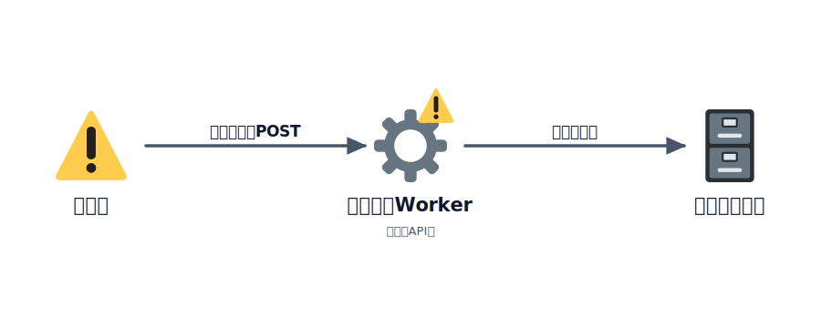
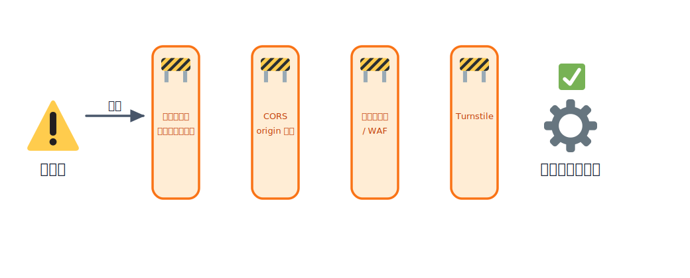

# 踏み台にされる危険とその対策

アプリをインターネットに公開するということは、**世界中の誰でもあなたの API やフォームにアクセスできる**
ようになる、ということです。アクセスしてくるのは善意のユーザーだけではありません。

公開した API・フォーム・ストレージが第三者に悪用されることを、ここでは「踏み台にされる」と表現します。
あなたのアプリが、スパムや攻撃の中継地点として使われてしまう状態です。

「ひとことボード」は、誰でも投稿（POST）できるシンプルなアプリです。だからこそ、対策をしないと
スパム投稿や大量リクエストの的になりやすい構造でもあります。この章では、どんな悪用があり、どう守るかを
整理します。

## TODO

1. 「踏み台にされる」とはどういう状態かを理解する
2. 公開 API・フォームに対する代表的なリスクを知る
3. それぞれに対する基本的な対策を知る
4. 「ひとことボード」に即して、何から手を付けるか考えられるようになる

## 学ぶこと

- 認証なしの公開エンドポイントが抱えるリスク（スパム・大量投稿・財布攻撃）
- CORS を `*` のままにする危うさと、origin を絞る考え方
- サーバー側バリデーション・レート制限・認証・上限設定という対策の引き出し
- フォームを守る手段としての Turnstile（次セクションへの布石）

## 説明

### 「踏み台にされる」とは

公開したエンドポイント（API・フォーム・アップロード先など）が、本来の目的とは違う形で第三者に使われる
ことです。たとえば次のようなことが起きます。

- 投稿フォームがスパムの投稿先にされる
- 公開アップロード先が、違法ファイルの保管庫にされる
- 大量のリクエストを送りつけられ、課金や負荷の被害が出る

「自分の小さなアプリなんて誰も狙わない」と思いがちですが、悪用は人手ではなく**自動化されたボット**が
無差別に行います。公開されている時点で対象になり得ます。



<!-- genfig: 左に攻撃者のボット(⚠️, ラベル「ボット」)、中央にあなたのWorker/公開API(⚙️)、右にデータベース(🗄️)を横一列に置く。ボットからWorkerへ向かう矢印に「大量の不正POST」ラベル、WorkerからDBへ向かう矢印に「スパム保存」ラベルを付け、Workerを経由して被害が伝播する様子を表す。Workerの上に⚠️を重ねて「踏み台にされている」状態を示す。イメージスキーマ = SOURCE-PATH-GOAL（攻撃者→API→データ）。絵文字割当: ボット/警告=⚠️, API/Worker=⚙️, データベース=🗄️。 -->
*図: 認証のない公開APIが攻撃の通り道になり、アプリ自身がスパムや攻撃の中継地点（踏み台）にされる。*

### 代表的なリスク

#### 認証なし POST API への大量投稿・スパム

「ひとことボード」のように誰でも投稿できる API は、ボットにとって格好の標的です。広告リンクや
意味のないテキストが大量に流し込まれ、まともに使えなくなります。

#### オープンなアップロード先の悪用

誰でもファイルを置ける状態のストレージ（R2 など）は、無関係なファイルの置き場にされたり、転送量を
食われたりします。アップロード先は必ず認証・検証の後ろに置きます。

#### 料金を狙った大量リクエスト（財布攻撃）

Cloudflare の無料枠や従量課金を超えるほどのリクエストを意図的に送り、**あなたに費用を発生させたり、
枠を使い切らせてサービスを止めたりする**攻撃です。被害が金額として出るため「財布攻撃（denial of
wallet）」と呼ばれます。

#### CORS を `*` のままにする

CORS は「どのサイトからこの API を呼べるか」を制御する仕組みです。許可 origin を `*`（すべて許可）の
ままにすると、まったく無関係な他サイトからあなたの API を自由に叩けてしまいます。

### 対策の引き出し

ひとつの対策で完璧にはなりません。複数を組み合わせて「割に合わない標的」にするのが基本です。



<!-- genfig: 左から攻撃しようとするボット(⚠️, ラベル「ボット」)、その先に複数の遮断バリア(🚧)を縦の壁として何枚も重ねて並べる。各バリアに上から順に「サーバー側バリデーション」「CORS origin 限定」「レート制限/WAF」「Turnstile」のラベルを付ける。バリアを通り抜けた先に守られたアプリ(⚙️)を置き、その手前に✅を添えて「保護された」状態を示す。攻撃の矢印が手前のバリアで止まる様子を描く。イメージスキーマ = FORCE:BLOCKAGE（攻撃する力を複数の壁が遮る）+ CENTER-PERIPHERY（中心のアプリを外周の対策が囲む）。絵文字割当: ボット/警告=⚠️, 各防御層=🚧, アプリ/Worker=⚙️, 保護成功=✅。 -->
*図: 単一の対策ではなく、バリデーション・CORS・レート制限・Turnstile を重ねて「割に合わない標的」にする多層防御。*

#### サーバー側のバリデーション

入力チェックは**必ずサーバー（Worker）側で**行います。フロントのチェックは利便性のためのもので、
攻撃者は API を直接叩いてくるため簡単に回避されます。文字数の上限、必須項目、想定外の値の拒否などを
Worker 側で必ず実施します。

#### CORS の origin を絞る

API を呼んでよいのは自分の Pages サイトだけのはずです。許可 origin を自分のフロントの URL に限定します。

```text
Access-Control-Allow-Origin: https://あなたのサイト.pages.dev
```

`*` のままにせず、自分の origin だけを許可するのが原則です。

#### レート制限（Rate Limiting / WAF）

同じ相手からの短時間の大量アクセスを制限します。Cloudflare には Rate Limiting Rules や WAF
（Web Application Firewall）といった、リクエストの頻度やパターンで制御する仕組みがあります。
「1分あたり N 回まで」のような制限をかけるだけでも、ボットの大量投稿はかなり抑えられます。
※利用できる機能やプラン条件は変わるため、最新は公式ドキュメントを確認してください。

#### フォームを守る Turnstile

Turnstile は Cloudflare が提供する、**人間かボットかを判定する仕組み**（CAPTCHA の代替）です。
フォーム送信時にこの検証を挟むことで、自動投稿のスパムを大きく減らせます。「ひとことボード」の投稿
フォームのような、誰でも送信できる入口の保護に向いています。Turnstile の具体的な導入は別の章で扱います。

#### 認証の導入

「ログインした人だけが投稿できる」ようにすれば、匿名の大量投稿はそもそも成立しなくなります。すべての
アプリに必要なわけではありませんが、悪用が深刻なら認証は強力な対策です。

#### 上限・クォータの設定

財布攻撃に備え、課金の上限やアラート（次章で扱います）を設定しておきます。「気づいたら高額請求」を
避けるための保険です。

#### 不要なエンドポイントを公開しない

使っていない API、テスト用のエンドポイント、管理用の口を公開したままにしないことも立派な対策です。
攻撃される面（アタックサーフェス）を減らします。

### 「ひとことボード」での進め方

このアプリは「誰でも POST できる」のが弱点です。現実的には次の順で固めていくとよいでしょう。

1. サーバー側で入力をバリデーション（文字数上限・空投稿の拒否など）
2. CORS を自分の Pages の origin に限定する
3. レート制限で短時間の大量投稿を抑える
4. スパムが続くなら Turnstile を入口に追加する
5. 課金の上限・通知を設定して財布攻撃に備える（次章）

## 次の章へ

[バックアップ・監視・アラート](../03-backup-monitoring/LECTURE.md)
